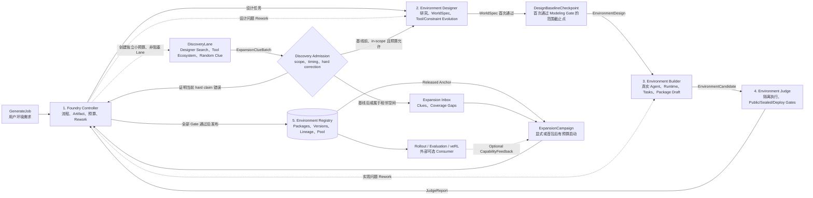
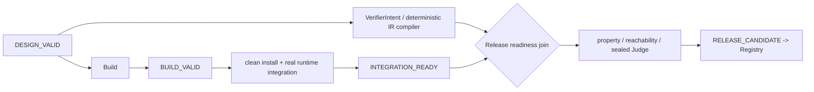

# Programmatic Environment Foundry v2 — Technical Design

> 状态：结构已获用户批准，进入 clean-break 实现。
>
> 目标：说明系统为什么存在、组件如何协作、如何真实执行、如何验证与 rework，以及 Expansion 如何在没有训练反馈时工作。

## 1. Architecture Thesis

本项目是一个 Environment Compiler + Environment Expansion Engine，而不是 Training Loop，也不是一个纯 Evolution 框架。

- **Environment Compiler** 把用户需求变成可信 EnvironmentPackage；
- **Expansion Engine** 因需求和人工 search 不完备而扩大环境覆盖；
- **Consumer Layer** 可选地把 package 用于 rollout/评测/训练。

Generation 是核心产品。Expansion 和 Consumption 都可以被删除而不影响“一个 request 生成一个 package”。Consumption 可以晚于 Generation/Expansion 数月接入。

## 2. System Shape



完整 ExpansionCampaign 会通过同一个 Environment Compiler 生成、验证和发布真实环境；只有 `EnvironmentExpansionPolicy` 不直接生成文件，它只选择 `MutationIntent`。这样所有搜索算法共享同一 correctness/release authority。

GenerateJob 的 Direct Generation 永远不经过 EvolutionPolicy。DiscoveryLane 只提供 clue；完整 ExpansionCampaign 会生成真实 Runtime，但它通过同一 Compiler 完成，而不是由 Policy 直接写代码或发布。

## 3. Five Top-level Components

| Component | Owns | Internal mechanisms | Must not own |
|---|---|---|---|
| Foundry Controller | Job、流程状态、预算、Gate、rework | Artifact graph、events、Agent sessions、RepairRouter | 世界内容、发布规则的任意放宽 |
| Environment Designer | 从需求/父环境得到完整 Design | Research、Discovery/Admission、EvidenceGraph、CoverageMap、WorldSpec、ExpansionPolicy | Runtime code、release verdict |
| Environment Builder | Design 到真实候选工程 | Codex Engineer、Runtime ABI、task generator、package draft | sealed cases、release verdict |
| Environment Judge | 独立执行和判定候选 | static checks、Supervisor、Verifier IR、public/sealed/deploy tests | 修改候选、选择 Expansion 父代 |
| Environment Registry | 发布版本、lineage、Pool、outcomes | content store、fingerprints、package index、Suite refs | 生成、验证或训练模型 |

Rollout/veRL 是 Registry 的外部 consumer，不属于五个核心组件。

## 4. Component-shaped Module Boundaries

第一版物理结构与五组件一致，而不是先拆十几个平级 package：

```text
agent_world/
  contracts/        EnvironmentJob, Design, Candidate, JudgeReport, Package
  controller/       run loop, artifacts, budgets, Agent sessions, rework
  designer/         research, evidence, coverage, WorldSpec, expansion
  builder/          codegen, Runtime ABI project, tasks, package draft
  judge/            supervisor, checks, Verifier IR, release decision
  registry/         versions, lineage, Pool, outcomes, persistence
  cli/              generate, expand, inspect
```

内部代码可以继续按职责分文件，但不提前创建平级微服务。依赖方向固定为：Controller 调用 Designer/Builder/Judge/Registry；Designer、Builder、Judge 只依赖 contracts 和各自 adapter；Judge 永远不 import candidate code；Registry 不回调业务组件。

## 5. Domain Model

### 5.1 Identity

逻辑 id 与 revision 分离：

```text
RequestId
CompileRunId
DiscoveryRunId
CampaignId
MutationIntentId
ProposalId
ArtifactId
ArtifactRevisionId
PackageId
PackageVersion
EpisodeId
AgentSessionId
FindingId
GateRunId
SuiteSnapshotId
```

### 5.2 ArtifactRevision

每个 revision 不可变、content-addressed：

```python
class ArtifactRevision:
    revision_id: ArtifactRevisionId
    artifact_id: ArtifactId
    artifact_type: str
    schema_version: str
    content_ref: BlobRef
    content_hash: str
    dependency_revisions: tuple[ArtifactRevisionId, ...]
    producer: ProducerRef
    provenance: Provenance
    validity: VALID | INVALIDATED | QUARANTINED
```

Current artifact 只是 projection。Rework 创建新 revision，不覆盖旧内容。

### 5.3 Main Artifacts

```text
EnvironmentRequest
ResearchPlan
EvidenceGraph
CoverageMap
WorldSpec
TaskCurriculumSpec
VerifierProposal / VerifierBundle
ImplementationContract
SourceWorkspaceSnapshot
BuildArtifact / RuntimeCandidate
EvaluationPlan / EvaluationEvidence
Finding / RepairPacket
ReleaseDossier / EnvironmentPackage

ExpansionCampaignSpec
DiscoveryRunSpec
ExpansionClueBatch
DiscoveryAdmissionDecision
DesignBaselineCheckpoint
ExpansionInboxRevision / ExpansionInboxSnapshot
MutationIntent
ToolContractSet / SemanticDelta
ExpansionProposal
PolicyCheckpoint
CandidateOutcome

SemanticLineage
ImplementationLineage

EnvironmentSuiteSnapshot
RolloutReport / CapabilityFeedback [optional]
```

Artifact type 不是 stage。Run 可以有多份 EvidenceGraph、CoverageMap、WorldSpec 和 RuntimeCandidate revision。

### 5.4 Package Identity

`WorldBoundary` 决定 stable package identity：

```python
class WorldBoundary:
    primary_domain: str
    actors_and_authority: tuple[ActorBoundary, ...]
    systems_of_record: tuple[str, ...]
    core_resources: tuple[str, ...]
    transition_authorities: tuple[str, ...]
    tool_namespaces: tuple[str, ...]
    core_invariants: tuple[str, ...]
```

ExpansionProposal 声明 identity intent，Identity Gate 再检查：

- WorldBoundary 保持，增加 coverage/difficulty -> same PackageId, new version；
- authority/system-of-record/core resource graph/transition authority/core tool namespace 明显变化 -> new PackageId；
- multi-parent recombination 默认 new PackageId；
- 无法可靠判断 -> new PackageId，避免污染原身份。

Versioning 不承诺 Runtime code ABI 向后兼容；Suite 引用精确 version/hash。若需要 consumer compatibility，单独记录 public tool contract compatibility。

WorldBoundary 是 framework Identity Gate 对完整 SemanticDelta 的判定依据，不是主要原子 evolution operator。谱系拆分为：

```text
SemanticLineage
  semantic parents
  clue/evidence refs
  operator id/version/parameters/seed
  before/after ToolContractSet + WorldSpec hashes
  SemanticDelta hash
  IdentityDecision

ImplementationLineage
  reused workspace/source snapshot
  Builder profile/model/session
  dependency/build provenance
```

纯 workspace 重构可以产生同 PackageId 的 maintenance version，但 `semantic_delta=empty`，不计作 coverage、novelty 或 evolution success。Workspace 若改变可观察行为，必须先产生对应 SemanticDelta；否则 Judge 将其作为未声明行为漂移拒绝。

## 6. Control Plane

### 6.1 Dynamic Artifact DAG

Generation 的常见依赖：

```text
EnvironmentRequest
  -> ResearchPlan
  -> EvidenceGraph <-> CoverageMap
  -> WorldSpec
       ├-> TaskCurriculumSpec
       ├-> VerifierProposal -> VerifierBundle
       └-> ImplementationContract -> Workspace -> Build -> RuntimeCandidate
  Task + VerifierBundle + RuntimeCandidate
       -> EvaluationEvidence
       -> ReleaseDossier
       -> EnvironmentPackage
```

这是依赖图，不是固定流水线。Research/coverage 可迭代；WorldSpec 有效后三个编译分支并行；Evaluation Finding 可以推翻任何 owner。

非阻塞 Discovery 是由 Controller 创建的独立分支：

```text
EnvironmentRequest
  -> DiscoveryRunSpec
  -> ExpansionClueBatch
  -> DiscoveryAdmissionDecision
       ├-> Finding [hard correction]
       ├-> EvidenceGraph/CoverageMap revision [baseline 前 in-scope]
       ├-> ExpansionInboxRevision [普通晚到/相邻 clue]
       └-> rejected clue

WorldSpec first Modeling PASS
  -> DesignBaselineCheckpoint
```

`DesignBaselineCheckpoint` 只冻结首包可选 scope，不豁免 correctness。新证据若证明 hard claim、工具语义、安全规则或 fidelity 声明错误，任何时刻都创建 Finding；已发布时根据严重性 quarantine 或 corrective revision。

### 6.2 Producer Rules

```python
class ProducerRule(Protocol):
    consumes: tuple[ArtifactPattern, ...]
    produces: tuple[ArtifactType, ...]
    async def plan(ctx: RuleContext) -> WorkOrder: ...
    async def execute(order: WorkOrder) -> WorkResult: ...
```

Scheduler 根据目标 claim、有效 artifact、open findings、预算和权限选择 ready rule。没有 PLAN/S0-S7 stage contract。

### 6.3 Events

最少包括：

```text
RunStarted
DiscoveryRunStarted / DiscoveryRunStopped
ExpansionClueCommitted / DiscoveryAdmissionDecided
DesignBaselineCheckpointed / ExpansionInboxSnapshotted
ArtifactRevisionCommitted / ArtifactInvalidated
WorkOrderScheduled / Completed / Failed
GateScheduled / Completed
FindingOpened / Resolved / Superseded
AgentSessionStarted / Continued / Completed
BudgetReserved / Consumed / Released
PermissionRequested / Granted / Denied
CandidateReleased / Rejected / Quarantined
CampaignStarted / PolicyCheckpointed / CampaignStopped
PolicyAsked / PolicyTold
SuiteSnapshotPublished / RolloutCompleted
```

Event payload 保存 redacted metadata 和 Artifact refs，大对象进入 blob store。

### 6.4 Budget

预算是向量而非单值：token、Agent turns、Web/tool calls、build time、evaluation episodes、container time、live probe cost、repair attempts、wall time。每个 WorkOrder 先 reserve，结束后 consume/release。

Direct Generation 使用前台保留容量；Discovery 和 ExpansionCampaign 使用独立 budget partition、低优先级和 max-in-flight。后台工作不能借用会导致 Direct Generation 饿死的前台保留量；新 GenerateJob 到达时不经过 EvolutionPolicy，也不会排在无限 Evolve 队列之后。

### 6.5 Terminal States

```text
released
rejected
needs_human
budget_exhausted
superseded
quarantined
```

Infrastructure `ERROR` 不算 candidate `FAIL`，也不能算 `PASS`。

### 6.6 Claim/Maturity Readiness、Integration Lane 与全局 RepairLedger

此前真实执行暴露出的八条经验现在是实现合同：逐项 ClaimVector、framework-derived Artifact maturity、owner-by-DAG RepairRouter、紧凑 VerifierIntent 编译、每节点/Verifier batch 原子 NodeCommit、早期真实 Integration、受限 backjump，以及 run/campaign 唯一 durable RepairLedger。



Verifier 的 `error/unknown` 产生 `block_release` Claim，但不阻塞 Integration。Release 标准不变。Finding 的 owner hint 不可信；Router 根据 claim producer、failure taxonomy、subject revision 与 Artifact dependency closure 产生 RepairDirective。distance 0 最多两次，distance 1 需要 causal evidence 且最多一次，distance >= 2 默认拒绝，Research 只接受 hard external correction。所有组件内部 correction 都要向同一 RepairLedger 申请，不能持有独立隐形 repair budget。

### 6.7 Observability and Experiment Plane

Controller 内部持有一个横切 telemetry service，但五组件只发送 backend-neutral WorkSpan/usage；业务组件不依赖 SQLite 查询结果作语义决策。存储分为 ArtifactStore 中低频 `AuditEvent`、`state/telemetry/telemetry.sqlite` 的高频 WAL 事件和 `state/experiments/` 的不可变 ExperimentSnapshot。

数据合同覆盖 hierarchical span、token provenance、search/fetch/extract、tool、build/runtime、Gate/Claim/maturity、repair/backjump/retention、Registry、Consumer 和 Evolve。Unknown 不等于 0；raw prompt、secret、sealed/EvaluatorGoal 不得进入 telemetry。CLI 提供 `inspect --metrics`、JSON/Parquet export 与 experiment snapshot/compare/summarize。

### 6.8 Feedback contracts and execution placement

Node、Artifact、validation claim、observability span 和 Agent transaction 是五种不同对象。
Artifact/claim/span 可以细；昂贵 Agent transaction 必须少且有界。每个反馈点注册
`FeedbackContract(claim, timing_reason, executor, cost_class, owner,
maximum_attempts, maximum_backjump, invalidation_boundary, effect)`；没有合同的
validator/Gate 不得进入生产 catalog。Contract 是静态策略；动态 `FeedbackResult` 才绑定
精确 subject、RepairTarget、diagnostic、evidence 与 usage。

执行权固定如下：

- code：shape/schema/ref/type/rule compile/permission/projection、budget、retry、router、
  no-progress、invalidation、maturity、release；
- real execution：build/install/protocol/reset-step/reachability/property/sealed/deploy；
- LLM advisory：evidence synthesis、business/world/tool/task semantics、adversarial intent；
- hybrid：LLM 产出 typed semantic source，framework 编译并拥有所有控制效果。

RepairLedger 保持 run-global，但授权 key 从粗粒度 NodeKind 扩展为
`RepairTargetRef(component, artifact_slot, batch_id, immutable_input_refs)`。例如
`design.world_architecture`、`design.tool_semantics:booking-1`、
`judge.verifier_intent:batch-2`。顶层 owner 仍用于组件路由；实际 invalidation 从 target
Artifact dependency closure 推导，不能因为 target 属于 design 就清空全部后代。

### 6.9 Bounded semantic transaction topology

Direct Designer 改为：

```text
ResearchPlan -> real search/fetch/extract -> EvidenceSynthesis
-> WorldArchitecture transaction
-> deterministic schema/reference compiler
-> ToolSemanticsBatch × bounded partitions (up to 4 coupled tools)
-> one WorldRules transaction
-> deterministic WorldSpec closure
-> one TaskCurriculumSemantics transaction
-> deterministic Task/Reward/VerificationRequirements compiler
-> optional bounded SemanticRepair (whole run maximum 2)
-> ModelingGate
```

首次真实 Build 前硬上限 9 个 Agent turn，典型 7。实体数量只扩大 typed IR 和
deterministic compile，不扩大 Agent turn；工具数量只按 context-bound semantic batch 扩大。
完整 Task/Curriculum 必须在 Builder 前编译进 EnvironmentDesign，因为 Builder 要一次生成
最终 Task Materializer。只有 Challenger VerifierIntent 可与 Builder 并行；Builder commit 后
现有 Integration 对同一最终 digest 立即启动。现阶段不引入第二 Diagnostic Builder。

## 7. Direct Generation Flow

### 7.1 Intake

`generate(request)` 创建 EnvironmentRequest revision 和 CompileRun。Framework 检查权限、risk、supplied assets 和 basic feasibility，不要求用户填完整模板。Controller 同时为前台 Direct Generation 预留预算，并按 request policy 创建可关闭、低优先级、独立预算的 DiscoveryRunSpec。

### 7.2 Non-blocking Discovery

DiscoveryLane 由 Controller 调度、由隔离 Researcher profile 执行，只输出 `ExpansionClueBatch`，不创建 Runtime candidate。每批 clue 经 Designer 语义分类、Controller commit `DiscoveryAdmissionDecision`：

- `hard_correction`：打开 Finding，进入当前 rework；已发布时触发 quarantine/corrective revision policy；
- `in_scope_extension`：仅在 DesignBaselineCheckpoint 之前且前台 scope budget 允许时更新 EvidenceGraph/CoverageMap；
- `expansion`：写入 immutable ExpansionInboxRevision；
- `reject`：记录 evidence/risk/dedup rationale 后终止。

Discovery 的完成、失败、权限拒绝或预算耗尽都不是 Direct Generation release dependency。WorldSpec rework 不重新打开已经冻结的可选 scope cutoff。

### 7.3 Research Loop

Researcher 执行：

```text
plan questions
-> search/open/inspect tools
-> extract claims/tool surfaces
-> reconcile conflicts
-> update EvidenceGraph and CoverageMap
-> coverage Gate
-> continue or stop
```

停止条件由 request/release profile、coverage、unknown severity 和 budget 决定，不由 Agent 自称“研究完成”。

### 7.4 World Modelling

Environment Engineer 从 EvidenceGraph/CoverageMap 编写 typed WorldSpec。Modeling Gate 检查：

- schema/cross-reference；
- state/action reachability；
- pre/postcondition completeness；
- error/rollback/idempotency；
- permission/visibility；
- invariants and contradiction；
- task satisfiability；
- rule-to-evidence coverage；
- fidelity assumptions。

WorldSpec 首次通过 Modeling Gate 时，Controller commit `DesignBaselineCheckpoint`，保存 request/evidence/coverage/WorldSpec revisions 和 scope hash。

### 7.5 Parallel Compilers

WorldSpec 通过后：

- Task compiler 生成 task generator、private goal facts、difficulty dimensions；
- Challenger 生成 VerifierProposal 和 adversarial scenarios；
- Engineer 生成 ImplementationContract。

Task/verifier/runtime 都引用相同 WorldSpec revision。任一分支发现 spec 矛盾会产生 Finding 并回退 WorldSpec。

### 7.6 Code Generation

Engineer 在稳定 isolated workspace/thread 中调用真实 Codex SDK：

- 输入有效 artifacts、ImplementationContract、ABI skill；
- 允许 repo read/write、uv/build/test 等受控工具；
- 输出 workspace snapshot、manifest 和 structured completion；
- framework 自己运行 build/contract tests；
- 文件存在或 Agent 自称成功不算完成。

### 7.7 Independent Evaluation

Runtime 由 Supervisor 启动；Verifier 只通过 Runtime client 与 verifier channel 观察。Evaluation 分层：

1. schema/static/type/lint/license/secret；
2. generated unit tests；
3. public ABI/conformance；
4. property/metamorphic/model-based；
5. repair regression；
6. sealed release；
7. clean install/start/restart/concurrency/teardown；
8. optional read-only differential probe；
9. LLM semantic judge as soft evidence。

### 7.8 Release

ReleaseProfile 定义 required hard claims。Release Kernel 只读取有效 evidence；Search policy、Engineer、Challenger、Runtime 和 training score 均无权 override。

## 8. Agent Execution Design

### 8.1 InvocationBackend

```python
class InvocationBackend(Protocol):
    async def invoke(request: InvocationRequest) -> InvocationResult: ...
    async def continue_session(session, request) -> InvocationResult: ...
    async def cancel(session) -> None: ...
```

Domain/control 不引用 SDK types。Production profile 不自动 fallback 到 mock/template/manual/generic shell runner。

### 8.2 Three Profiles

#### Researcher

- generation requirement research；
- expansion wide search；
- tools: Web/Reader/repo/schema/MCP/API/SDK/CLI inspection；
- outputs EvidenceGraph/CoverageMap/clues；
- no code write/release authority。

#### Environment Engineer

- WorldSpec、Task、ImplementationContract、Runtime code、repair；
- stable conversation + workspace per implementation lineage；
- receives exact artifact revisions and RepairPacket；
- cannot read sealed cases。

#### Challenger

- isolated conversation；
- critiques evidence/spec/task/verifier/candidate behavior；
- proposes adversarial cases and VerifierProposal；
- cannot edit candidate or release。

### 8.3 Profile Recipe

每个 profile version 固定：backend/model、instructions、Skills、Hooks、tool allowlist、sandbox、workspace policy、permissions、budget、output schema、completion contract、continuation/checkpoint policy。

Controller 在调用 backend 前把 recipe 物化为 `ResolvedAgentProfile` 和 hermetic runtime directory：独立 HOME/CODEX_HOME、只读 Skill bundle、只读 Hook bundle、MCP/tool capability manifest、workspace mounts、network allowlist、credential handles 和 output directory。任何 ambient user/repo Skill、Hook、MCP 或 credential 不进入生产 invocation；adapter 无法证明隔离时必须拒绝运行。

Framework 提供 backend-neutral hook contract（before invocation/tool/artifact/complete 与 after tool/invocation），具体 SDK hook 只存在于 adapter。Hook 无法扩大 ToolBroker 已授予的 capability，也不得跨 profile/session 保存隐藏可变状态。

Researcher 的 Search 工具链按 capability 分层：`SearchProvider -> Fetcher -> Extractor -> Browser/Crawler -> EvidenceNormalizer`。默认 provider/fallback 均在 config 中显式声明；search snippet 不算 evidence，正文必须带 source、retrieved_at、content_hash 和 parser/provider version。

### 8.4 Session Strategy

- implementation bug -> same Engineer conversation；
- WorldSpec revision -> same lineage with explicit diff；
- context exhaustion -> framework checkpoint, then resume/new session；
- Challenger/sealed evaluator -> always isolated；
- provider/no-progress -> policy-controlled backend/session change, recorded in events。

## 9. Runtime ABI v2

### 9.1 Operations

```text
handshake
setup
reset(episode_id, seed, config)
invoke(episode_id, tool_id, arguments, idempotency_key)
observe(episode_id, channel/ref)
close_episode
shutdown
```

### 9.2 Information Boundary

Runtime 可见：world setup、episode seed/config、tool/action、arguments、idempotency key。

Runtime 不可见：task id、case label、expected answer/state/path、Verifier IR、sealed data、release label/threshold。

Reset config 只包含建立世界所需信息；private goal facts 只进入 framework verifier。

### 9.3 Supervisor

负责 process/container、cwd/env/network/filesystem/secret policy、protocol framing、timeout/CPU/memory/process/output limits、health/restart、episode isolation、request/event hash 和 teardown。

Candidate code 从不 import 到 framework verifier process。

### 9.4 Runtime Profiles

首批支持：

- `managed-state`：候选在 SQLite/files 中管理状态；
- `local-service`：候选启动一个或多个本地服务，由 ABI gateway 控制。

真实第三方写操作属于后续 `sandboxed-live-write` profile，需要 credential broker、sandbox tenant、compensation 和人工授权。

## 10. Verifier Design

### 10.1 VerifierProposal and IR

LLM 输出 proposal，不输出拥有发布权的任意代码。Framework compiler 只允许：

- typed equality/order/set/multiset；
- state predicate/transition relation；
- event sequence/partial order；
- trace invariant；
- property quantification；
- metamorphic relation；
- bounded model/reference comparison；
- approved differential probe。

禁止 eval/arbitrary Python、候选 callback、任意网络调用和读取 release metadata。

### 10.2 Evaluation Partitions

| Partition | Engineer visible | Purpose | After disclosure |
|---|---:|---|---|
| generated unit | yes | fast diagnosis | remains public |
| framework public | yes | ABI/conformance | remains public |
| repair regression | yes | prevent recurrence | not sealed |
| sealed release | no | generalization/anti-cheat | retire if disclosed |
| differential/live | policy | fidelity evidence | protect by sensitivity |

Sealed generator 与 candidate generator 不共享 session/context。

### 10.3 Three Separate Claims

- implementation conformance：Runtime 是否执行 WorldSpec；
- source fidelity：WorldSpec 是否有证据地对应外部工作流；
- training utility：环境是否产生学习信号（optional）。

Hidden tests 只能增强 conformance assurance，不能自动证明现实 fidelity。

## 11. Rework Design

### 11.1 Finding

```python
class Finding:
    finding_id: FindingId
    category: FindingCategory
    severity: BLOCKER | ERROR | WARNING | INFO
    subject_revision: ArtifactRevisionId
    owning_artifact_type: str | None
    evidence_refs: tuple[EvidenceRef, ...]
    fingerprint: str
    repair_hint: str | None
    disclosure: PUBLIC | REPAIR_ONLY | SEALED_SUMMARY
```

### 11.2 Routing

| Failure | Owner | Default rework |
|---|---|---|
| unsupported claim | EvidenceGraph | Researcher continues search |
| uncovered high-risk gap | CoverageMap/Request | research or needs_human |
| inconsistent transition | WorldSpec | revise spec, invalidate descendants |
| build/type/ABI bug | Workspace/Runtime | same-thread Engineer repair |
| task unsatisfiable/leaky | TaskCurriculum | recompile task/verifier |
| verifier weak/invalid | VerifierProposal/IR | Challenger/compiler rework |
| sealed behavior fail | inferred owner | minimal summary, targeted repair |
| deployment/package fail | Runtime/Packaging | repair build/package |
| repeated no progress | lineage | broaden scope, change backend, reject |

### 11.3 Sealed Repair

对 Engineer 只披露无法反推 case 的最小 summary。必须披露具体 case 时，它转入 repair regression，sealed pool 重新补充。

### 11.4 Invalidation

Owner revision 修改后，通过 dependency graph invalidates 所有后代；不相关 siblings 保持有效。新 Gate 不能复用被 invalidated evidence。

## 12. Expansion Engine

### 12.1 Campaign Snapshot

```python
class ExpansionCampaignSpec:
    anchor_requests: tuple[ArtifactRevisionId, ...]
    anchor_packages: tuple[PackageRef, ...]
    pool_snapshot: PoolSnapshotRef
    inbox_snapshot: ExpansionInboxSnapshotRef | None
    coverage_objective: CoverageObjective
    sources: tuple[PluginSpec, ...]
    policy: PluginSpec
    operator_catalog: tuple[OperatorSpec, ...]
    external_injection: InjectionPolicy
    optional_feedback: tuple[ArtifactRevisionId, ...]
    release_profile: ReleaseProfileId
    budget: Budget
    max_in_flight: int
    seed: int
    stop_policy: StopPolicy
```

Anchor、Pool 和 Inbox snapshot 固定保证可复现。Policy 可显式 checkpoint + refresh，但不能悄悄读取不断变化的 current Pool/Inbox。Campaign 使用独立 budget partition 和并发上限，不能消费 Direct Generation 的前台保留容量。

### 12.2 Coverage Analysis

Expansion 首先合并：

- request declared scope；
- EvidenceGraph observed scope；
- WorldSpec modelled scope；
- Runtime/Verifier covered scope；
- Pool neighborhood；
- optional failure feedback。

产生 gap hypotheses，而不是直接产生代码。

### 12.3 Source Search

ExpansionSource 接收 gap/anchor/budget，返回 `ExpansionClueBatch`。Clue 经过 cheap admission：relevance、evidence、feasibility、risk、permission、dedup、coverage potential 和 cost。

随机 clue 必须经过外部 evidence 或明确 simulation design decision 才能升级 proposal。

### 12.4 Vertical Proposal

```text
same PackageId
parent WorldSpec + proposed delta
identity preserved rationale
full new WorldSpec/Runtime/Task/Verifier/evidence
new immutable version
```

它不是在旧包上原地打补丁。完整重编保证不存在“父包通过，所以新增规则也通过”的错误继承。

### 12.5 Lateral Proposal

```text
new PackageId
one/multiple parent refs or external clue
new WorldBoundary
full research/WorldSpec/Runtime/Task/Verifier/evidence
```

Multi-parent recombination 记录每个 parent 提供的 rule/resource/workflow provenance，但输出只有一个独立 package。

### 12.6 Ask/Tell Policy

```python
class EnvironmentExpansionPolicy(Protocol):
    async def ask(
        context: ExpansionContextRef,
        checkpoint: PolicyCheckpointRef | None,
        budget: AskBudget,
    ) -> MutationIntentBatch: ...

    async def tell(
        checkpoint: PolicyCheckpointRef | None,
        outcomes: OutcomeBatch,
    ) -> PolicyCheckpoint: ...

    def should_stop(
        checkpoint: PolicyCheckpointRef,
        remaining_budget: Budget,
    ) -> StopDecision: ...
```

Policy 只选择 `(parents, clues, operator id/version, parameters, seed, target dimensions)`。它不直接生成 EnvironmentDesign、Runtime 或任意源码，也不拥有 Artifact commit/release 权限。`ask` 只读取固定 snapshot；`tell` 对 outcome id 幂等，接收 admission rejected、research/design/build/judge/release/needs-human/budget-exhausted 等结果。Infrastructure error 独立标记，不能当作低 fitness。

最初实现/研究基线：

- WideSearchPolicy：coverage gap + external sources；
- RandomBaselinePolicy：合法 clue/parent/operator 随机采样；
- EvolutionaryArchivePolicy：multi-objective archive + parent/operator selection。

MAP-Elites/MCTS/Bayesian/bandit/RL 后续插件化。

### 12.6.1 Tool-first Operator Model

Policy 采样的是 `(parents, clues, operator, parameters)`，而不是任意源码 patch：

```text
ToolSurfaceOperator
ToolSemanticsOperator
TransitionConstraintOperator
TaskScopeOperator
CompositeOperator
```

这些 operator 输出 typed `SemanticDelta` 和 provenance：

- `ToolSurfaceOperator` 改变 Agent 可见 tool graph、namespace、argument/result/error schema、依赖、角色可见性和 observation surface；
- `ToolSemanticsOperator` 改变 tool pre/transition/postcondition、权限效果、错误/partial failure、idempotency、retry/timeout、transaction、rollback 或 compensation；
- `TransitionConstraintOperator` 改变 state schema、合法状态、资源/时间/顺序/并发约束和跨工具不变量；
- `TaskScopeOperator` 只在既有 ToolContract/WorldSpec 内改变 goal/initial-state distribution、工具组合、难度、规模、partial observability 和 terminal condition；需要新工具或状态时必须升级为语义 operator；
- `CompositeOperator` 组合上述 delta，适用于多父代或跨系统 proposal。

新增工具至少包含 ToolSurfaceDelta + ToolSemanticsDelta；涉及状态时还必须包含 TransitionConstraintDelta。`ToolContract` 至少包含：

```text
id / namespace
argument / result / error schema
visibility / permission
precondition / transition / postcondition refs
observation projection
idempotency / retry / timeout
transaction / rollback / concurrency
evidence / fidelity refs
runtime binding profile
```

Designer 将 MutationIntent 完整化为 SemanticDelta，补齐 research/evidence，随后由 Identity Gate 比较变异前后的 ToolContractSet、WorldSpec 和 WorldBoundary，判定 package revision 或 new package。WorldBoundary 是身份判定结果，不是主要原子 operator。

Workspace 复用、重构或重写只属于 Builder implementation strategy，不是 Expansion operator。即使增量复用父代码，Runtime、Task、Verifier 和 release evidence 仍按 dependency invalidation 重新证明；source diff 不计 semantic novelty，未声明的 observable behavior drift 必须被 Judge 拒绝。

### 12.7 Outcome Vector

```text
terminal status
hard Gate results
coverage delta by dimension
semantic/structural/behavioral descriptor
fidelity/risk
compile/release yield
cost vector
repair depth/failure categories
lineage
optional rollout/training metrics
```

Policy 自行处理 Pareto、archive、survivor 和 parent。Core 不提供一个 advantage 字段。

### 12.8 Cost Funnel

```text
source clue                    cheap
-> proposal admission
-> research/coverage sanity
-> WorldSpec/model gates
-> build/public tests
-> property/metamorphic
-> sealed/deployment           expensive
-> optional rollout/training   independently scheduled
```

Policy 可决定投入多少候选到下一成本层，但不能把低成本层结果冒充 release。

## 13. Registry and Packaging

### 13.1 Registry Indexes

- PackageId/version/hash/status/release profile；
- WorldBoundary/WorldSpec/CoverageMap；
- proposal origin、SemanticLineage、ImplementationLineage、policy checkpoint；
- semantic/structural/behavioral fingerprints；
- Gate evidence/findings/assurance；
- cost/repair/runtime/deployment results；
- optional rollout/training feedback。

### 13.2 envpkg v2

```text
environment-package/
  envpkg.toml
  manifest.json
  world_spec.json
  runtime/ project + lock + launch descriptor
  generators/ task/curriculum
  adapters/ local + optional verl
  public_eval/ verifier bundle
  evidence/ provenance + assurance + fidelity
  SBOM / licenses
```

不包含 sealed cases、secret、expected output corpus、Agent transcript 或绝对 workspace path。

### 13.3 Clean Release

从 package artifact 而非 generation workspace 开始，在空目录/container 中 install、handshake、reset/invoke、restart、concurrency、teardown、package-relative execution、public/sealed evaluation、SBOM/license/secret scan，最后原子发布 ReleaseDossier。

## 14. Optional Consumer Layer

### 14.1 SuiteSnapshot

精确记录 PackageId/version/hash、weight、curriculum、seed policy 和 adapter version。Package quarantine 不修改历史 snapshot，但阻止新 snapshot 默认选中。

### 14.2 Local Environment Interface

```python
episode = env.reset(seed, task_config)
while not episode.done:
    action = agent.act(episode.observation, tools=episode.tools)
    step = env.step(action)
return RolloutResult(...)
```

Foundry 提供 env side；consumer 提供 agent act。

### 14.3 veRL Adapter

Adapter 映射 reset/step/reward/termination/trace；veRL 拥有 model server、tokenization、generation、loss mask 和 optimization。完整 veRL 不是 core dependency。

### 14.4 Optional Feedback

CapabilityFeedback 保存 capability dimension、failure clusters、difficulty、pre/post metrics、uncertainty、reward hacking 和 transfer signal。ExpansionSource 可以消费它；它为空时所有 Expansion contracts 仍成立。

## 15. Security and Operations

### 15.1 Permission Policy

每个 WorkOrder 声明 network domains、filesystem roots、commands、tools/MCP、credential handles、external mutation 和 cost ceiling。默认 deny；超出 request/campaign policy 进入 needs_human。

### 15.2 Secret Flow

Secret 只从 credential broker/host injection 到获准 adapter；Agent prompt 看 handle，不看值。Events/artifacts/packages/logs redaction。Sealed data 与 secret 分 namespace/role。

### 15.3 Supply Chain

Dependency lock/hash、SBOM、license/provenance、install-script sandbox、package attestation 和 quarantine。

### 15.4 Inspectability

`inspect` 应显示 request/campaign、artifact DAG、current revisions、open findings、agent sessions、Gate claims/evidence、budget、repair history、lineage、terminal reason 和 next ready work。

## 16. CLI Shape

```text
agent-world doctor
agent-world generate --request ...
agent-world expand --campaign ...
agent-world inspect run|campaign|artifact|package
agent-world verify --candidate ...
agent-world publish --run ...
agent-world suite create ...             [optional]
agent-world rollout --suite ...          [optional]
```

CLI 只是 application service client；不能各自实现一套 workflow。所有命令支持 JSON、run id、resume 和明确 exit code。

## 17. Migration from Current Repository

### 17.1 Extract Concepts, Not Compatibility

可提取：

- InvocationRequest/Result/Backend Registry 思路；
- Codex SDK backend 的真实 thread continuation/workspace/sandbox；
- config secret rejection/redaction；
- research provider 的真实 fetchers；
- artifact/gate record 的有用字段；
- codegen skill 的 isolated workspace 方法。

### 17.2 Delete/Rewrite

- monolithic agents.py/pipeline.py；
- fixed PLAN/S0-S7 stages；
- ABI v1 and eight-interface contract；
- task replay/fixed task id/case；
- generated verify release path；
- candidate import into verifier process；
- expected path/state/labels passed to candidate；
- stub envpack runner；
- production mock/template/manual/process fallback；
- old awm CLI/package compatibility；
- benchmark submodule blocking core uv install。

旧测试不应改写成让旧行为继续通过。对可提取机制先写 characterization tests，再在新边界重建；v2 Gate 接管后删除旧 success path。

## 18. End-to-End Example

用户请求：为本地库存预留与订单履约 Agent 创建环境。

### Direct Generation

1. Controller 为 Direct Generation 预留前台预算，并创建独立小预算 DiscoveryLane；
2. Researcher 检索库存、预留、过期、幂等、部分失败和权限资料；
3. EvidenceGraph/CoverageMap 显示 concurrency 尚不明确，继续研究；
4. Engineer 建立 WorldSpec 和 WorldBoundary，首次 Modeling PASS 后 commit DesignBaselineCheckpoint；
5. 晚到的 adjacent tool clue 进入 Expansion Inbox，不移动首包范围；若 clue 证明当前 hard claim 错误，则形成 Finding；
6. Task、VerifierProposal、ImplementationContract 并行编译；
7. Codex SDK 生成 SQLite local service Runtime；
8. property Gate 发现重复 idempotency key 二次扣库存；
9. RepairRouter 将 Finding 交回同一 Engineer thread；
10. 修复后 sealed/concurrency/clean deployment 通过；
11. 发布 `inventory-fulfillment@1.0`。不需要训练，也不等待 Discovery 完成。

### Vertical Expansion

CoverageMap 与 wide search 发现 backorder、reservation expiry、partial shipment 未覆盖。Policy.ask 选择父版本、clue 和 ToolSemantics/TransitionConstraint operators；Designer 形成 typed SemanticDelta，Identity Gate 保持 PackageId，完整重编并发布 `inventory-fulfillment@1.1`。

### Lateral Expansion

Pool 中另有采购审批环境；Policy 将库存履约与审批/供应商补货 workflow 重组，WorldBoundary 改变，生成新 package `procurement-replenishment@1.0`。

### Optional Consumption

两个 package 以后可组成 Suite 进行 veRL training；得到的补偿决策失败 feedback 可以帮助下一 campaign，但没有它 Expansion 仍然运行。

## 19. Architecture Decisions

- ADR-001：Generation、Expansion、Consumption 三条路径分离；
- ADR-002：EnvironmentPackage 是唯一发布单位；
- ADR-003：纵向产生同 PackageId 新版本，横向产生新 PackageId；
- ADR-004：Expansion candidates 统一回到 Environment Compiler；
- ADR-005：训练反馈 optional，不属于 Expansion required contract；
- ADR-006：immutable Artifact DAG 代替 fixed stages；
- ADR-007：Runtime ABI v2 task-agnostic/out-of-process；
- ADR-008：LLM VerifierProposal + framework typed IR；
- ADR-009：Engineer stable session，Challenger isolated session；
- ADR-010：release、expansion selection、training sampling 三权分离。
- ADR-011：Controller-owned non-blocking Discovery + explicit Admission/DesignBaselineCheckpoint；
- ADR-012：Policy ask/tell 只产生 MutationIntent，tool/world semantics 是 evolution genotype；
- ADR-013：SemanticLineage 与 ImplementationLineage 分离，Workspace 仅属于 Builder。

## 20. Resolved Discovery and Expansion Timing

- Controller 为 GenerateJob 默认创建可关闭、独立小预算、低优先级的 DiscoveryLane；
- WorldSpec 基线前的 in-scope clue 可以进入当前 research/design，基线后的 clue 进入 Expansion Inbox；
- 任意时刻证明 hard claim、工具语义、安全或 fidelity 声明错误的 clue 必须形成 Finding；已发布时触发 quarantine/corrective revision policy；
- Discovery 不创建 Runtime candidate，也不阻塞首包；
- 首包发布后，只有显式 ExpandJob 或 request 已分配 Expansion budget 才启动完整 Campaign；
- Campaign 使用固定 anchor/Pool/Inbox snapshot，失败 outcome 不修改父 package 或原 GenerateJob；
- 开启/关闭 Evolve 均不改变 Direct Generation 的 success contract。
