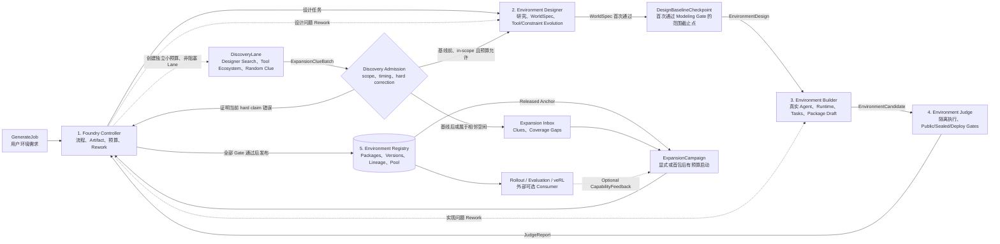
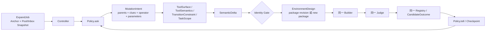

# Programmatic Environment Foundry v2 — Component-first Delivery Plan

> 状态：用户已批准五组件结构、clean-break 和实现风险，任务进行中。
>
> 原则：先做五组件贯通的真实 walking skeleton，再逐步加强各组件内部机制；不先分别建设十几个子系统。

## 1. Target Shape

第一版只落地 `FoundryController`、`EnvironmentDesigner`、`EnvironmentBuilder`、`EnvironmentJudge` 和 `EnvironmentRegistry` 五个核心组件。

四个稳定工作 envelope：

```text
EnvironmentJob
EnvironmentDesign
EnvironmentCandidate
JudgeReport
```

Released EnvironmentPackage 是最终产物。Expansion 仍复用完全相同的五组件路径。

Discovery/Expansion 通过 envelope 中的 typed Artifact refs 交接：`DiscoveryRunSpec`、`ExpansionClueBatch`、`DiscoveryAdmissionDecision`、`DesignBaselineCheckpoint`、`ExpansionInboxSnapshot`、`MutationIntent`、`SemanticDelta`、`SemanticLineage` 和 `ImplementationLineage` 不增加顶层组件。

## 2. Main Flow



## 3. Slice 0 — Five-component Real Walking Skeleton

### Purpose

用一条真实需求贯通组件边界，证明结构成立。不是 mock demo；所有组件都执行最小但真实的职责。

### Contracts

#### EnvironmentJob

```text
job_id
kind = generate | expand
request/anchor refs
permissions
budget
release profile
```

Slice 0 只启用 `generate`，但合同预留 `expand`，不实现搜索算法。

#### EnvironmentDesign

```text
design_id/revision
request and evidence refs
WorldBoundary + WorldSpec
CoverageMap summary
task/curriculum requirements
verification requirements
lineage + target_kind
```

#### EnvironmentCandidate

```text
candidate_id
design revision
source workspace snapshot
Runtime launch/ABI descriptor
task generator
public tests/verifier proposal
package draft
```

#### JudgeReport

```text
verdict = pass | fail | inconclusive | error
hard claims
evidence refs
Findings with owner = design | build | judge-infrastructure
metrics
```

### Component Work

#### Controller

- 接收一个自然语言 GenerateJob；
- 保存 Design/Candidate/Report revisions；
- 调用三个工作组件；
- Judge fail 时按 owner 回到 Designer 或 Builder；
- 管理最小 repair budget；
- 只有 Judge pass 才调用 Registry publish。

#### Designer

- 使用真实 Researcher/InvocationBackend；
- 研究需求和至少一个真实工具/文档来源；
- 输出 evidence-backed WorldSpec、最小 CoverageMap、任务和验证要求；
- 通过分层 SearchProvider/Fetcher/Extractor/Crawler 获取真实来源，search snippet 不算 evidence；
- 不写 Runtime code。

#### Builder

- 使用真实 Codex SDK Engineer；
- Controller 为 Engineer 物化隔离 HOME/CODEX_HOME、Skill/Hook bundle、tool allowlist 和 workspace；
- 在隔离 workspace 生成可启动 Runtime、task generator 和 package draft；
- 实现 task-agnostic reset/invoke；
- 不读取 hidden/expected data。

#### Judge

- 在子进程中启动 Runtime，不能 import candidate；
- 检查 build、handshake、reset、invoke、未知 seed、状态变化和 package-relative path；
- 运行至少一个 framework-owned hidden case；
- 产生 structured Finding，而不是让 Runtime 自评。

#### Registry

- content-addressed 保存 released package；
- 保存 PackageId/version、WorldBoundary、design/candidate/report refs 和 lineage；
- 提供 get/list/query；
- 不需要先实现复杂 Pool search。

### Slice 0 Acceptance

- 一条未写入 fixture 的需求真实生成 package；
- Designer 和 Builder 都使用真实 backend；
- Runtime 真正执行状态转移；
- Judge 在独立进程验证；
- 至少一次真实 Finding 触发 rework；
- 关闭真实 backend 时诚实失败；
- 项目与测试中无 mock/fake/stub backend，无 fixed environment/task/replay/template fallback；
- package 从其他 cwd 启动；
- 不依赖 Expansion、Suite 或 Training。

Slice 0 完成后，才能判断五组件结构是否正确；若边界不合理，此时重构成本仍可控。

## 4. Slice 1 — Trust and Rework Hardening

在 walking skeleton 内部增强机制，不新增顶层组件：

### Controller internals

- immutable Artifact revisions；
- dependency graph and invalidation；
- durable events/checkpoint/crash resume；
- vector budgets；
- no-progress detection；
- permission/needs_human policy。
- foreground Direct Generation capacity reservation；
- independent low-priority Discovery budget/max-in-flight；
- DiscoveryRunSpec、Admission 和 Expansion Inbox revisions。

### Non-blocking Discovery

- Controller 为 GenerateJob 创建真实 DiscoveryLane，不允许 lane 绕过 Controller 直接修改 Design；
- 隔离 Researcher 使用真实 Search/Fetch/Extract/Crawl 工具，只输出 evidence-backed ExpansionClueBatch；
- WorldSpec 首次 Modeling PASS 时 commit DesignBaselineCheckpoint；
- Designer 分类 clue，Controller commit DiscoveryAdmissionDecision；
- 基线前的 in-scope extension 可进入当前 research，普通晚到/相邻 clue 进入 Inbox；
- 证明 hard claim、工具语义、安全或 fidelity 声明错误的 clue 在任意时刻形成 Finding；已发布时进入 quarantine/corrective revision policy；
- Discovery failure、permission denial 或 budget exhaustion 不改变 Direct Generation verdict。

### Designer internals

- iterative ResearchPlan；
- full EvidenceGraph/conflict checking；
- CoverageMap dimensions and unknowns；
- typed WorldSpec validators；
- Task/Curriculum and Verifier requirements branches。

### Builder internals

- stable Engineer session/workspace；
- ImplementationContract；
- dependency lock/build snapshot；
- same-thread repair；
- envpkg v2 draft。

### Judge internals

- Runtime ABI v2 complete lifecycle；
- resource/network/filesystem limits；
- typed Verifier IR；
- public/repair/sealed partitions；
- property/metamorphic tests；
- clean container deployment；
- secret/license/SBOM checks。

### Registry internals

- immutable versions and status；
- quarantine/supersede；
- fingerprints/coverage/outcome indexes；
- release dossier。

### Slice 1 Acceptance

后置 property failure 能准确回到 WorldSpec/Builder，创建新 revision，只 invalidates 受影响后代；sealed case 不泄漏；crash 后 run 可恢复；clean package 全生命周期通过。

同时使用真实 Agent/Search 验证：Discovery 成功时 clue 带 provenance 并进入 research/Finding/Inbox；Discovery 权限拒绝、provider 失败或预算耗尽时，Direct Generation 仍使用保留容量独立完成；普通 post-baseline clue 不移动首包范围，hard correction 真实触发 rework。

## 5. Slice 2 — Expansion through the Same Components

### Purpose

不增加 `ExpansionService` 顶层组件。ExpandJob 仍由 Controller 接收，Expansion 逻辑作为 Designer 的第二种工作模式。

Slice 2 消费 Slice 1 已建立的 Expansion Inbox、released anchors 和固定 Pool snapshot。它不重新实现 Discovery，也不增加第二条生成/验证路径。

### Flow



WorldBoundary 是 Identity Gate 对完整 SemanticDelta 的结论，不是主要原子 operator。Workspace 复用、重构或重写只属于 Builder implementation strategy。

### Vertical

- Designer 输出 `target_kind=package_revision`；
- 保持 WorldBoundary；
- Registry 分配同 PackageId 新 version；
- Builder/Judge 全量重建和验证。

### Lateral

- Designer 输出 `target_kind=new_package`；
- 新 WorldBoundary，支持单/多父代；
- Registry 分配新 PackageId；
- Builder/Judge 全量构建和验证。

### Slice 2 Acceptance

CapabilityFeedback 为空，只给 anchor package 和 budget：Designer 通过 CoverageMap + external search 产生一个 vertical Design 和一个 lateral Design；两者通过同一 Builder/Judge；至少一个诚实失败；Registry 保存 lineage 和 outcomes。

另需证明：开启 Evolve 时原 GenerateJob 仍独立发布首包；真实候选分别覆盖 ToolSurface、ToolSemantics/TransitionConstraint 和 TaskScope delta，并由 Runtime handshake/trace 或真实 task distribution 证明；单纯 workspace source diff 不算成功，未声明 observable behavior drift 必须被拒绝。Registry 分别保存 SemanticLineage 和 ImplementationLineage。

## 6. Slice 3 — Replaceable Expansion Policies

Designer 内部增加稳定接口：

```text
ask(context_snapshot, checkpoint, budget) -> MutationIntentBatch
tell(checkpoint, outcomes) -> PolicyCheckpoint
should_stop(checkpoint, remaining_budget) -> StopDecision
```

按相同 budget 比较：

- WideSearch；
- RandomBaseline；
- EvolutionaryArchive；
- 后续 MAP-Elites/MCTS/Bayesian/RL。

Policy 只选择 parents、clues、operator id/version、parameters、seed 和目标维度；Designer 才把 MutationIntent 完整化为 SemanticDelta、ExpansionProposal 和 EnvironmentDesign。Policy 不修改 Artifact、Builder、Judge 或 Registry release rule；`tell` 对 outcome id 幂等，infrastructure error 不得当作低 fitness。

首批 operator 固定为 ToolSurface、ToolSemantics、TransitionConstraint、TaskScope 和 Composite。WorldBoundary 由 Identity Gate 判定；workspace strategy 只在 Builder 内选择代码复用/重构/重写方案，不属于 policy 的语义 novelty。

Acceptance：更换 policy 无需修改其他四个组件；无 training metric 时仍可比较 coverage、diversity、yield、cost、repair depth 和 lineage。

## 7. Slice 4 — Optional Consumer

Registry 之后接外部 adapter：

```text
Registry -> SuiteSnapshot -> local rollout / veRL
                              |
                              `-> optional feedback -> later ExpandJob
```

Consumer 不成为第六个 Foundry 核心组件；feedback 通过普通 ExpandJob input 返回 Controller。

Acceptance：删除所有 consumer/feedback code 后，Slice 0-3 仍通过。

## 8. Physical Structure

```text
agent_world/
  contracts/
  controller/
  designer/
  builder/
  judge/
  registry/
  cli/
```

内部机制作为这些目录的子模块，不先拆平级微服务。首批只允许跨组件通过 contracts 类型通信。

## 9. What to Reuse from Current Code

只做机制提取：

- Codex SDK backend 的 thread continuation/workspace/sandbox；
- Invocation backend registry 思路；
- secret config rejection/redaction；
- real research provider fetchers；
- artifact/gate metadata；
- isolated codegen workspace skill。

不保留旧 API、CLI、fixed stages、replay、generated verify、stub runner、in-process candidate import 或 mock success path。

## 10. Implementation Start Gate — Approved

用户已经批准以下内容，Slice 0 可以开始：

- 五个顶层组件；
- 主流程图和 Judge -> Controller rework 回路；
- Expansion 是 Designer 的 mode，而不是新的顶层服务；
- Training 在 Registry 之后且完全可选；
- 四个稳定工作 envelope 与 typed Artifact refs 的边界；
- Direct Generation 永远不经过 Evolve，Discovery 只是并行 clue lane；
- 专用 Agent 的 Skills/Hooks/Tools/HOME/workspace/sealed namespace 真隔离；
- Tool/semantics/transition/task-first evolution，workspace strategy 仅属于 Builder 实现；
- 无兼容层、无 mock/fake/stub。

## 11. Approved Control-plane Refactor and Delivery Order

本轮不是单点 Verifier 补丁，按以下顺序破坏性实施：

1. 冻结宾馆预订失败 run，记录 pre-build Agent turn/token/wall-time、issue 和 Artifact retention 基线。
2. 引入 FeedbackContract catalog，所有 validator/Gate/review 声明 Claim、timing、executor、cost、owner、repair target、retry、backjump、invalidation 与 effect；机械错误不得进入 LLM Router。
3. 将 Direct Designer 从逐实体/逐 schema/逐语义 shard 调用重构为 compact WorldArchitecture + bounded ToolSemanticsBatch + WorldRules + deterministic compiler；首次 Build 前 Agent turn 硬上限 9、典型 7。
4. RepairRouter/RepairLedger 使用精确 RepairTargetRef 和 immutable input refs；每批 issue 聚合为一个 RepairAction，相同 frontier/issue set 一次后停止，失效按 Artifact dependency closure 推导。
5. 保留单一最终 Builder：完整 Task/Curriculum 先进入 EnvironmentDesign；Builder 与 VerifierIntent 并行，Builder commit 后立即复用现有 Integration lane 对相同最终 digest 做 clean install/ABI/reset-step，不新增 tainted DiagnosticCandidate 或第二成功路径。
6. 保留并复验现有 WorkSpan、ClaimVector、GateEffect、ArtifactMaturity、NodeCommit、IntegrationReport、VerifierIntent compiler 和 Release Kernel；删除重复、无 Claim 或错误时机的反馈点。
7. 先跑确定性 schema/ref/router/repair/invalidation 单测，再跑 Designer/Builder/Integration 分阶段真实测试，避免每次从 Research 重放。
8. 使用真实 `用户预订宾馆` request、真实 Search/Codex `gpt-5.4-mini`、clean install、未知 seed rollout、sealed Judge、envpkg v3、Registry、Suite/RPC 完成 live acceptance；目标 pre-build token/wall-time 比冻结基线下降至少 60%。
9. 独立 Agent 按项目目的复审最终 node/feedback catalog、调用次数、回跳和 release closure；将经验同步到 source of truth 与 Trellis backend spec。

每个阶段必须同时交付确定性合同测试、故障注入测试和真实执行证据。fixture 只能证明 framework 协议，不能算 live Foundry 成功；外部能力缺失时只能诚实失败/skip/needs_human。
