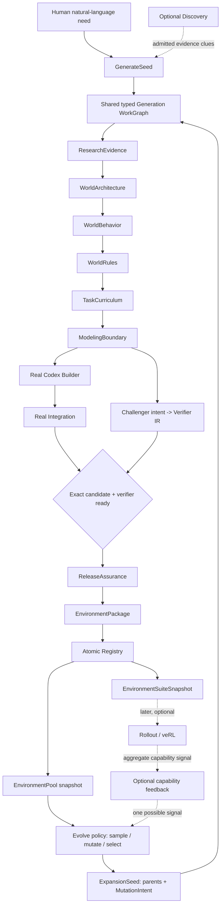
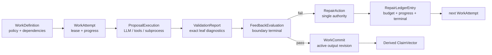
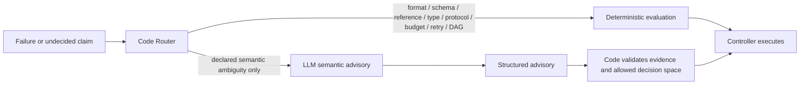
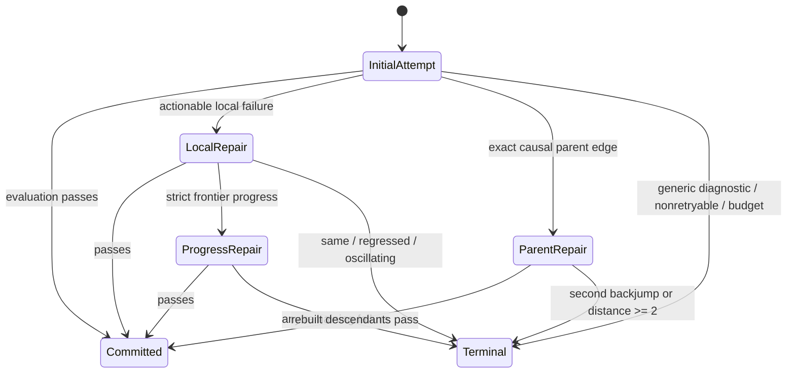

# Feedback Control Plane and Shared Generation WorkGraph

## 1. Architectural invariant

The architecture exists to produce a real programmatic environment, not to maximize Agent
activity or validator count.  A check belongs on the production path only when its result can
change a declared Claim, Artifact readiness, repair route, quarantine or release decision.
Cheap leaf checks remain plentiful, but they are diagnostics inside a transaction rather than
independent workflow authorities.

## 2. Product components and their purpose

| Component | Purpose | Must not own |
|---|---|---|
| FoundryController | Instantiate WorkGraph, schedule work, own leases/budgets/repair/invalidation/readiness | Domain semantics or hand-authored release claims |
| EnvironmentDesigner | Turn grounded evidence into compiled World/Task semantics | Workflow jumps, retry count or release |
| EnvironmentBuilder | Use real Codex codegen to implement one frozen Design as Candidate source | World truth, evaluator reward or release |
| EnvironmentJudge | Independently execute framework-owned checks against exact Candidate bytes | Candidate edits or generated-environment oracle authority |
| EnvironmentRegistry | Atomically publish and reread the exact verified envpkg | Semantic repair or implicit compatibility |

Research, Verifier compilation, Runtime supervision, telemetry and repair routing are
internal services.  Researcher, Environment Engineer and Challenger are Agent roles, not
additional workflow authorities.

## 3. Complete system flow



Direct does not wait for Discovery, Evolve or training.  Evolve does not bypass generation;
it creates a different frozen seed and then produces a complete real environment through the
same graph.  Capability feedback is useful but not required for expansion.

## 4. Shared WorkGraph

### 4.1 Logical versus physical work

Logical stages are the stable product topology.  Physical work is a bounded implementation
detail that may run concurrently and retain successful siblings.

| Logical stage | Physical work | Output coordinate |
|---|---|---|
| ResearchEvidence | plan Agent; real search/fetch/extract; synthesis Agent | `research/evidence` |
| WorldArchitecture | one Engineer proposal and deterministic compile | `design/architecture` |
| WorldBehavior | code coupling plan; optional shared-contract shard; 1–2 tool batches; group closure | `design/behavior/{group,shard}` plus aggregate commit |
| WorldRules | one Engineer proposal over frozen behavior | `design/rules` |
| TaskCurriculum | one Engineer proposal over frozen world | `design/curriculum` |
| ModelingBoundary | deterministic cross-artifact closure | `design/environment` |
| Build | one real codegen workspace with progress journal | `build/candidate` |
| VerifierIntent | bounded Challenger batches compiled to framework IR | `verifier/intent/{shard}` plus aggregate commit |
| Integration | install/static/public/protocol/materializer/deploy probes | `assurance/integration` |
| ReleaseAssurance | added reachability/property/sealed/fresh-release probes | `assurance/release` |
| Package/Registry | exact bytes then atomic publication | `release/package`, `registry/publication` |

WorldBehavior remains logically separate from Architecture and Rules because it is an
independent causal repair unit.  Its physical batches do not become separate release gates.
The old per-field/per-tool microsharded graph is deleted.

### 4.2 Seed adapters

`GenerateSeed` contains the user request and admitted optional clues.  `ExpansionSeed`
contains selected parent package/design refs, MutationIntent, coverage target and admitted
clues.  A deterministic adapter creates a common `GenerationContext`:

- required business capability and scope;
- immutable evidence/source requirements;
- optional parent constraints and permitted delta;
- permissions and hard Budget;
- target identity policy.

Every common stage receives this context.  Expansion proposals produce full stage outputs,
not source-code splice patches.  The compiler checks permitted delta against parents.

## 5. Work and feedback data model



### WorkDefinition

Static executable policy:

- stable `work_id`, logical stage and output coordinate pattern;
- input coordinate patterns and dependency rules;
- ProposalPolicy, ValidationPolicy, optional AssurancePolicy;
- RepairPolicy and invalidation rule;
- required Claim and success maturity;
- hard wall/token/tool/process budgets.

### WorkAttempt / WorkCommit

`WorkAttempt` replaces separate top-level NodeAttempt and semantic transaction attempt
authorities.  It supports parent/child identity for physical shards.  It records lease,
inputs, policy digests, scheduled/start/progress/terminal timestamps and output refs.

`WorkCommit` is the only active-success marker.  An aggregate logical commit binds all
required physical shard commits.  Resume reads these commits; successful sibling commits are
retained if their exact dependencies are unchanged.

### ProposalExecution

Records what expensive work was attempted without granting validity: real InvocationResult,
search/fetch execution, Candidate workspace journal or subprocess evidence.  It owns cost and
capability provenance, not routing.

### ValidationReport

One report per attempt/policy revision.  It contains all safe leaf issues and successful
checks.  Each issue has stable code, path, condition, expected category, phase/frontier and
retryability.  Reports may be frequent and cheap.  They do not authorize retries.

### FeedbackEvaluation

One terminal boundary evaluation per exact subject and policy digest.  It binds the
ValidationReport/real evidence, sets Claim status and readiness effect, and names no trusted
repair owner supplied by an Agent.  Superseded evaluations remain auditable but only the
active digest-bound evaluation contributes to maturity.

### RepairAction / RepairLedgerEntry

`RepairAction` embeds the exact target coordinate, immutable inputs, allowed mutation roots,
causal evidence and decision.  This absorbs separate RepairTarget, ControlEvent and
Disposition authorities.  `RepairLedgerEntry` is the sole durable attempt/budget/progress
record.  Local schema corrections do not additionally produce framework Findings.

`Finding` remains only for cross-boundary execution failure, hard semantic conflict,
permission/risk or release-policy evidence requiring causal attribution.

## 6. Code router and LLM boundary



The router first classifies from typed evidence.  It may request an LLM advisory only when a
registered policy declares the Claim not mechanically decidable, such as conflicting
business evidence or plausibility of a curriculum.  The advisory returns a bounded finding;
code validates references and makes the operational decision.  There is no generic
LLM-as-judge fallback for malformed output.

## 7. Boundary matrix: the ten questions

`L0` means in-process deterministic, `L1` bounded local real tools/subprocess,
`L2` one bounded Agent proposal, and `L3` isolated multi-case assurance.  The executable
policy stores numeric deadlines and limits; these labels are only reporting classes.

| Boundary / Claim and timing | Executor / cost | Owner and minimal repair | Retry / jump | Invalidation / effect |
|---|---|---|---|---|
| Research plan covers workflow/tool/state/authority/error/risk before search | Researcher proposal + code, L2+L0 | `research/plan` | 1 local; second only strict progress / 0 | current research descendants / reject attempt |
| Evidence claims bind fetched passages and preserve conflict/unknown before Design | real search/fetch + Researcher synthesis + code, L1+L2+L0 | `research/synthesis`; fetch infra is separate | 1 local / 0 | EvidenceGraph descendants / block Design |
| Architecture vocabulary closes before behavior | Engineer + code, L2+L0 | `design/architecture` | 1 + progress bonus / 0 | behavior/rules/task/design descendants / block behavior |
| Behavior transition/error/authority/reliability closes before rules | Engineer shards + code, L2+L0 | exact `design/behavior/{group,shard}` or shared group | 1 + progress bonus / 0 | group aggregate and later stages; retain siblings / block closure |
| Reset/global rules close over frozen behavior before tasks | Engineer + code, L2+L0 | `design/rules`; one parent only with exact causal issue | 1 + progress bonus / <=1 | curriculum/design descendants / block task |
| Tasks bind frozen world/tool/reward before Build | Engineer + code, L2+L0 | `design/curriculum` | 1 + progress bonus / 0 | design/build/verifier descendants / block modeling |
| EnvironmentDesign cross-artifact closure before Build | code, L0 | coordinate derived from exact issue path | no blind retry / <=1 | descendants of derived coordinate / block Build |
| Candidate closure before Integration | real Engineer codegen + code checks, L2+L0/L1 | `build/candidate` workspace | 1 + progress bonus / 0 | candidate descendants / block Integration |
| Challenger intent compiles before final Judge join | Challenger + code, L2+L0 | exact `verifier/intent/{shard}` | 1 / 0 | verifier/judge only; never cancel ready Build / block release |
| Candidate installs and Reset/Step/materializer/smoke run immediately after Build | real execution, L1 | candidate by default; Design only with exact one-hop evidence | typed infra retry or 1 owner repair / <=1 | integration/judge/release / block release |
| Reachability/property/sealed/fresh release pass after candidate+verifier join | real execution, L3 | causal Candidate/Task/Verifier coordinate | 1 direct owner repair / <=1 | affected assurance/release / block release |
| Required telemetry is present or explicit unknown before release | code, L0 | telemetry projection only | 0 semantic / 0 | release dossier only / block release |
| Exact package bytes atomically commit and reread at publication | filesystem/code, L1 | publication transaction | idempotent infra resume / 0 | no semantic backjump / establish RELEASED |

## 8. Repair state machine



Progress is computed by code from normalized issue identities, frontier ordinal and lineage:

- `resolved`: no blockers;
- `strict_progress`: blocker set shrank or frontier advanced without reintroducing an ancestor;
- `unchanged`: same normalized blockers and frontier;
- `regressed`: frontier moved backward or resolved blockers returned;
- `oscillating`: a prior normalized state recurs;
- `unknown`: diagnostic quality is insufficient.

Only `strict_progress` grants one final local attempt.  Unknown never spends Agent budget.

## 9. Integration evidence reuse and independence

Integration evidence key:

```text
sha256(candidate_source_digest,
       validation_policy_digest,
       validator_toolchain_versions,
       runtime_profile_or_image_commitment,
       environment_constraints,
       freshness_policy)
```

ReleaseAssurance accepts Integration results only when the key matches exactly.  It then
runs additive reachability, property/behavior, sealed and fresh-release deployment checks.
A fresh deployment remains independent; static/source/public protocol checks are not rerun
merely under a different method name.  Any mismatch makes reuse impossible and is recorded,
not silently approximated.

## 10. Diagnostic lane

Diagnostic execution is a mode of the same WorkGraph scheduler, not a second fake pipeline.
It requires a committed, deterministically valid start Artifact and a bounded stop boundary.

- `--no-rework` disables RepairAction creation while preserving reports and real execution;
- all produced attempts/evaluations carry `diagnostic_only=true` and `releasable=false`;
- no diagnostic output may satisfy a release Claim;
- `retry-node` creates a normal new attempt only after code verifies exact input and
  invalidation scope;
- partial Design is not sent to Builder by default.

## 11. Agent isolation and tools

InvocationBackend resolves an immutable EffectiveProfile per WorkDefinition:

| Role | Skills/tools | Network/write scope |
|---|---|---|
| Researcher | search plan, SearXNG or configured search provider, Jina/HTML extraction and bounded crawl adapters | allowlisted research domains/cache; no Candidate writes |
| Environment Engineer (Design) | semantic authoring instructions; structured output | staged evidence read; own semantic workspace only |
| Environment Engineer (Build) | `agent-world-environment-codegen`; SDK file/process tools | Candidate workspace, dependency domains explicitly granted |
| Challenger | verifier-intent skill; no generated Candidate mutation | frozen Design read; no sealed values or Candidate write |

Hooks and skills are per-profile.  Tool adapters report real calls and sanitized provenance.
The core pipeline depends only on InvocationBackend and typed research/execution interfaces.

## 12. Observability model

Every `WorkAttempt`, Agent invocation, search/fetch/extract, Builder workspace event and Judge
subprocess is a span.  Parent links describe scheduling; Artifact dependency links describe
causality.  Required events are scheduled, started, heartbeat/progress, first-write where
applicable and terminal.

Controller-accounted, backend/provider-observed and upper-bound/unknown usage are separate
fields.  Aggregation produces:

- per-stage and critical-path time distribution;
- token, turn, search, fetch, parser, process and test distribution;
- time-to-first-progress/write and silent-period maxima;
- repair funnel and issue/frontier transition matrix;
- sibling reuse, invalidation and checkpoint hit ratios;
- Integration evidence reuse savings;
- maturity and publication provenance.

Periodic error audit remains a code-generated advisory summary.  It does not add another
Agent to the hot path or automatically change policy.

## 13. Recovery and publication

On restart, Controller rebuilds active state from WorkCommit, terminal FeedbackEvaluation,
RepairLedgerEntry and BudgetLedger.  Running attempts without a terminal event are settled
as interrupted/unknown before rescheduling.  Exactly matching commits are reused; old live
stores are not migrated.

Registry accepts only a package whose source/design/assurance/claim digests match active
commits and whose required usage dimensions are present or explicitly allowed unknown by
release policy.  Publication is atomic and reread-verified.

## 14. Explicit deletions

After replacement regressions pass, delete:

- old per-field/per-tool microsharded Designer and retired skeleton resume helpers;
- component-local semantic retry authorization;
- Evolve monolithic Design success path;
- write-only FeedbackResult and parallel hand-built readiness projection;
- separate routing authority duplicated across RepairTarget/ControlEvent/Disposition;
- duplicate Integration checks in final Judge;
- obsolete feedback doctrine that every leaf validator needs a FeedbackContract.

Historical Artifacts remain read-only bad-case evidence, not compatibility inputs.

## 15. Known hypotheses and non-decisions

- Builder prompt/skill/model is not yet proven to cause long first write; measure in isolated
  real execution before changing prompts.
- Integration/Judge duplicate cost is source-proven but not live-quantified.
- A default provisional Builder is deliberately not introduced until at least ten converged
  live runs show diagnostic benefit.
- The Verifier straggler hang must be isolated from sandbox/subprocess behavior before its
  production supervisor is changed.

