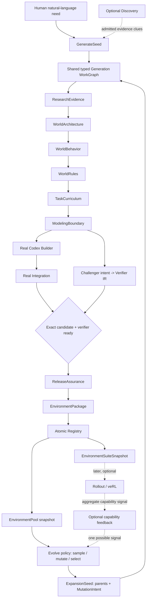
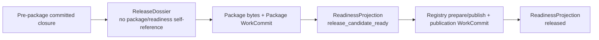
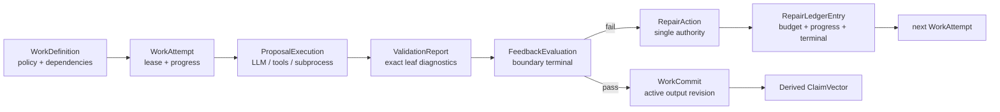
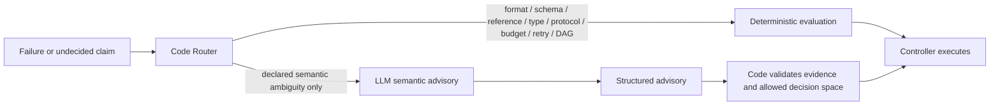
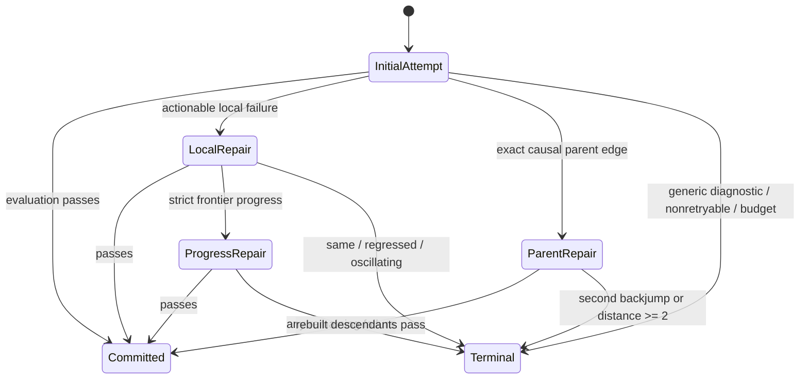
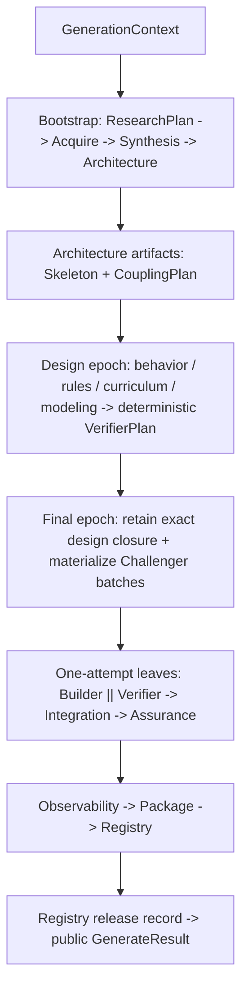

# Feedback Control Plane and Shared Generation WorkGraph

## 1. Architectural invariant

The architecture exists to produce a real programmatic environment, not to maximize Agent
activity or validator count.  A check belongs on the production path only when its result can
change a declared Claim, Artifact readiness, repair route, quarantine or release decision.
Cheap leaf checks remain plentiful, but they are diagnostics inside a transaction rather than
independent workflow authorities.

## 2. Product components and their purpose

| Component | Purpose | Must not own |
|---|---|---|
| FoundryController | Instantiate WorkGraph, schedule work, own leases/budgets/repair/invalidation/readiness | Domain semantics or hand-authored release claims |
| EnvironmentDesigner | Turn grounded evidence into compiled World/Task semantics | Workflow jumps, retry count or release |
| EnvironmentBuilder | Use real Codex codegen to implement one frozen Design as Candidate source | World truth, evaluator reward or release |
| EnvironmentJudge | Independently execute framework-owned checks against exact Candidate bytes | Candidate edits or generated-environment oracle authority |
| EnvironmentRegistry | Atomically publish and reread the exact verified envpkg | Semantic repair or implicit compatibility |

Research, Verifier compilation, Runtime supervision, telemetry and repair routing are
internal services.  Researcher, Environment Engineer and Challenger are Agent roles, not
additional workflow authorities.

## 3. Complete system flow



Direct does not wait for Discovery, Evolve or training.  Evolve does not bypass generation;
it creates a different frozen seed and then produces a complete real environment through the
same graph.  Capability feedback is useful but not required for expansion.

## 4. Shared WorkGraph

### 4.1 Logical versus physical work

Logical stages are the stable product topology.  Physical work is a bounded implementation
detail that may run concurrently and retain successful siblings.

| Logical stage | Physical work | Output coordinate |
|---|---|---|
| ResearchEvidence | plan Agent; real search/fetch/extract; synthesis Agent | `research/evidence` |
| WorldArchitecture | one Engineer proposal and deterministic compile | `design/architecture` |
| WorldBehavior | code coupling plan; optional shared-contract shard; 1–2 tool batches; group closure | `design/behavior/{group,shard}` plus aggregate commit |
| WorldRules | one Engineer proposal over frozen behavior | `design/rules` |
| TaskCurriculum | one Engineer proposal over frozen world | `design/curriculum` |
| ModelingBoundary | deterministic cross-artifact closure | `design/environment` |
| Build | one real codegen workspace with progress journal | `build/candidate` |
| VerifierIntent | bounded Challenger batches compiled to framework IR | `verifier/intent/{shard}` plus aggregate commit |
| Integration | install/static/public/protocol/materializer/deploy probes | `assurance/integration` |
| ReleaseAssurance | added reachability/property/sealed/fresh-release probes | `assurance/release` |
| Package/Registry | exact bytes then atomic publication | `release/package`, `registry/publication` |

WorldBehavior remains logically separate from Architecture and Rules because it is an
independent causal repair unit.  Its physical batches do not become separate release gates.
The old per-field/per-tool microsharded graph is deleted.

### 4.2 Seed adapters

`GenerateSeed` contains the user request and admitted optional clues.  `ExpansionSeed`
contains selected parent package/design refs, MutationIntent, coverage target and admitted
clues.  A deterministic adapter creates a common `GenerationContext`:

- required business capability and scope;
- immutable evidence/source requirements;
- optional parent constraints and permitted delta;
- permissions and hard Budget;
- target identity policy.

Every common stage receives this context.  Expansion proposals produce full stage outputs,
not source-code splice patches.  The compiler checks permitted delta against parents.

### 4.3 Topology epochs, not a second pipeline

The physical member sets for WorldBehavior and Verifier Intent become knowable at different
causal points: grounded Architecture determines tool-coupling batches, while the committed
ModelingBoundary determines the actual TaskCurriculum and therefore the Challenger batch plan.
Freezing a fictitious complete graph before either fact is known would be as misleading as
allowing an arbitrary partial graph to publish. The solution is one Direct Job with three
explicitly linked **topology epochs**, not three workflows:

1. `bootstrap` is diagnostic-only and contains `Intake → ResearchPlan → Acquire →
   EvidenceSynthesis → Architecture`.  It may run real tools and Agent calls, but cannot
   establish any release maturity.
2. The framework derives bounded behavior groups from committed Architecture, retains the exact
   bootstrap commits, and freezes `design`. `design` completes shared/tool semantics, rules,
   curriculum, ModelingBoundary and one deterministic `VerifierPlan`; it cannot publish.
3. The framework freezes `final` only from that committed design closure and its exact
   `VerifierBatchPlan`. It materializes precisely those Challenger batch coordinates, then Build,
   Integration, ReleaseAssurance, Package and Registry coordinates. The Scheduler continues from
   retained commits; it never recomputes prompts or creates a shadow Design. Only `final` is
   eligible for release and it must contain the complete required closure.

`WorkGraphEpoch` binds the same job/context, exact predecessor manifest and retained commit
closure. A successor epoch is rejected if a retained coordinate's definition, inputs or active
commit differs. This gives both dynamic fan-outs a real freeze point while keeping resume, budget
and repair authority singular; the epoch freezes add no Agent turn themselves.

### 4.4 Break the package/readiness cycle

The former package design admitted a Design-only production graph because it embedded a
`WorkReadinessSnapshot` in a `ClaimVector` inside the package, while that snapshot itself needs
the Package WorkCommit.  The resulting cycle was hidden by fixtures, not resolved by code.

The replacement has a strict temporal order:



`ReleaseDossier` is framework-authored pre-package evidence: final graph manifest, exact Design,
Candidate, Verifier, Integration, ReleaseAssurance and telemetry commits/reports, release policy
and their dependency closure.  It contains neither package manifest, reservation nor readiness.
Package metadata binds this dossier reference.  A separately named `PublicationDossier` is
written by Registry only after reservation/staging facts exist.  The retired `ClaimVector` is not
an alternative success authority and is removed from envpkg metadata, Registry validation and
the production controller.

## 5. Work and feedback data model



### WorkDefinition

Static executable policy:

- stable `work_id`, logical stage and output coordinate pattern;
- input coordinate patterns and dependency rules;
- ProposalPolicy, ValidationPolicy, optional AssurancePolicy;
- RepairPolicy and invalidation rule;
- required Claim and success maturity;
- hard wall/token/tool/process budgets.

`WorkDefinition` is a boundary policy, not the whole scheduler.  Before production cutover it
also binds explicit input/output Artifact slot contracts (accepted Artifact types, cardinality,
producer ownership and confidentiality), while graph-level `WorkGroup`/`JoinPolicy` owns dynamic
physical shards and exact aggregate readiness.  This prevents a Builder workspace, Verifier shard
or Judge evidence bundle from being accepted merely because an arbitrary ArtifactRef exists.

### WorkAttempt / WorkCommit

`WorkAttempt` replaces separate top-level NodeAttempt and semantic transaction attempt
authorities.  It supports parent/child identity for physical shards.  It records lease,
inputs, policy digests, scheduled/start/progress/terminal timestamps and output refs.

`WorkCommit` is the only active-success marker.  An aggregate logical commit binds all
required physical shard commits.  Resume reads these commits; successful sibling commits are
retained if their exact dependencies are unchanged.

### ProposalExecution

Records what expensive work was attempted without granting validity: real InvocationResult,
search/fetch execution, Candidate workspace journal or subprocess evidence.  It owns cost and
capability provenance, not routing.

Validation and assurance have symmetric execution records.  `ValidationExecution` accounts for
the deterministic validator revision, elapsed time and actual/unknown process/tool usage;
`AssuranceExecution` binds real probe ids, runtime profile/image commitment, freshness and
evidence refs.  `ValidationReport` is the diagnostic result of those executions, not their cost
or provenance container.

### ValidationReport

One report per attempt/policy revision.  It contains all safe leaf issues and successful
checks.  Each issue has stable code, path, condition, expected category, phase/frontier and
retryability.  Reports may be frequent and cheap.  They do not authorize retries.

### FeedbackEvaluation

One terminal boundary evaluation per exact subject and policy digest.  It binds the
ValidationReport/real evidence, sets Claim status and readiness effect, and names no trusted
repair owner supplied by an Agent.  Superseded evaluations remain auditable but only the
active digest-bound evaluation contributes to maturity.

### RepairAction / RepairLedgerEntry

`RepairAction` embeds the exact target coordinate, immutable inputs, allowed mutation roots,
causal evidence and decision.  This absorbs separate RepairTarget, ControlEvent and
Disposition authorities.  `RepairLedgerEntry` is the sole durable attempt/budget/progress
record.  Local schema corrections do not additionally produce framework Findings.

`Finding` remains only for cross-boundary execution failure, hard semantic conflict,
permission/risk or release-policy evidence requiring causal attribution.

### WorkGroup / JoinPolicy / scheduler

The graph manifest freezes every logical coordinate plus any materialized physical member before
that member may start.  `WorkGroup` defines the member coordinate pattern, bounded fan-out,
aggregate output contract and `all`/explicit-threshold join.  Successful siblings remain active;
failure blocks only the aggregate consumer and never authorizes sibling cancellation or
invalidation by itself.

One scheduler is the only production caller allowed to begin/supersede a WorkAttempt, reserve a
lease, create a RepairAction, invalidate descendants or project readiness.  Components return
proposal/execution evidence only.  Recursive Controller calls and component-owned `while`/retry
loops are forbidden semantic control paths.

## 6. Code router and LLM boundary



The router first classifies from typed evidence.  It may request an LLM advisory only when a
registered policy declares the Claim not mechanically decidable, such as conflicting
business evidence or plausibility of a curriculum.  The advisory returns a bounded finding;
code validates references and makes the operational decision.  There is no generic
LLM-as-judge fallback for malformed output.

## 7. Boundary matrix: the ten questions

`L0` means in-process deterministic, `L1` bounded local real tools/subprocess,
`L2` one bounded Agent proposal, and `L3` isolated multi-case assurance.  The executable
policy stores numeric deadlines and limits; these labels are only reporting classes.

| Boundary / Claim and timing | Executor / cost | Owner and minimal repair | Retry / jump | Invalidation / effect |
|---|---|---|---|---|
| Research plan covers workflow/tool/state/authority/error/risk before search | Researcher proposal + code, L2+L0 | `research/plan` | 1 local; second only strict progress / 0 | current research descendants / reject attempt |
| Evidence claims bind fetched passages and preserve conflict/unknown before Design | real search/fetch + Researcher synthesis + code, L1+L2+L0 | `research/synthesis`; fetch infra is separate | 1 local / 0 | EvidenceGraph descendants / block Design |
| Architecture vocabulary closes before behavior | Engineer + code, L2+L0 | `design/architecture` | 1 + progress bonus / 0 | behavior/rules/task/design descendants / block behavior |
| Behavior transition/error/authority/reliability closes before rules | Engineer shards + code, L2+L0 | exact `design/behavior/{group,shard}` or shared group | 1 + progress bonus / 0 | group aggregate and later stages; retain siblings / block closure |
| Reset/global rules close over frozen behavior before tasks | Engineer + code, L2+L0 | `design/rules`; one parent only with exact causal issue | 1 + progress bonus / <=1 | curriculum/design descendants / block task |
| Tasks bind frozen world/tool/reward before Build | Engineer + code, L2+L0 | `design/curriculum` | 1 + progress bonus / 0 | design/build/verifier descendants / block modeling |
| EnvironmentDesign cross-artifact closure before Build | code, L0 | coordinate derived from exact issue path | no blind retry / <=1 | descendants of derived coordinate / block Build |
| Candidate closure before Integration | real Engineer codegen + code checks, L2+L0/L1 | `build/candidate` workspace | 1 + progress bonus / 0 | candidate descendants / block Integration |
| Challenger intent compiles before final Judge join | Challenger + code, L2+L0 | exact `verifier/intent/{shard}` | 1 / 0 | verifier/judge only; never cancel ready Build / block release |
| Candidate installs and Reset/Step/materializer/smoke run immediately after Build | real execution, L1 | candidate by default; Design only with exact one-hop evidence | typed infra retry or 1 owner repair / <=1 | integration/judge/release / block release |
| Reachability/property/sealed/fresh release pass after candidate+verifier join | real execution, L3 | causal Candidate/Task/Verifier coordinate | 1 direct owner repair / <=1 | affected assurance/release / block release |
| Required telemetry is present or explicit unknown before release | code, L0 | telemetry projection only | 0 semantic / 0 | release dossier only / block release |
| Exact package bytes atomically commit and reread at publication | filesystem/code, L1 | publication transaction | idempotent infra resume / 0 | no semantic backjump / establish RELEASED |

## 8. Repair state machine



Progress is computed by code from normalized issue identities, frontier ordinal and lineage:

- `resolved`: no blockers;
- `strict_progress`: blocker set shrank or frontier advanced without reintroducing an ancestor;
- `unchanged`: same normalized blockers and frontier;
- `regressed`: frontier moved backward or resolved blockers returned;
- `oscillating`: a prior normalized state recurs;
- `unknown`: diagnostic quality is insufficient.

Only `strict_progress` grants one final local attempt.  Unknown never spends Agent budget.

## 9. Integration evidence reuse and independence

Integration evidence key:

```text
sha256(candidate_source_digest,
       validation_policy_digest,
       validator_toolchain_versions,
       runtime_profile_or_image_commitment,
       environment_constraints,
       freshness_policy)
```

ReleaseAssurance accepts Integration results only when the key matches exactly.  It then
runs additive reachability, property/behavior, sealed and fresh-release deployment checks.
A fresh deployment remains independent; static/source/public protocol checks are not rerun
merely under a different method name.  Any mismatch makes reuse impossible and is recorded,
not silently approximated.

## 10. Diagnostic lane

Diagnostic execution is a mode of the same WorkGraph scheduler, not a second fake pipeline.
It requires a committed, deterministically valid start Artifact and a bounded stop boundary.

- `--no-rework` disables RepairAction creation while preserving reports and real execution;
- all produced attempts/evaluations carry `diagnostic_only=true` and `releasable=false`;
- no diagnostic output may satisfy a release Claim;
- `retry-node` creates a normal new attempt only after code verifies exact input and
  invalidation scope;
- partial Design is not sent to Builder by default.

## 11. Agent isolation and tools

InvocationBackend resolves an immutable EffectiveProfile per WorkDefinition:

| Role | Skills/tools | Network/write scope |
|---|---|---|
| Researcher | search plan, SearXNG or configured search provider, Jina/HTML extraction and bounded crawl adapters | allowlisted research domains/cache; no Candidate writes |
| Environment Engineer (Design) | semantic authoring instructions; structured output | staged evidence read; own semantic workspace only |
| Environment Engineer (Build) | `agent-world-environment-codegen`; SDK file/process tools | Candidate workspace, dependency domains explicitly granted |
| Challenger | verifier-intent skill; no generated Candidate mutation | frozen Design read; no sealed values or Candidate write |

Hooks and skills are per-profile.  Tool adapters report real calls and sanitized provenance.
The core pipeline depends only on InvocationBackend and typed research/execution interfaces.

## 12. Observability model

Every `WorkAttempt`, Agent invocation, search/fetch/extract, Builder workspace event and Judge
subprocess is a span.  Parent links describe scheduling; Artifact dependency links describe
causality.  Required events are scheduled, started, heartbeat/progress, first-write where
applicable and terminal.

Controller-accounted, backend/provider-observed and upper-bound/unknown usage are separate
fields.  Aggregation produces:

- per-stage and critical-path time distribution;
- token, turn, search, fetch, parser, process and test distribution;
- time-to-first-progress/write and silent-period maxima;
- repair funnel and issue/frontier transition matrix;
- sibling reuse, invalidation and checkpoint hit ratios;
- Integration evidence reuse savings;
- maturity and publication provenance.

Periodic error audit remains a code-generated advisory summary.  It does not add another
Agent to the hot path or automatically change policy.

## 13. Recovery and publication

On restart, Controller rebuilds active state from WorkCommit, terminal FeedbackEvaluation,
RepairLedgerEntry and BudgetLedger.  Running attempts without a terminal event are settled
as interrupted/unknown before rescheduling.  Reuse requires exact inputs and acceptance identity,
while new execution and repair continue to use full definition and repair-epoch identities.  A
policy-only budget/recovery change therefore cannot invalidate a successful semantic Artifact,
but a Claim, transform, validator executable revision, assurance or maturity change does.  Old
live stores are not migrated.

Registry accepts only a package whose source/design/assurance/claim digests match active
commits and whose required usage dimensions are present or explicitly allowed unknown by
release policy.  Publication is atomic and reread-verified.

## 14. Explicit deletions

After replacement regressions pass, delete:

- old per-field/per-tool microsharded Designer and retired skeleton resume helpers;
- component-local semantic retry authorization;
- Evolve monolithic Design success path;
- write-only FeedbackResult and parallel hand-built readiness projection;
- separate routing authority duplicated across RepairTarget/ControlEvent/Disposition;
- duplicate Integration checks in final Judge;
- obsolete feedback doctrine that every leaf validator needs a FeedbackContract.

Historical Artifacts remain read-only bad-case evidence, not compatibility inputs.

## 15. Known hypotheses and non-decisions

- Builder prompt/skill/model is not yet proven to cause long first write; measure in isolated
  real execution before changing prompts.
- Integration/Judge duplicate cost is source-proven but not live-quantified.
- A default provisional Builder is deliberately not introduced until at least ten converged
  live runs show diagnostic benefit.
- The Verifier straggler hang must be isolated from sandbox/subprocess behavior before its
  production supervisor is changed.

## 16. 2026-07-21 production cutover decision: one Direct runner, never an adapter

The audit found that the implementation cannot safely switch `FoundryController.generate()` by
wrapping the existing `EnvironmentDesigner.generate()` in one Scheduler leaf. That method owns
its own `WorkControlRuntime`, component-local correction loop, historical feedback writes and
multi-node commits. Treating it as one proposal would create two active retry/commit authorities
inside one WorkAttempt and would hide the actual causal owner of a failed semantic transaction.

The replacement is a **DirectWorkRunner**, not a compatibility adapter. It is the sole
production caller of `WorkScheduler` and receives only immutable `GenerationContext`, exact
components, a per-run workspace root and the `TelemetryStore` trace identity. It has no LLM
prompt logic, no semantic retry loop and no release projection. Its responsibility is restricted
to: freeze topology, resolve the executor by exact `work_id`, run ready work, persist epoch
boundaries, and translate the resulting active Registry commit into the public `GenerateResult`.



### 16.1 Leaf contract

Every leaf gets only `WorkExecutionContext` and its already-open `WorkAttempt`. It performs one
of three bounded proposal kinds and returns immutable outputs through `SchedulerLeafExecutor`:

| Leaf family | Real work | Framework-owned validation / output |
|---|---|---|
| Research plan, synthesis, Architecture, behavior, rules, curriculum | exactly one real structured `InvocationBackend` turn using the role-isolated profile | typed source artifact plus deterministic compiler validation; a failed schema returns `ValidationIssue` paths, never an exception string |
| Acquisition | exactly one bounded `ResearchToolchain.run(search, fetch, extract)` | normalized source/evidence/passage artifacts and measured tool counts |
| Modeling | no Agent | compile the exact Design closure and policy gate |
| Build / Verifier / Integration / Assurance / Package / Registry | existing real one-attempt leaves | their own typed independent evidence and the common kernel |

The shared `one_structured_turn` helper may resolve a profile and invoke the real backend once,
but it must not call `FeedbackContract`, `RepairLedger`, `WorkControlRuntime.begin`,
`execute_structured_work`, or a component-local retry loop. Agent output errors are translated
to a safe `LeafValidationFailure` while retaining actual invocation provenance; the Scheduler is
the only code that may create a repair attempt.

### 16.2 Three topology epochs

Bootstrap is diagnostic-only because Architecture is needed to discover the bounded tool
coupling/behavior shard set. It contains exactly `research_plan`, `evidence_acquisition`,
`evidence_synthesis` and `world_architecture`. Once Architecture commits, framework code derives
the coupling plan from the exact Architecture artifact; no Agent chooses graph coordinates. It
then freezes the non-releasable `design` graph, retaining the four byte-identical bootstrap
commits and completing ModelingBoundary plus a deterministic `VerifierPlan`. Only after that plan
commits does it freeze the releasable `final` graph, retaining the exact design closure and
materializing precisely its real Challenger batches plus Build through Registry. A successor graph
with a missing retained commit, changed predecessor definition/input, invented batch count, or a
Modeling-only terminal is rejected before any Builder call.

### 16.3 Repair and recovery decisions

- A deterministic proposal/schema failure returns one complete `ValidationReport`; it can receive
  at most the WorkDefinition's Scheduler-authorized local correction.
- Acquisition transport failure is `real_tools` infrastructure recovery only. It cannot ask the
  Researcher to rewrite a plan unless a distinct plan validation claim fails.
- Modeling, Package, observability and Registry have zero semantic correction budget. Registry
  may reconcile only an idempotent/queryable durable publication transaction.
- A direct parent route is explicit only for Integration/ReleaseAssurance -> Build; design leaves
  do not infer cross-stage backjumps from category text.
- On restart, the runner restores frozen epoch/active commit closure before scheduling; no legacy
`DirectJobSnapshot`, `ClaimVector` or component session becomes release evidence.

### 16.5 Implemented first slice (2026-07-21; not yet a production cutover)

The first two primitives now exist and are covered by Scheduler integration tests:

1. `designer.one_shot.invoke_structured_once` resolves one isolated profile and makes **one**
   backend call using the existing Scheduler `dispatch_id` as its invocation identity. It has no
   session continuation, no `FeedbackContract`, no `RepairLedger`, and no retry. JSON transport,
   Pydantic shape, and typed semantic errors become safe path-addressed `LeafValidationFailure`;
   an untyped validator error becomes non-retryable `framework_diagnostic_incomplete`.
2. `designer.ResearchPlanLeaf` loads only the immutable `GenerationContext`, proves the
   context/job/request/permission closure, invokes that one-shot primitive, and commits an exact
   `design.research_plan` Artifact through `SchedulerLeafExecutor`.
3. Scheduler input resolution and committed-work reuse derive one identical input closure:
   the immutable external root plus only the typed parent consumer refs allowed by the child’s
   declared `input_slots`. Parent `WorkCommit` refs remain causal lineage but are not blanket
   data disclosure. This prevents both an old downstream commit surviving a changed root and a
   least-privilege downstream commit being falsely marked `stale` during recovery.

The integration tests use a protocol boundary double only to make malformed/valid structured JSON
deterministic. They prove no hidden local retry and real Artifact/WorkControl state transitions;
they are explicitly **not** a claim that Research, Build or Registry live E2E has run. The next
slice is Acquisition, where real `ResearchToolchain.run()` must execute outside the WorkHead lock
and produce an exact evidence/passage closure before Synthesis can be added.

### 16.6 Research bootstrap closure implemented (2026-07-21; not live E2E)

The bootstrap now covers all three research boundaries under one Scheduler graph:

1. `research_plan_work_definition` declares the external `GenerationContext` input and exactly one
   ResearchPlan output; it prevents a root-only plan from hiding Controller state.
2. `ResearchAcquisitionLeaf` calls the real `ResearchToolchain.run()` after Scheduler has opened
   its Proposal OperationRun, then commits a public `ResearchAcquisition`, hash-bound passage pack
   and every raw/metadata/extracted source ref. `ResearchBundle` now counts `search_calls`,
   `fetch_calls` and `extract_calls`; all three contribute to `tool_calls` and telemetry.
3. `research_synthesis_work_definition` accepts only the context plus that committed acquisition
   closure. `EvidenceSynthesisLeaf` receives one tool-free Researcher turn, validates every claim
   reference against the exact evidence ids and persists the derived EvidenceGraph. It cannot read
   Designer state or initiate research.

The local integration regression executes those three WorkDefinitions with the actual toolchain
protocol and materializer. Its model transports are test doubles solely for deterministic schema
coverage; it is not a live Search/provider or release claim.

### 16.7 Architecture bootstrap closure implemented (2026-07-21; not live E2E)

`world_architecture_work_definition` now consumes exactly the external GenerationContext plus the
committed EvidenceSynthesis/EvidenceGraph lineage and produces exactly three artifacts:
`design.world_architecture_source`, `design.world_skeleton`, and
`design.tool_coupling_plan`. `WorldArchitectureLeaf` invokes one isolated Engineer turn, sees a
bounded claim/conflict/unknown catalog rather than raw source bodies, and immediately calls the
stateless deterministic compiler. It has no Designer session, feedback ledger, retry loop, or
mutable evidence cache.

The compiler was made class-bound rather than instance-bound and is exposed through a narrow
pure compilation module; this reuse is deliberately limited to schema/coupling mechanics, not the
legacy Designer orchestration. A single explicit adapter maps the WorkGraph identifier
`environment_engineer` to the pre-existing isolated profile capability identifier
`environment-engineer`; individual leaves cannot choose or alias profiles.

The four-node regression runs `ResearchPlan -> real local Search/Fetch/Extract ->
EvidenceSynthesis -> WorldArchitecture`, validates all artifact slots/closures, then freezes a
diagnostic bootstrap epoch. The model transports remain local protocol doubles only for a
deterministic Scheduler/Artifact assertion. This proves neither a real provider search nor a
released environment. The next boundary is final-epoch derivation from the committed coupling
plan, followed by behavior/rules/curriculum/modeling leaves.

### 16.4 Controller deletion boundary

`FoundryController.generate()` now delegates only to `DirectWorkRunner`; the Runner is the sole
Direct production work graph owner from Research through Registry. The old `_run_design`, old
`FeedbackContract`/`RepairLedger` success path, pre-Scheduler package projection and component
semantic retry loops must remain unreachable from this route and be deleted rather than retained
as fallback authority. A deterministic Package-to-Registry closure test now drives the real
Scheduler, PackageLeaf, Registry filesystem transaction and final `WorkCommit`; it is evidence
for the framework closure only. It is not a live hotel end-to-end acceptance, which still needs
a real provider-backed Request-to-Registry run.

### 16.8 Provider-compatible logical output delivery

`ResolvedAgentProfile.output_schema` remains the authoritative local typed contract. A
`json_envelope` provider transport constrains only one outer object with an `artifact_json` string;
the decoded inner object is always parsed by the original Pydantic model and then by the unchanged
deterministic compiler. It is never an alternate success path.

Some compatible gateways reject a recursive JSON Schema when it is copied verbatim into the model
prompt, even when they accept the shallow outer schema. For such a measured profile, a Rule-bearing
leaf must pass a versioned compact output protocol instead of the generated recursive JSON Schema.
That protocol may describe only a strict, framework-supported subset of the logical Rule ADT and
must name exact required roots, bounded term forms and forbidden raw bindings. It must not hide a
field, add a free-form expression language, or change the local Pydantic/compiler ABI.

Each compact protocol needs (1) a deterministic test that a conforming document parses into the
unchanged source model, (2) a negative test proving malformed/raw/unbound forms still fail at the
same local boundary, and (3) a real transport probe recording only profile/model digest, safe
terminal category and token counts. Full E2E remains the only release evidence.
