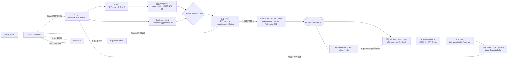

# Agent World Foundry

本项目是一个可执行的 loop-engineering 环境工厂：人只需给出自然语言需求，框架代码负责真实
检索、隔离 Agent 调用、WorldSpec、Runtime 代码生成、独立验证、定向返工和 Registry 发布，最终
产出可供后续 Agent 训练/评测使用的程序化 `EnvironmentPackage`。状态转移由生成的程序执行，
不是由 LLM 在 rollout 时临场编造，也不存在模板、mock 或 replay 成功路径。

Direct Generation 始终可以从人的需求独立启动；Discovery 是非阻塞的覆盖补充，Evolve 是可选的
tool-first 环境扩展通道；Direct 与 Evolve 最终进入同一条 WorldSpec → Task/Verifier/Implementation
→ Builder → Judge → envpkg v3 成功路径。系统只设 Researcher、Environment Engineer、Challenger
三种隔离 Agent 角色；代码框架拥有 Artifact、Gate、预算租约、返工 DAG 与发布权。Evolve 优先改变
Agent 可见工具面、工具语义、状态约束和任务范围，源码改写只是重新实现新语义的手段。



`ExpansionSource`、Policy 和 Operator 都不发布环境；Evolve 会把每个语义变异交回共享 Designer，
生成完整 WorldSpec、Runtime、任务和 verifier，再重新通过 Builder、Judge 与 Registry。训练反馈可以
不存在，也不能当作世界事实或发布证据。

唯一项目目标源文档：

- [docs/agent-world-environment-generation.zh.md](docs/agent-world-environment-generation.zh.md)

背景材料：

- [docs/loop-engineering.md](docs/loop-engineering.md)

配置说明：

- [docs/configuration.zh.md](docs/configuration.zh.md)

## 直接执行

先复制并修改 [`config/agent-world.example.toml`](config/agent-world.example.toml)，然后运行：

```bash
uv sync
uv run agent-world --config /path/to/agent-world.toml doctor
uv run agent-world --config /path/to/agent-world.toml doctor --production
uv run agent-world --config /path/to/agent-world.toml generate \
  --request-id 'request:local-business-v1' \
  --need '构造一个本地商家订单、库存和退款协作环境'
uv run agent-world --config /path/to/agent-world.toml registry list
uv run agent-world --config /path/to/agent-world.toml registry inspect PACKAGE_ID VERSION
uv run agent-world --config /path/to/agent-world.toml expand start \
  --campaign-id 'campaign:local-business-expansion-v1' \
  --anchor 'PACKAGE_ID@VERSION' \
  --target tool_semantics \
  --target transition_constraints \
  --source 'source:tool-ecosystem' \
  --source 'source:random-theme'
uv run agent-world --config /path/to/agent-world.toml expand inspect \
  'campaign:local-business-expansion-v1'
uv run agent-world --config /path/to/agent-world.toml expand resume \
  'campaign:local-business-expansion-v1'
uv run agent-world --config /path/to/agent-world.toml suite create \
  --package 'PACKAGE_ID@VERSION=1.0' \
  --max-steps 128
uv run agent-world --config /path/to/agent-world.toml suite start SUITE_SNAPSHOT_ID --seed 8459123
uv run agent-world --config /path/to/agent-world.toml suite rollout SUITE_SNAPSHOT_ID \
  --seed 8459123 \
  --action 'TOOL_ID={"argument":"value"}'
uv run agent-world --config /path/to/agent-world.toml feedback record SUITE_SNAPSHOT_ID \
  --signal '{"signal_type":"coverage_gap","capability_dimension":"refund_compensation","sample_count":24,"confidence":0.85,"gap":"low_success","severity":0.7}'
```

命令结果写为 JSON 到 stdout，错误写为 JSON 到 stderr。`generate` 只有真正发布时返回 0；诚实的
非发布终态返回 2。`expand start` 只接受 Registry 中仍为 released 的精确 manifest 锚点；必填的
`--campaign-id` 是外部工作开始前确定的持久幂等/恢复键。命令会冻结 Pool、Inbox、SourceCatalog、
OperatorCatalog 和可选 feedback，先执行所选真实 Source，再执行可替换 Policy 的 ask/tell，并让
每个候选重新通过完整的 Designer、Builder、Judge 与 Registry 门禁。省略 `--source` 时使用配置的
`default_source_ids`。Campaign 可恢复、使用独占 head/CAS 和分维预算租约，不依赖 rollout 或训练
反馈。

`feedback record` 只接受绑定不可变 SuiteSnapshot 的封闭聚合统计，不接受原始 task、轨迹、
EvaluatorGoal、Verifier IR、sealed case 或所谓 Oracle。命令返回精确 `feedback_ref`；需要时可把其
revision 通过 `expand start --feedback-revision SHA256_REVISION` 冻结进后续 Campaign。Feedback 只
帮助 Source/Policy 排定覆盖优先级，不是 WorldSpec evidence，也不能改变历史 release verdict。

`suite create` 只接受仍为 released 且物理哈希复验通过的精确版本，并把 package digest、manifest
hash、权重和 curriculum policy 固定到不可变快照。`suite start` 会真实完成 clean build、隔离启动、
Task Materialization v3 和 reset，只输出 `PublicTask + agent-visible reset + tools`；调用方据此选择动作后，
用相同 snapshot/seed 调用 `suite rollout`，CLI 会在新的干净隔离中确定性重建该 episode 并执行动作。
Python 的交互式 `LocalEpisode.start/step/close` 是可信框架控制对象，不能直接交给不可信训练 Agent
或与其共享进程。EvaluatorGoal、initial config、snapshot 和 Rule IR 始终留在可信服务进程。真实训练
接入使用 `LocalEnvServiceProcess.launch(...)` 启动单会话服务，只把它的
`LocalEnvRpcClient` 交给训练适配器；客户端通过带认证、大小限制和超时的 Unix-socket JSONL 执行
`start/step/result/close`，无需 mount envpkg，也拿不到 Registry 路径、package 对象或 evaluator 状态。
训练启动器仍须把 Agent 进程放进不含 `state_root`/envpkg 的 mount/PID sandbox；RPC 边界不会撤销
调用方原本就拥有的宿主机文件权限。

`generate --request-id` 是持久化幂等合同，不是日志标签。同一 id 与完全相同的
request、权限、生成/发布预算和 Discovery 策略再次提交时，已完成的任务直接校验
Artifact checkpoint 与 Registry 中的精确 package digest，然后返回原 `GenerateResult`；
不会再调用 Agent、重新构建或再次发布。同一 id 与不同语义会拒绝为
`direct_request_conflict`。

进程中断时，Controller 会识别持久 checkpoint；如果 Registry 已经用该 job 的独占
reservation 完成发布，就从 Registry 事实自动补齐最终 snapshot/result。其他
无法证明安全的中间状态会返回 `direct_resume_required`，不会把未知的 Agent/tool
消耗当作没发生过并盲目重放。

验证入口：

```bash
uv run pytest tests/agent_world
```
