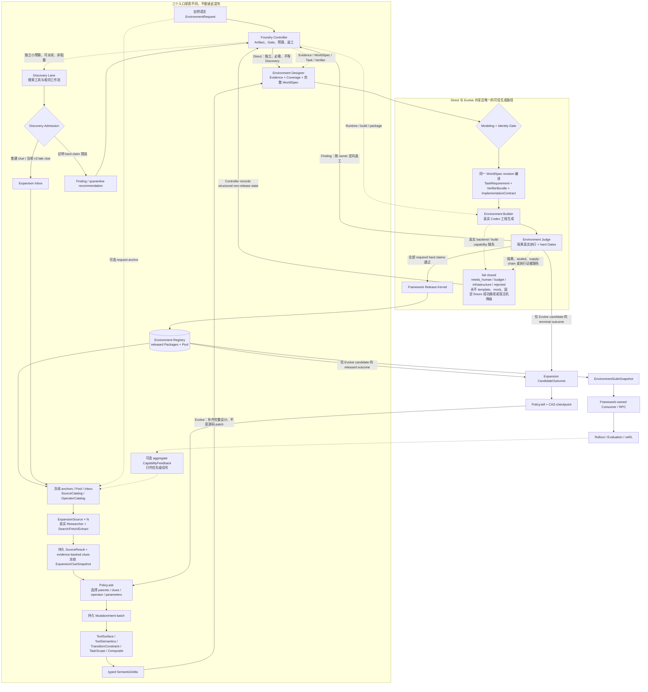
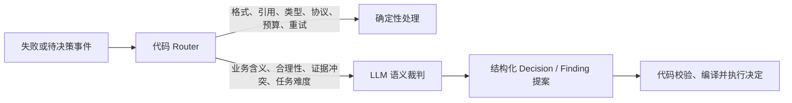
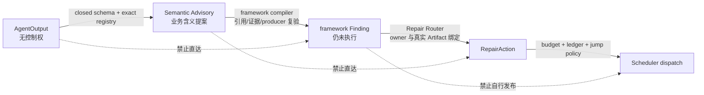
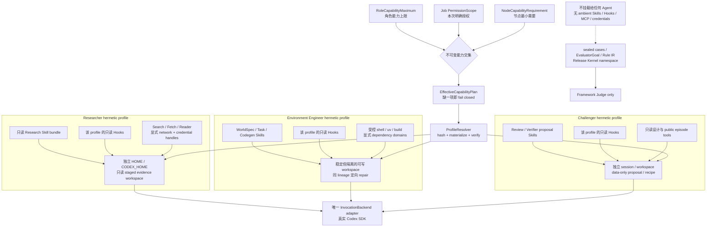
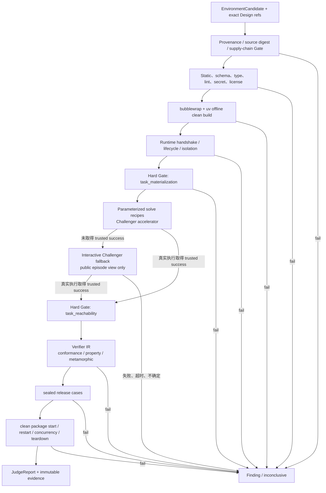
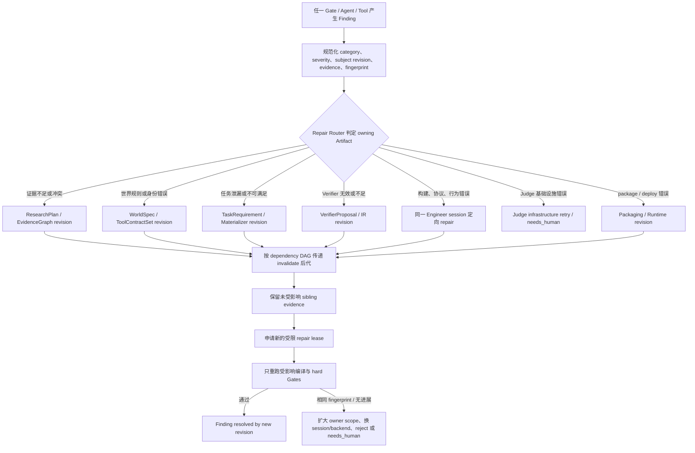
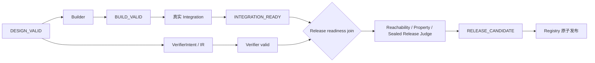
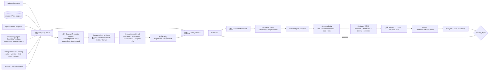

# Agent World 程序化环境 Foundry：目标合同与整体结构

本文是项目源文档。代码、测试、Trellis 任务、历史会话和研究笔记若与本文冲突，以本文为准。

本文同时承担两种职责：

- **目标合同**描述系统最终必须满足的产品、信任和接口边界，是规范性要求；
- **实现状态**只描述当前仓库已经具备、正在迁移和尚待验收的能力，不把目标设计虚构为已完成。

## 1. 项目目的：自动生产可信、可训练使用的程序化 Agent 环境

本项目要把一条自然语言需求自动编译成真实可执行的 Agent 环境：

```text
自然语言需求
  + 可选的非阻塞 Discovery
  + 可选的 tool-first Evolve
-> 真实 Agent 调研与设计
-> 由程序执行状态转移的环境
-> 独立真实执行验证
-> 对失败 Artifact 定向返工
-> 发布 EnvironmentPackage
-> 后续 local rollout / evaluation / veRL
```

用户不需要预先写出完整状态机、工具合同、任务集、测试和实现。系统应在尽量少的人类参与下完成需求研究、工具生态发现、世界建模、任务与评测设计、代码生成、隔离执行、失败修复和发布。只有权限、凭证、高风险歧义、外部副作用或发布政策确实需要决策时才询问人。

环境在 rollout 时必须由真实程序执行状态转移。LLM/Agent 负责开放语义工作，但不能临场用文本扮演世界、伪造工具执行结果、决定 reward/termination 或自行宣布发布成功。这样得到的环境才可以晚些时候被本地 Agent、评测系统或 veRL 等强化学习框架消费；训练不是 Generation 或 Evolve 的前置条件。

本项目解决四类根本问题：

- LLM 文本世界模型的状态转移可能幻觉、矛盾或泄漏目标；
- 人工逐个研究、编写、部署和测试环境无法扩展；
- 单份需求、单轮研究和有限人工检索总会遗漏工具、约束、失败模式与相邻工作流；
- LLM 生成的世界、任务、代码和 verifier 可能不可执行、同质化、互相迁就或作弊。

因此系统采用 Loop Engineering：**代码掌控工作流、Artifact、证据、权限、预算 lease、Gate、返工、失效传播和发布；真实 Agent 只完成受边界约束的研究、设计、实现、审查和修复。**

全系统只定义三种可复用 Agent 角色：`Researcher`、`Environment Engineer` 和 `Challenger`。静态检查、schema compiler、Runtime Supervisor、Verifier IR 执行器、预算账本、Repair Router、Release Kernel 和 Registry 都是确定性的 framework 组件，不包装成更多 Agent。

## 2. 总体产品结构

### 2.1 主流程



这张图表达六条不可破坏的关系：

1. Direct Generation 是核心路径，永远不经过 Evolve，也不等待 Discovery；
2. Discovery 可以与 Direct 并行，但只产生 evidence-backed clue，不能自行修改 Design 或发布环境；
3. ExpansionSource 只做真实研究并产生 clue；Policy 只选择，Operator 只产生 typed delta，三者都不能写候选或发布；
4. Evolve 是可选的环境覆盖扩展器；Designer 必须把每个 SemanticDelta 补齐为完整 WorldSpec、任务、verifier 与实现合同，因此 Evolve 产生的是真实完整环境候选，不是 patch 或 metadata；
5. Direct 与 Evolve 最终都进入同一条 `WorldSpec -> Task/Verifier/Implementation -> Builder -> Judge -> Release` 信任路径；
6. rollout/veRL 是发布后的 consumer，CapabilityFeedback 可缺失且不是世界证据；删除训练侧代码也不影响 Generation 和 Evolve。

### 2.2 三条产品路径

#### Generation：核心必需路径

输入一个 `EnvironmentRequest`，输出一个 released `EnvironmentPackage`，或结构化的 `rejected`、`needs_human`、`budget_exhausted`。成功不依赖 EnvironmentPool、Evolve、Suite、rollout 或训练反馈。

Designer 对外只暴露经过 framework typed validation 的 `evidence_graph` `DesignPhaseCheckpoint`，它绑定同一 `EnvironmentJob`、`EnvironmentRequest` 与完整证据 DAG。恢复时复用该 EvidenceGraph，且本次恢复的 search/fetch/Researcher 调用为零。其后的 WorldArchitecture、SharedToolSemantics、ToolSemanticsBatch、WorldRules 和 TaskCurriculum 不暴露为可任意采用的 phase checkpoint；每个事务只能在 Source/derived Artifacts、当前 compiler 的 `ValidationReport`、唯一 terminal `FeedbackEvaluation` 全部完成后写一个 framework-owned `WorkCommit`。跨进程恢复必须同时验证 coordinate、精确 immutable dependencies、当前 `acceptance_digest` 和未失效 WorkCommit；`acceptance_digest` 绑定 Claim、依赖拓扑、输出契约、acceptance transform、显式 validator executable revision、assurance 要求和 success maturity。完整 `definition_digest` 仍绑定新 Attempt 的执行预算与权限，`repair_epoch_digest` 仍绑定失败/返工授权，但这些未来执行策略的变化不得追溯性地使已经通过且 acceptance 不变的成功失效。单独 Source、审计事件、未完成模型输出或旧控制对象均无恢复资格。需求语义变化、跨 request 复用、证据过期或来源失效不得隐式采用旧证据，必须进入显式 freshness/adoption policy。

首次通过 Modeling Gate 时，Controller 仍固化 `DesignBaselineCheckpoint`。Controller 不会为了制造“基线前接入”而等待 Discovery，也不会伪称 late evidence 已进入当前 Design：完成的 clue 先确定性写入 provisional Expansion Inbox，再由独立 admission 细化；未完成 work 写成 deferred state，可由 `agent-world discovery resume DISCOVERY_RUN_ID` 在新独立预算下恢复。任何时刻证明 hard claim、工具语义、安全规则或 fidelity 声明错误的新证据仍必须形成 Finding 与 `quarantine_recommended` 信号；真正 quarantine 由框架独立证据政策决定，不能由 LLM admission 单独执行。

#### Evolve：可选独立路径

Evolve 解决“一次需求和一次检索覆盖不足”，不是首包生成器的前置阶段。Campaign 可以围绕 request/package anchor、冻结的 Pool/Inbox snapshot 和外部 source 反复采样、变异、构建、验证和选择候选。它不需要训练反馈；训练反馈只是可选输入。

Evolve 的主要 genotype 是 Agent 真正感知的工具与世界语义：tool surface、tool semantics、状态/转移约束和任务范围。源码复用、重构或重写只是 Builder 的 implementation strategy，不是环境进化本身。

Campaign 在第一次 `Policy.ask` 之前先冻结 Source catalog，并为每个选中的 Source 持久化 request、预算 lease、terminal result 与 clue snapshot。Source 可以从 requirement gap、Web workflow、tool ecosystem、repository、Pool neighborhood、random theme 或可选 capability gap 扩大搜索范围，但它不选择候选、更不生成 Runtime。普通的 `insufficient_evidence`、`input_rejected`、预算或基础设施结果可以留下空 clue 后让 Policy 继续从冻结 Pool/Inbox 采样；`needs_human` 会在第一次 ask 前停止。这样外部发现是可审计输入而不是 Evolve 的隐式副作用，且 Source 不可用时不会伪造 evidence。

Policy 产生的 `MutationIntent` 经过 framework admission 和 Operator materialization 后只是一个有 provenance 的语义变化提案。Environment Designer 必须重新研究缺口、形成完整 ToolContractSet/WorldSpec、做 identity decision 并编译完整任务/评测/实现合同；随后 Builder 真正生成代码，Judge 真正运行，Registry 才可能发布。因此“Evolve 负责生成环境”是指它驱动同一完整 Foundry 路径，而不是 Policy 或 Operator 自己写一个半成品环境。

#### Consumption：可选下游路径

Consumption 从 Registry 获取精确 package version/hash，创建不可变 `EnvironmentSuiteSnapshot`，再通过 framework-owned RPC 服务执行 episode。Consumer 不修改历史 release verdict，不进入 Generation 的成功条件，也不把模型推理、token bookkeeping 或 optimizer 耦合进 Runtime。

### 2.3 顶层只保留五个组件

产品只暴露 `FoundryController`、`EnvironmentDesigner`、`EnvironmentBuilder`、`EnvironmentJudge` 和 `EnvironmentRegistry` 五个主要组件。EvidenceGraph、CoverageMap、Artifact DAG、Agent profiles、Runtime Supervisor、Verifier IR、Repair Router 和 Consumer service 是内部机制，不扩张成平级微服务。

五个组件通过四个稳定工作 envelope 和 typed Artifact refs 交接：

- `EnvironmentJob`：Generate 或 Expand 工作请求；
- `EnvironmentDesign`：证据、覆盖、WorldSpec、Task/Verifier/Implementation 要求和 lineage；
- `EnvironmentCandidate`：可构建源码闭包、协议描述和 package draft；
- `JudgeReport`：verdict、硬声明、Finding、证据、成本和执行指标。

released `EnvironmentPackage` 是最终产物，也是唯一基本生成、验证、版本和发布单位。

## 3. 权威对象与边界

### 3.1 EnvironmentRequest

入口包含自然语言需要、可选 PRD/repo/schema、允许来源、fidelity、权限、风险、预算与 release profile。需求可以很短。Researcher 负责研究可研究的缺失信息；framework 对无法安全推断的权限、凭证和高风险歧义进入 `needs_human`。

### 3.2 EvidenceGraph 与 CoverageMap

`EvidenceGraph` 保存 source、版本、抓取时间、内容哈希、许可/风险、observed claim、inference、product decision、assumption、冲突和 tool surface。模型记忆、搜索标题或用户原始文本不能冒充已验证外部证据。

`CoverageMap` 是向量和缺口集合，不是单一分数。它分别记录 evidence discovered、WorldSpec modelled、Runtime implemented、Verifier covered 和 unknown，至少覆盖：

- actors、roles、identity、permission 和 visibility；
- entities、resources、tools、actions 和 observation；
- precondition、transition、postcondition 和 invariants；
- errors、partial failure、rollback、compensation；
- time、order、expiry、concurrency 和 idempotency；
- task types、difficulty、termination、fidelity 和 known divergence。

`unknown` 只表示尚未处置、会阻塞当前 release profile 的问题；已经明确排除的能力边界必须进入 `known_divergence`，已经由冻结 WorldSpec 决定的模拟政策必须形成 `product_decision Claim + synthetic_policy FidelityStatement`，不能继续以裸 `unknown` 重复触发 Modeling Gate。框架将 EvidenceGraph、EnvironmentDesign、WorldSpec 和每个 CoverageDimension 中的待决项按稳定 issue id 聚合，同时保留全部来源；Assumption Closure 一次只对这些 typed issue 作 `product_decision / bounded_out_of_scope / needs_human` 处置，再确定性更新各来源 Artifact。显式的 `EnvironmentRequest.unknowns_requiring_human` 不允许模型代替人闭合。

### 3.3 WorldSpec 与 ToolContractSet

`WorldSpec` 是任务、Runtime 和 verifier 的唯一 typed 语义中枢。它定义 `WorldBoundary`、状态 schema、工具、规则、错误、权限、不变量、task dimensions、fidelity 和 rule-to-evidence links。三个编译分支不得分别从 prompt 发明三个不同世界。

`ToolContractSet` 描述 Agent 能观察和调用的交互面。每个 ToolContract 至少包含：

```text
id / namespace
argument / result / error schema
visibility / permission
precondition / transition / postcondition refs
observation projection
idempotency / retry / timeout
transaction / rollback / concurrency
evidence / fidelity refs
runtime binding profile
```

### 3.4 EnvironmentPackage、Episode 与身份

一个 package 由稳定 `package_id` 和不可变 version/hash 标识。Package 不是固定 task、固定轨迹或单个 episode，而是在同一世界规则下生成许多未知 seed、目标、初态和难度的参数化环境能力。

`WorldBoundary` 根据主要角色与权威、system-of-record、核心资源图、状态转移权威、工具命名空间和核心不变量决定身份：

- 边界保持的语义补全产生同一 package 的新 immutable version；
- 边界实质变化或多父代组合默认产生新 package；
- 每个新候选都完整重编、重建和重验，不能继承父版本的发布资格；
- 纯源码重构的 `semantic_delta` 为空，不计作 coverage、novelty 或 Evolve 成功。

`Episode` 是 package 的一次隔离 materialize + reset + rollout，不单独发布。训练 Agent 只看到 PublicTask、observation、工具、结果、公开错误、reward 和 termination；看不到完整状态、EvaluatorGoal、Verifier IR、sealed case、发布阈值或源码。

不引入 `EnvironmentFamily` 或 `CompositeFamily`。多父代只形成 lineage；组合结果仍是一个普通 EnvironmentPackage。

### 3.5 不可变 Artifact DAG

每个 Artifact revision 是不可变、content-addressed、带生产者和依赖签名的事实。常见依赖如下：

```text
EnvironmentRequest
  -> ResearchPlan
  -> EvidenceGraph <-> CoverageMap
  -> WorldSpec + ToolContractSet
       ├-> TaskRequirement / Curriculum
       ├-> VerifierProposal -> VerifierBundle
       └-> ImplementationContract -> SourceWorkspace -> CandidateManifest
  -> JudgeEvidence / JudgeReport
  -> ReleaseDossier
  -> EnvironmentPackage
```

这是 readiness DAG，不是固定直线阶段。多个 EvidenceGraph、WorldSpec、Task、Verifier 或 Candidate revision 可以并存；current 只是 projection。任一 Gate 可以推翻上游 Artifact，rework 创建新 revision，不覆盖旧内容。

#### 3.5.1 拓扑 epoch 与发布因果顺序（2026-07-26 更正）

WorldBehavior 的物理 shard 只有在 Architecture 已被真实证据约束后才能确定；`TaskRequirement`
的物理 shard 又只能在一个已提交的 `CurriculumPlan` 给出精确 task-family 集合后才能确定；Verifier
的真实 Challenger batch 数最后才在 Modeling 已冻结 exact `EnvironmentDesign` 后确定。因此同一
`EnvironmentJob` 允许四个有因果链接的 `WorkGraphEpoch`，每次只为一个新发现的、有界物理成员集
冻结拓扑：不可发布的 `bootstrap` 完成 Intake、Research 与 Architecture；不可发布的 `world` 保留
bootstrap commits 并完成 Behavior、WorldRules 和小型 CurriculumPlan；不可发布的 `design` 保留 world
commits，按 plan 顺序逐个执行 TaskRequirement，再由 code 确定性合并 TaskCurriculum、执行 Modeling
与 framework-owned `VerifierPlan`；唯一可发布的 `final` 保留前三者的精确 active commits，再从已提交
VerifierPlan 派生每个实际 Challenger batch，并追加 Build、Integration、ReleaseAssurance、Observability、
Package 和 RegistryPublication。它们不是四条流水线，仍由同一个 Scheduler、预算和 repair ledger
执行；任何隐藏 fan-out、把所有任务族塞进一次模型调用、或只到 ModelingBoundary 的 graph 都必须
fail closed。

发布证据不得产生自引用环。预打包 `ReleaseDossier` 只绑定 final graph manifest 与已经完成的
Design/Candidate/Verifier/Integration/Assurance/Telemetry commit closure，**不能**引用 package、
reservation 或 `WorkReadinessSnapshot`。Package bytes 和其 WorkCommit 成功后，framework 才投影
`release_candidate_ready`；Registry 原子 publish 及其 WorkCommit 成功后，才投影 `released`。
Registry staging 后生成的物理发布回执另称 `PublicationDossier`。旧 `ClaimVector` 不能再作为
package/Registry 的平行成功权威，迁移完成后删除。

恢复同样按 readiness DAG，而不是按“整条流水线重跑”。任一节点通过后，Controller 必须在启动下一个长耗时 consumer 前立即结算 lease、关闭 `WorkAttempt`、写唯一 `WorkCommit` 和不可变快照；Builder 与 Verifier 并发时，Builder 一完成就必须提交 ImplementationContract、source tar、lineage、CandidateManifest、BuildRecord 与 Candidate，并立即进入 Integration，慢 Verifier 不得推迟或抹掉已经成功的 Build。恢复只采用同一 request/job、同一最终 Design revision、当前 Modeling Gate 仍通过且 Artifact dependency closure 完整的 WorkCommit。Build 恢复还必须逐文件复验 link-free source tar 的 path、mode、size、content hash 和完整 manifest closure，再物化到新的隔离 workspace，并从精确 Design/ImplementationContract 重新生成候选只读的 `inputs/`（不能把它遗漏或塞入 source tar）。Agent continuation 只能从 framework 私有 checkpoint 恢复，并重新验证 workspace、lineage、profile/config/schema、immutable inputs、RepairAction 和 budget lease；不存在这些绑定时显式启动新的真实 Builder，不能伪造 session 或把旧候选假装修好。

### 3.6 决策权限：Code Router 执行，LLM 只作语义裁判

失败处理和待决策事件必须先经过 framework-owned Code Router。不能把一个 LLM 变成全局流程 Router，也不能让任何 Agent 输出直接成为节点跳转、预算、Gate 或发布决定。



这里的“LLM 语义裁判”不是第四种 Agent 角色，而是现有 `Researcher`、`Environment Engineer` 或 `Challenger` 在所属节点内执行的一种受限工作模式。角色由 Artifact 所有权决定；LLM 不能自行选择自己属于哪个节点。

权限分为三层：

| 层 | 可以做什么 | 不可以做什么 | 典型对象 |
|---|---|---|---|
| Agent 提案层 | 解释业务含义、比较证据、提出 World/Task/Verifier 语义、声明候选 workspace、提出单个 episode action | 生成或伪造控制平面事实 | `AssumptionResolutionDraft`、`AdmissionAssessment`、`VerifierIntent`、`CandidateCompletion`、`InteractiveSolveDecision` |
| Framework 编译/验证层 | schema/reference/type/rule/evidence 检查，把合格提案编译为 Artifact 或 Finding；拒绝越权字段 | 任意接受 Agent 自报的成功、完成或阻塞 | SourceDraft compiler、semantic validator、Runtime Supervisor、Judge executors |
| Scheduler / Release Kernel 执行层 | 解析 Artifact owner、生成 `RepairAction`、控制 one-hop backjump/失效/预算/重试、提交 `WorkCommit` 并调用 Release Kernel | 发明业务规则或替 Agent 补写语义 | `WorkScheduler`、`WorkControlRuntime`、`WorkRepairLedger`、budget ledger、Gate policy、Release Kernel |

必须满足下列不变量：

1. Agent-facing output model 不得可达 `Finding`、`GateResult`、`JudgeReport`、`RepairDirective`、`RepairLedgerEntry`、`Budget`、`ReleaseProfile`、`ReleaseRecord` 等 framework authority contract；真实 Invocation profile 建立前必须 fail closed 检查。
2. LLM 不得直接输出 `owner_node`、`target_node`、`next_node`、`jump_distance`、`invalidates`、`repair_attempts`、`gate_results`、`verdict`、`release_ref` 或发布授权。它可以给出理由、证据引用和建议修改的业务语义。
3. `needs_human`、`done`、`blocked`、`completed` 等 Agent 声明都没有终态权威。Controller 或 Judge 必须依据权限策略、真实 episode、workspace 检查和 hard claims 重新判定。
4. 机械错误不进入 LLM 路由：JSON/schema/引用/类型/协议/path 安全、预算守恒、重试次数、依赖失效和跳转距离由代码处理，并把精确、可修复的诊断返回给所属 Agent。
5. 语义裁判输出必须使用封闭枚举和 typed payload；代码复验 schema、可见证据、Artifact 归属和允许的处置集合后，才可形成新的 Artifact/Finding。任意未知字段或越权 contract 一律拒绝。
6. Release authority 永不委托：LLM 判断“合理”、Builder 声明“completed”、Challenger 声明“done”都不能替代真实 Gate；只有 Release Kernel 对完整、独立、同 revision 的硬证据闭包作确定性提交。

因此，LLM 可以帮助回答“这个业务规则是否合理、两条证据是否冲突、任务是否真的体现目标能力”，但不能回答并执行“下一步跳到哪里、再花多少预算、失效哪些 Artifact、是否允许发布”。后者始终由代码从前者的受限结构化结果和真实证据中推导。

这条边界必须落实到类型和 capability，而不只是 prompt：

| 容易混淆的输入 | LLM 可以输出 | LLM 明确不能输出 | Framework 的确定性绑定 |
|---|---|---|---|
| 返工问题 | category、语义解释、建议修复 | owner、跳转距离、失效集合、重试预算 | 仅从 framework-owned `Finding.owner` 封闭枚举路由；category 永不参与路由 |
| Discovery 矛盾 | challenged claim、证据引用、风险与理由 | `Finding`、`blocks_release`、release verdict | 先写不可路由的 `DiscoveryQuarantineRecommendation`；只有 Controller policy 可另行提升为 Finding |
| Verifier case | task、actor、reset、action、语义 expectation | case id、public/repair/sealed partition、seed | Framework 为每条语义轨迹绑定独立 public/sealed case id 与 uint64 seed |
| Agent 终态声明 | reason、缺失信息、建议处置 | completed/blocked 对流程的直接终结权 | Controller 依据真实产物、权限、预算和 Gate 再判定 |

所有真实 Invocation 在 schema 暴露给模型之前都必须递归审计 output contract；任何可达的 `Finding`、`GateResult`、`RepairDirective`、Budget、Permission、Release 或等价控制字段立即 fail closed。Artifact writer 也必须做第二层 capability 隔离，例如 Environment Designer 只能写 `design.*` / `discovery.*`，不能写 `control.finding`。

权限只能沿一个方向提升，且每一次提升都留下独立 Artifact：



具体代码不变量如下：

- Agent output root 必须以**精确 Python 类型**注册到 process-local authority registry；继承标记、同名类、字符串属性或 schema 形似都不能获得权限；
- `RepairRouter` 只接受 ArtifactStore 中 producer 为 `framework` 的精确 `control.finding` revision；`Finding.category` 永远只是观测标签；
- `Finding.owner` 还必须能从 `subject_ref/evidence_refs` 解析到对应 owner Artifact。比如 `owner=design` 必须绑定真实 `design.*` revision；只有 Modeling Gate ref 而没有 Design ref 时只能拒绝，不能 backjump；
- Gate 是失败的 causal evidence，不冒充被修复对象。Modeling Gate 失败的 Finding 以 `EnvironmentDesign` revision 为 subject，以 Gate revision 为 evidence；
- LLM 产生的 Discovery 建议依次处于 `quarantine_recommended`、`quarantine_dismissed` 或 `quarantine_confirmed`。只有最后一种由 framework 验证 baseline、hard claim、clue、admission、research-toolchain producer 和新 evidence 后产生可路由 Finding；
- schema 校验必须返回 field path 和封闭 reason code。相同 validator frontier、相同 issue set 才算无进展；错误 A 变成错误 B 不能按粗粒度 `value_error` 判成无进展。

因此，“LLM 作为 Router”在本项目中只是一种口语误称。真正实现是：LLM 对程序不可判定的业务语义给出受限 advisory，Code Router 对一切执行效果作最终、可复现、可审计的决定。

### 3.7 Feedback control plane：检查可以多，决策边界必须少而精确

#### 3.7.1 Case-driven change discipline：先证明控制假设，再改变控制面

本项目的目的始终是把自然语言需求编译为真实、可执行、可独立验证和可发布的程序化 Agent
环境；因此 Foundry 对**生成流水线本身**的状态转移、预算、返工和发布也必须像 Runtime 的世界
状态一样可证据化、可复现。一次 live trace、一次模型失败或一条 telemetry 曲线都只能提出
控制假设，不能单独授权扩大 Gate、重构 Scheduler 或改变 RepairPolicy。

每次分析 bad case 或提出控制面修改前，记录必须依序回答：

1. 重述此 case 服务的项目目的、涉及组件的权威边界，以及不能被破坏的控制不变量；
2. 列出持久 Artifact/Operation/Lease/WorkHead 的观察事实，并严格区分事实、推断和假设；
3. 将 case 分类为模型语义、输入/输出表示、框架控制、拓扑/Artifact 闭包、基础设施或观测投影，
   不把不同类别合并为“模型不好”或“验证太严”；
4. 比较至少两个独立 bad case，并使用历史 case、可重复的确定性回归或源级不变量作交叉检验；
   单一 case 只能进入调查，不进入结构性重构；
5. 对会改变 Scheduler、RepairLedger、BudgetLedger、invalidations 或 release authority 的 P0 修改，
   要求独立审查提出反例，并明确为什么不选择更小的观测或输入表示修正；
6. 设计修复时写出最小因果范围、替代方案、预期反例、回归矩阵和下一阶段真实验收；通过前不得
   把 fixture、部分 Design、静态测试或已停止的 live run 称为生成成功。

特别地，`stale` 只表示已提交的因果父 revision 或 definition/input closure 改变后形成的**新
lineage**；同一 immutable input closure 的再次 semantic proposal 必须经过唯一
`RepairAction -> WorkRepairLedgerEntry -> WorkAttempt` 链。实时观测必须同时区分 settled
actual/unknown/conservative usage 与 active reservation，并显示 active repair 的 coordinate、父
attempt、RepairAction、reason、depth 和 liveness；不能因投影缺失把一份已授权返工误报为新初始
调用，也不能因 worker 已停止但尚未 reconcile 就擅自释放或重放其 lease。

并非每个 Validator assertion 都注册独立反馈权威。格式、schema、引用、类型、协议、预算等
叶子检查可以细且多，但同一 `WorkAttempt` 内必须聚合成一个 `ValidationReport`；只有当结果
会改变 Claim、Artifact readiness、repair route、quarantine 或 release state 时，才由
framework-owned `WorkDefinition/ValidationPolicy` 声明一个决策边界并产生唯一终态
`FeedbackEvaluation`。没有决策价值的检查不得制造独立 retry、Finding、ControlEvent 或 Gate。

`WorkDefinition` 分开声明 `ProposalPolicy`、`ValidationPolicy` 和可选 `AssurancePolicy`：LLM、
真实检索或 Builder 属于 proposal/execution 成本，code compiler 属于确定性判断，真实 Runtime /
sealed probe 属于 assurance。旧的 `hybrid` 单字段不能继续同时表达“谁提出内容”和“谁有验证
权威”。每个决策边界至少回答：

Agent/real-execution 的 usage 必须聚合该事务全部真实尝试的 turn、wall-time、search/tool/process
和 provider token；未报告的维度保持 unknown，不得补零。每个 exact subject + policy digest
只有一个 active terminal FeedbackEvaluation；内部 correction 只由 RepairAction/RepairLedger 和
invocation span 表达，不为每次失败重复生成一套 feedback/event/disposition/finding 权威。

```text
验证哪个 Claim？
为什么必须在当前成熟度验证？
proposal 由 LLM、真实 tool 还是 subprocess 执行；validation/assurance 又由谁执行？
成本等级和硬预算是什么？
失败 owner 如何从 boundary policy、Claim producer 和 Artifact DAG 推导？
最小可修复 Artifact 是什么？
允许多少次 correction / retry？
最多自动回跳多远？
失败后允许失效到哪类依赖边界？实际失效哪些 refs 必须怎样从 Artifact DAG 推导？
效果是 evidence_only、reject_revision、block_compile、block_integration、block_release 还是 quarantine？
```

成本等级固定为：`L0` 进程内确定性检查、`L1` 编译/子进程/真实 smoke、`L2`
单次语义 Agent transaction、`L3` 独立 Challenger/sealed/deploy assurance。L0 可以细且多；
L2/L3 必须批量化、显式预算并产生可复用 Artifact。反馈粒度取“最小因果可修复
Artifact”，不取最小字段；多个字段问题属于同一语义批次时必须聚合成一个 RepairAction。

执行权边界固定如下：

- `code` 负责 JSON/schema 语法、ID、引用、类型、required、closed shape、Rule IR 编译、
  permission/visibility closure、预算、重试、no-progress、路由、失效和发布；
- `real_execution` 负责 build、install、Runtime protocol、reset/invoke、task reachability、
  property、sealed 和 deploy 事实；
- `llm_advisory` 只负责证据综合、业务语义、工具行为、任务合理性和 adversarial intent；
- LLM proposal 与 code validation 即使属于同一 WorkAttempt，也必须分别计费和观察，不能合并
  成一个含糊 executor。

每个 production leaf 的执行协议固定为：Scheduler 先持久化并打开 `WorkAttempt`，leaf 只能在
已授权的 `OperationRun` 内执行**一次**真实 proposal、工具调用或子进程；随后 framework 写聚合
`ValidationReport`，必要时另写真实执行的 `AssuranceReport`，最后只由 `FeedbackEvaluation` 选择
`WorkCommit`、`RepairAction` 或 terminal block。leaf 不得自行调用下一轮修复、不得选择别的
coordinate，也不得把失败包装成新的“组件成功”。这条规则是减少反馈成本的关键：检查可以很多，
但每个 Artifact 边界只有一个有因果价值的决定。

`ProposalPolicy.replay_mode` 是这个决定的一部分，而不是 executor 的隐含习惯。纯代码边界必须
标为 `deterministic`，带 idempotency key 的外部写入标为 `idempotent_with_key`，可重新发起且不改变
语义的检索标为 `queryable`；其余 Agent、构建和可能产生外部副作用的操作一律 `non_replayable`。
进程在 OperationRun 已打开后异常退出时，恢复器必须保留真实 operation id、租约与 unknown usage，
写入 `interrupted` attempt 和可审计的恢复 finding；只有上述可重放类别才可由同一 coordinate 的
既有 repair authority 发起一次本地重试。不得把中断计成零成本，也不得让新的进程在未结算旧租约时
重新预约预算。

对 Agent proposal，Scheduler 的 dispatch id、已解析的 provider/model/profile/schema digest 在越过
provider 边界**前**就是已知 provenance。若 SDK 超时、取消或 transport 在 terminal envelope 前失败，
framework 必须用这些已知事实写 failed `ProposalExecution`、结算完整 unknown reservation，并继续
Validation/Evaluation；不能因为缺少 provider 回包而要求伪造 provenance、抛出 framework exception
或遗留 active OperationRun。是否允许后续 retry 仍只取决于 `replay_mode`、RepairPolicy 与硬预算。

DirectJob 的恢复只在重新获得其 durable writer lock、并确认原 worker 已停止后才运行。恢复前必须将
旧 trace 中仍为 running 的 spans 关闭为 `owner_process_interrupted`，保留已观察到的 SDK 指标；新的
Scheduler span 继续使用同一 `run_id`。每个 terminal `DirectWorkRun` 必须从 durable scope leases 汇总
actual 与 unknown usage 并投影到 DirectJob snapshot，不能只把内部 OperationRun 的成本留在另一个数据库。
**运行中的** `run inspect` 也必须直接读取同一 scope lease ledger：已 settled 的 lease 汇总为实际/unknown/
conservative usage，active lease 显示保留暴露；不得等整轮 Direct snapshot 写回而把已运行的工作误报为
零。每个 Scheduler WorkAttempt span 还必须以 Direct root span 为 parent；缺失 parent、尚未取得 provider
usage 或尚未结算的 lease 都是明确的 `unknown/provisional`，不能用 0 或孤立 span 代替。

一个 `WorkDefinition` 也不得掩盖可变数量的真实模型或工具调用。若 ToolSemantics 的物理工作量在
Architecture 后确定、TaskRequirement 的物理工作量在 CurriculumPlan 后确定、或 Verifier 的物理工作量
在 Modeling 后确定，framework 必须在紧接该发现边界的下一 epoch 冻结明确 shard coordinates；每个
shard 各有自己的 Proposal/Validation/Feedback/WorkCommit，随后只由 code aggregate 绑定精确 child
commit set。把 N 个真实 invocation 塞进单个 `ProposalExecution` 会破坏 token、重试、恢复和因果失效的
测量，属于 fail-closed 的拓扑错误。

Generic root schema error、没有 exact path 的机械错误、相同 validator frontier + issue set 的
重复错误不得继续消耗 LLM correction。它们必须被判为 output-contract/framework defect。
错误 A 变成字段可定位的错误 B 是进展而不是解决；只有 Contract 仍有同一 RepairTarget 的
第二次额度时才可继续；默认每个 logical Artifact 一次 local correction，只有 code 证明
strict progress 才允许第二次，同时仍受全 run 的硬 Budget ceiling 约束。LLM 永远不能决定
WorkDefinition、cost、owner、重试、回跳、失效、maturity 或 Gate effect。

对于 shape 已正确、但 compiler/semantic validator 拒绝的 proposal，`ValidationReport` 中的每个 issue
必须保留安全的 `code + exact path + violated_condition + expected_category`。不得把已知的业务约束压缩为
“structured/semantic contract violated”；否则 framework 虽然正确地只授权一次局部 correction，Agent 却
没有可因果修复的信息。无法安全披露 condition/expected 的情况必须改为 framework/output-contract failure，
而不是授权盲目的 semantic retry；同一 `path+code+condition+expected` 集合才是 no-progress 比较键。
一旦 Scheduler 授权 semantic local correction，它必须沿 immutable
`RepairAction -> FeedbackEvaluation -> ValidationReport` 链编译只含 blocker
`code/path/violated_condition/expected_category` 的 `AgentCorrectionBrief`，并把该简报附加到目标
Agent 的一次新调用。简报不得投影 `RepairAction` 的 policy、预算、jump、mutation root、坐标、owner、
invalidates 或 release 字段；模型只重新产出完整的同一 typed semantic artifact，路由与授权仍完全由 code
拥有。否则“诊断可见但没有进入下一次提示”会让 stateless Agent 原样重试，并被正确但无益地判成 no-progress。

`ValidationReport` 必须保留每个字段级 issue，供审计、A→B 进展比较和 release dossier 使用；但
`AgentCorrectionBrief` 不能把数十个同构 path 原样塞回模型。framework 必须按安全的
`code + violated_condition + expected_category` 聚类，给出每类的总出现次数、affected path pattern 和少量
代表 path，并明确该条件适用于完整 replacement 的每个匹配位置。这不是截断或放宽验证：完整报告仍是唯一
控制面事实，压缩简报只是让同一个最小语义 Artifact 在一次 bounded correction 中可以被因果地重写。若不同
condition 的簇多到不能形成可理解的局部修复，应 terminal block 或重构提案边界，不能以无限 correction 掩盖。

工具 Rule 的 namespace、ordinal 与跨 section identity 也不是业务语义。对于
`ToolSemanticsBatchSourceDraft`，Agent 可省略 `rule_id`，framework 按 frozen
`tool_id + section + ordinal` 在 source artifact 写入和 Rule IR 编译前确定性派生。更重要的是：
ToolSemantics 的 `args/tool_result/observation/pre_state/post_state` 已在 Agent 调用前由同一
`WorldSpec` 冻结，因此 Agent 只能以 `bound_reference` 或 `bound_lookup_by_key` 选择一个
`FrozenToolRuleBindingCatalog` 的 binding id；framework 再将它确定性展开为 source、RFC 6901
pointer、collection、primary key、item field 与 value type，并编译原有可执行 Rule IR。不得允许模型
抄写 raw pointer、collection 或 key/value type，再把机械 `$ref`/拼写错误交给昂贵返工。Agent 仍负责
“哪条业务关系应成立、选择哪个已有字段、常量/比较/错误语义/evidence”的语义判断；代码负责绑定表、ID
语法、唯一性、路径、类型与命名空间。该 binding 边界先限于 ToolSemantics；WorldRules/Curriculum 中
尚未冻结的 task-local 语义不得被伪装成机械 binding。

同样，`EvidenceSynthesis` 中“哪一份冻结证据支持这个 Claim”是 Researcher 的语义选择，但
`evidence_id` 是 framework 的不透明持久身份。运行时输入必须给 Researcher 一个从 1 开始的
`CitationCatalog`（含可读摘要/正文片段），SourceDraft 只返回 `evidence_catalog_indexes`；framework
随后按同一冻结顺序映射为真实 `evidence_id` 并验证闭包。不得要求模型逐字抄写、猜测或修复这种内部
ID；越界 catalog 位置必须以安全的 path/condition/category 反馈，而非把原始 ID 或 provider 文本塞回
下一轮提示。

## 4. 五个组件的具体职责

| 组件 | 输入 | 核心输出 | 权威 | 明确不得拥有 | 关键验证 |
|---|---|---|---|---|---|
| Foundry Controller / Scheduler | EnvironmentJob、GenerationContext、冻结 WorkGraph、权限与预算 | epoch、WorkAttempt/Commit、RepairAction、terminal projection | 调度、预算、失效传播、是否提交 Release Kernel | 发明世界规则、放宽 Gate、把旧组件 retry 当作权威 | durable CAS、幂等恢复、预算守恒、依赖有效性 |
| Environment Designer | Request/parent、evidence、clue、CoverageMap | 完整 WorldSpec、ToolContractSet、TaskRequirement、VerifierProposal、ImplementationContract、SemanticDelta | 设计 Artifact 的新 revision | 写 Runtime、决定发布 | schema/reference/reachability/permission/invariant/evidence/identity Gate |
| Environment Builder | 已通过 Modeling Gate 的精确 Design revision | 源码闭包、锁文件、Runtime/Task Materializer、CandidateManifest | 候选 workspace revision | 读取 sealed data、定义 reward、宣布发布 | exact contract、source digest、真实 build/test、依赖闭包 |
| Environment Judge | Candidate、WorldSpec Rule IR、Task/Verifier contracts、release profile | JudgeEvidence、Finding、JudgeReport | 对 release claims 给出独立证据 | 修改候选、选择 Evolve 父代、任意放宽 policy | 独立进程、真实 episode、property/sealed/deploy Gate |
| Environment Registry | ReleaseDossier、JudgeReport、manifest、reservation | immutable package/version、lineage、Pool、Suite refs | 原子发布、quarantine、查询 | 生成、修复、重新解释 Judge 结果 | producer/signature/digest/reservation/release-state 复验 |

Release authority 不是某个 Agent 的判断。只有 framework-owned Release Kernel 能把 required hard claims 全部满足的 dossier 提交 Registry。

## 5. 三种 Agent 与真实执行隔离

### 5.1 Researcher

负责 Generation 的需求/工具研究和 Evolve 的 wide search，产出 ResearchPlan、EvidenceGraph update、CoverageMap gap 和 ExpansionClue。不写 Runtime，不读取 sealed namespace，不决定发布。

研究工具链由 framework 分层提供：

```text
SearchProvider -> Fetcher -> Extractor -> Browser/Crawler -> EvidenceNormalizer
```

实现可按配置使用真实 SearxNG 搜索、Jina Reader、Trafilatura/HTML extractor、repo/schema/API/SDK/CLI 检查器。搜索 snippet 不是 evidence；正文必须绑定 canonical source、retrieved_at、content hash、provider/parser version、许可与风险。redirect、DNS/peer、凭证 origin 和 source allowlist 必须逐层校验。

### 5.2 Environment Engineer

负责 WorldSpec、TaskRequirement、ImplementationContract、Runtime/Task Materializer 代码和定向 repair。实现 lineage 使用稳定 workspace/conversation；实现类 Finding 优先继续同一 session，上游 revision 变化时收到精确 diff 和 RepairPacket。它不能读取 sealed cases、EvaluatorGoal 实例或发布阈值。

### 5.3 Challenger

使用与 Engineer 隔离的 session 审查 Evidence、WorldSpec、Task、VerifierProposal 和候选行为，提出 adversarial scenario、受限 Verifier IR proposal 和参数化 solve recipe。它不能修改 candidate、读取源码后再执行隐藏求解、定义 release verdict 或把 recipe 当成 expected answer。

Verifier 编译不得按 task 数量复制完整 Challenger invocation。Framework 应按明确、可配置的容量策略把 Task 分为少量 batch（生产默认每批最多两个；经过 provider 延迟基准后可调，但不得按业务环境分支），将每批去重后的 schema/tool surface、Rule identity 和覆盖分配投影为紧凑私有 context，再由一个 Challenger turn 产生该批 VerifierIntent。Agent-facing `VerifierCaseIntent` 只包含 task、actor、reset、action 和 family-level expectation；schema 中不存在 case id、partition 或 seed。Framework 对每条语义轨迹确定性生成 public/sealed 成对实例，分别绑定不可由 Agent 选择的 id 和 uint64 seed，再扩展成完整 Rule obligations。批次可在后端容量允许时并发；结构化输出不合格时只允许在本批同一 session 内有界返工。每批完成后立即持久化 public 投影、sealed 数量与 commitment，最终 Verifier 投影必须显式依赖这些 checkpoint；sealed seed/action/expected value 仍只存在 Judge 内存，普通 ArtifactStore checkpoint 因而不是可跨进程复用的完整隐藏测试。若以后要求密封数据零重算，必须引入独立加密 Judge vault 和密钥生命周期，不能把 sealed case 偷写进共享 Artifact。Framework 必须重命名并合并批次中的 framework-bound ID，随后逐 Task、Case、Rule、schema 和 property family 做一次全局确定性闭包验证。这样 Task 数量扩大的是 Verifier IR 覆盖面，而不是一比一增加 Agent、重复上下文和超时概率。

### 5.4 ResolvedAgentProfile 与 EffectiveCapabilityPlan

每个 Agent invocation 前，framework 必须物化 hermetic `ResolvedAgentProfile`：独立 HOME/CODEX_HOME、workspace、只读 Skill bundle、只读 Hook bundle、Tool/MCP allowlist、network policy、credential handles、输出目录和 sealed namespace。不得自动继承开发者全局 Skills、Hooks、MCP、凭证或 ambient filesystem。

有效能力由不可变交集编译：

```text
RoleCapabilityMaximum
  ∩ Job PermissionScope
  ∩ NodeCapabilityRequirement
= EffectiveCapabilityPlan
```



Skill 与 Hook bundle 必须逐份内容哈希并只读物化；Tool/MCP 通过 typed allowlist、transport、domain 与 credential handle 描述，未声明能力不出现。不同角色不能共享 HOME、CODEX_HOME、workspace、session、可变 Hook 状态或隐藏工具。ProfileResolver 和 adapter 都要复验物理 bundle、Codex binary、workspace 和 capability manifest；无法证明隔离时在调用模型前失败，而不是带着宿主机的默认配置继续运行。

缺少任一必需授权时必须在调用模型前 fail closed，进入 `needs_human` 或结构化失败，不能退化为更宽 profile。隔离 shell、staged input read 和 Builder workspace edit 是节点声明的 intrinsic sandbox capability；外部网络、工具、MCP、credentials 和 side effects 是单独授权的 external capability。

所有模型调用都经过真实 `InvocationBackend` adapter。Codex SDK 的 session continuation、workspace 和 sandbox 逻辑只存在于 backend adapter，pipeline core 不散落 SDK 调用。关闭或缺少真实 backend 时诚实失败；不存在模板、固定环境、通用 shell 生成器或伪 Agent 成功路径。

Hook 使用 framework 定义的 backend-neutral lifecycle contract，并映射到 SDK 原生 hook。Hook 不得扩大 ToolBroker 能力、跨 profile 保存隐藏可变状态或绕过 Artifact writer。

## 6. Direct Generation 详细流程

1. **Intake**：Controller 将 canonical Request、permission、release profile 和预算绑定到 durable job fingerprint；同 id 不同 fingerprint 冲突。
2. **Budget reservation**：为 Direct 前台工作预留容量；Discovery 使用独立低优先级 lease，不能借走首包预算。
3. **Research**：Researcher 反复执行 plan、真实 search/fetch/extract、冲突核对和 gap 更新；停止由 coverage/risk/budget Gate 决定，不由 Agent 自称完成。
4. **World modeling**：同一个隔离 Engineer profile 执行少量、有界的语义事务，而不是把每个实体、schema role 和工具语义字段变成独立模型调用。`WorldArchitecture` 一次冻结 identity、authority、实体及紧凑字段语义、生命周期、关系、工具边界与嵌入所属工具的紧凑接口语义；framework 从它确定性编译 Entity/Tool Schema、ID、引用、required、closed shape 和 root assembly。framework 随后从 namespace 与共享状态生成不可由模型修改的 `ToolCouplingPlan`。含五至八个耦合工具的 group 先由一次短 `SharedToolSemantics` 事务冻结 atomicity、concurrency、idempotency、ordering、compensation 与共享 error policy；每个最多四工具的 `ToolSemanticsBatch` 必须实现这份共享合同。所有 batch 完成后，代码生成 `ToolSemanticGroupClosure` 并在 WorldRules 前拒绝跨批冲突。随后单独的 `WorldRules` 事务只表达初态规则和跨实体/工具 invariant；framework 将其编译并与 Schema/Tool contracts 做闭包校验。完整 WorldModel 成功后，`CurriculumPlan` 只产生最小、按顺序的 task family、objective、actor/tool scope、difficulty、sampling 与 design-stage coverage，不能产生 task Rule。framework 冻结一个 `TaskRequirement` coordinate/Agent turn 给 plan 的每个 task type；循环每次只要求该 task family 的 initial/success/failure/terminal `RuleDraft`，失败只停在该 item，若有精确 feedback 和 repair 授权也只修该 item。全部 item commit 后，code 按 plan 顺序确定性合并 `TaskCurriculum`，再编译 TaskRequirement、task protocol、Reward 和 VerificationRequirements。

   模型只拥有业务字段意义和 `RuleDraft`/typed source IR，不拥有 `properties/required/additionalProperties/items/anyOf`、case id、seed、public/sealed partition、reward、Gate 或发布字段。工具批次的 Rule ID 则由 framework 的 frozen `tool_id + section + ordinal` 组合，模型可省略该机械字段。对 `SharedToolSemantics`，prompt 必须把冻结 `ordered_tool_ids` 明示为构造约束：atomicity、concurrency、idempotency 三类 domain 各自精确分割该全集；没有证据要求更细分时一个覆盖全集的 domain 是保守合法构造；error policy 至少覆盖全集。这个提示只减少机械遗漏，不替代或放宽 compiler 对实际分组/语义的验证。framework 确定性编译 Draft 2020-12 schema、核心 Rule IR、projection、task binding 和全局闭包。一个批次中的所有安全问题在同一 validation frontier 聚合；机械问题由代码直接拒绝或规范化，只有仍需业务判断的缺口才允许对整个最小语义批次做一次 correction。工具批次具有独立 commit/repair identity；当前调度器按稳定顺序执行，后续只有在 backend 容量、预算 lease 与提交确定性均得到证明后才可并发，失败批次不得失效已提交 sibling。

   首次真实 Build 前，Direct Designer 的基础 Agent turn 为 `7–8 + K`：Research plan、检索后 synthesis、World Architecture、最多一次 multi-batch Shared Tool Contract、1–2 个 Tool Semantics batch、一次 WorldRules、一次 CurriculumPlan，以及已冻结 plan 中 `K` 个 TaskRequirement（`1 ≤ K ≤ 8`）。plan commit 后 Controller 才能计算精确 K、为每个 item 单独预留 turn/repair budget，并在总预算不足时 fail closed；不得把 K 个 item 假装成一次 Task/Curriculum 调用，也不得因某一 item 失败而启动后续 sibling。没有 multi-batch group 时共享事务为零，典型调用仍更少。框架不得以固定输入字节数、隐藏的单 turn token ceiling，或任意短的 first-progress/first-write deadline 预先拒绝、截断或迫使语义分片；first-progress/first-write 是观测事实，不是把尚未收到 Provider 事件的真实 Agent 调用自动判死的独立预算。真实 Provider/transport 的物理终态必须以安全可观测事实记录，再决定 profile、transport、workspace input 或拓扑调整。

   WorldClosure 不复制完整 ToolContract JSON。framework 把已验证 Rule 确定性投影为去除重复 metadata 的 typed RulePath，并按执行语义对 clause 去重为 ConstraintCatalog；RulePath 只引用 constraint id，`schema_valid` 的 schema 正文由 framework 留存并标记为 elided。投影必须保留 reference source/pointer/type、constant、bounded arithmetic、operator、boolean composition、error state effect 与 evidence 绑定。框架记录输入大小和 provenance 以供观测，但不设置固定字节上限来拒绝调用或改变语义；Provider 无法承载时必须给出可归因的安全终态，不能被框架预先伪装成“输入过大”。
5. **Baseline**：首次 Modeling PASS 固化 DesignBaselineCheckpoint；当前原子 Designer 下，全部并发 Discovery clue 先进入 provisional Inbox，hard correction 形成 Finding 与隔离建议；deferred lane 由独立 resume job 继续，不阻塞或重开 Direct。
6. **Modeling Gate、只读实现规划与并行编译**：完整 EnvironmentDesign 必须已经包含 framework 编译的 TaskRequirement、Reward 和 VerificationRequirements，随后通过 Modeling Gate。Builder 先在一个独立、只读的 `BuildImplementationPlan` Agent 边界中读取最小实现投影（WorldSpec、Curriculum、ImplementationContract 与 Task Materializer schema），产出可审计但非权威的文本实现计划；该计划不得写 `candidate/`、改变语义或充当 source checkpoint。之后 CandidateBuild 才消费完整合同和该 advisory plan 一次生成最终 Runtime 与 Task Materializer；因此 Task/Curriculum 不能后移到 Builder 之后。通过 Modeling Gate 后，`BuildImplementationPlan` 与 Challenger VerifierIntent 分支并行；CandidateBuild 只在自己的 plan commit 后开始。
7. **Real build 与早期 Integration**：Engineer 通过 Codex backend 在隔离 workspace 一次生成最终候选；framework 重新检查源码闭包、协议、锁文件和完成条件。Builder 一提交，现有 Integration lane 立即对同一最终 source digest 执行 clean install、handshake、未知 seed reset/invoke、task materialization、restart/concurrency smoke，无需等待 Verifier。Verifier 缺失或失败只 `block_release`，不能取消或抹掉已完成的 Build/Integration。`BuildImplementationPlan` 不是第二个 Builder、partial candidate 或 tainted source；现阶段仍不引入第二个 Diagnostic Builder 或 source checkpoint。只有至少十个收敛后的 live run 证明 Runtime-core failure 比例和 staged-build 成本满足明确阈值，才考虑同一 Builder lineage 的两阶段 source checkpoint。
8. **Independent Judge**：候选作为不可信子进程运行；Judge 执行 Task Materialization、reachability、conformance、property、sealed 和 clean deployment Gate。
9. **Directed rework**：失败回到 owning Artifact，创建新 revision并传递失效；没有进展或预算耗尽时拒绝或请求人，而不是无限重试。
10. **Atomic release**：Release Kernel 只读取有效 evidence；Registry 复验签名、owner、digest、reservation 和 package 物理内容后发布 envpkg v3。

Direct revision 与 Evolve 不能绕开第 4 步的 schema 权限边界。它们只输出紧凑的
`WorldArchitectureSourceDraft`（boundary、实体/字段语义、工具/接口语义）、批量
`ToolSemanticsSourceDraft`、`WorldRuleSemanticsSourceDraft` 和 Curriculum source；framework
复用同一编译器生成 `StateSchema/ToolSurface/WorldModel`，再编译 Task protocol、Reward 和
Verification。任何路径都不允许模型直接提交 state/tool JSON Schema。typed source 已经
排除的 task-reset 投影若仍在根级失败，属于 framework invariant/infrastructure failure，不能
伪装成 Designer Finding 触发语义返工。

Reward 同样是 framework-owned 的任务级归约：任意数量的 success Rules 只产生一次 `+1`，
任意 failure Rule 命中产生一次 `-1`，两者同时命中时 failure 优先，未命中为 `0`。Rule 数量、
rule id 或等价 Rule 重复均不得放大奖励；Judge 从 envpkg 中的 Rule IR 独立重算该结果。

Direct job 的持久幂等是成功合同的一部分。publish 后 Controller 若在终态 bookkeeping 前崩溃，可以依据同 owner 的 Registry 事实补齐终态；带未知 Agent/tool 消耗的中断不得静默从头重放。

每个设计子节点跨越真实 Agent 边界前创建 `WorkAttempt` 并记录 scheduled/started；完成时先提交 typed Source/derived Artifact 和一个聚合 `ValidationReport`，再由唯一 terminal `FeedbackEvaluation` 决定是否写 `WorkCommit`。预算 lease、ProposalExecution、RepairAction/RepairLedgerEntry 和终态事件形成同一执行轨迹；普通本地 schema 修复不再制造 Finding/Event/Disposition 权威链。`agent-world run inspect <request-id>` 只读这些持久事实，不解析 Agent 私有 transcript，也不需要模型或研究凭证。EvidenceGraph 是对外稳定 phase checkpoint；WorldArchitecture、SharedToolSemantics、逐批 ToolSemantics、WorldRules 和 TrainingContract 只能通过 acceptance 精确匹配的 WorkCommit 自动恢复，不能由 CLI 或 Agent 任意采用。恢复时若当前 running Attempt 将被历史成功取代，framework 必须先释放其真实 lease、写 `interrupted` Attempt，再原子切换 WorkHead；活跃语义 RepairAction 不得被缓存恢复覆盖。它们可观察、可定向失效且不进入发布包。

语义 correction 不是把 `RepairAction` 交给模型。Controller 在第二次 dispatch 前从上游失败报告构造
data-only `AgentCorrectionBrief`；`invoke_structured_once` 仅将其当作不可信诊断数据附加到原始 bounded
prompt。这样同一个局部 Agent transaction 获得可执行的修复条件，但不能看到或改写 framework control plane。

一个 Agent proposal 成功返回并不等于该 leaf 已可提交：随后的 deterministic compiler 与 immutable Artifact
DAG write 仍可能失败。所有 Artifact dependency closure 是集合语义，必须在写入前按 `ArtifactRef` 去重；不得把
已经在 Scheduler parent input closure 中的 evidence/architecture 等再次附加。若这类 post-proposal framework
failure 发生，leaf kernel 必须使用已记录的 Agent provenance、actual/unknown usage 终态化当前 OperationRun，并以
不可重试的 framework error 阻断；绝不能因“模型已经完成而 leaf 还未提交”遗留 active operation，也不能把该错误
伪装为新的 semantic correction。

真实 backend 若报告明确 `retryable` 的 provider/transport 失败，Designer 只可在当前节点的硬 turn/repair lease 内，用完全相同的 immutable prompt 与新隔离 session 重试；失败的 `InvocationResult` 必须保留在 lineage 中。它不构成语义修正，不能沿用可能残缺的会话状态，也不能绕过 Pydantic/semantic Gate。重试耗尽后，Controller 将 backend code、retryable 标志、尝试次数和安全诊断写入 FailureEvidence/Finding，并继续阻断发布。

## 7. Task Materialization v3：候选只产生任务实例，不拥有目标解释与评测权

### 7.1 目的与权威边界

Task Materialization v3 把“产生具体 episode 任务”与“定义 instruction、EvaluatorGoal、reward 和 success”分开。候选代码只实现以下语义函数：

```text
materialize(seed, task_type, actor, difficulty)
  -> public_goal + initial_config
```

协议 envelope 可以包含固定 schema literal 和对调用参数的 exact echo，但候选新增的语义字段只有 `public_goal` 与 `initial_config`。closed schema 拒绝任何额外 instruction、EvaluatorGoal、answer、solution path、reward、termination、verifier callback 或 expected output。

`TaskRequirement` 由 framework 从已提交的 WorldSpec revision 编译，至少包含：

```text
task_type / objective
allowed actors / required tools
difficulty dimensions and levels
public_goal_schema
initial_config_schema
evaluator_goal_schema
EvaluatorGoalBinding[]
reachability policy
```

### 7.2 一次 materialization 的数据流

```text
Framework 选择并持久化 Call(seed, task_type, actor, difficulty)
  -> 不可信 Task Materializer 返回 public_goal + initial_config
  -> framework 校验 closed schema、canonical JSON、exact echo、actor、difficulty
  -> framework 根据 frozen objective + canonical public_goal 渲染 public_instruction
  -> framework 通过完整 required-leaf identity binding 投影 EvaluatorGoal

Training Agent  <- PublicTask(actor, difficulty, public_instruction, public_goal)
Runtime         <- seed + actor + initial_config
Trusted Judge   <- EvaluatorGoal + WorldSpec Rule IR + trusted state/events
```

`public_instruction` 是 framework 的确定性渲染结果，不由候选编写。EvaluatorGoal 的每个 required leaf 必须由一个严格 RFC 6901 pointer 等值绑定到 required `public_goal` leaf，且恰好覆盖一次；不提供表达式、代码或隐式转换语言。Rule IR 读取的 task-goal pointer 必须落在已绑定 required leaf 上。

候选永远不提供求解见证或标准答案。Runtime 也不接收 task id、EvaluatorGoal、case label、Verifier IR 或 release metadata。训练 Agent 能看到完整 PublicTask，但不能通过 observation、event、error details 或 package mount 旁路读取 evaluator-only 状态。

### 7.3 `task_materialization` 硬门

Judge 对实际 candidate process 执行，而不是只检查 Python 对象：

- 输入调用必须由 framework 选择并持久化；
- 输出必须满足递归 closed schema、canonical form 和大小上限；
- seed、task_type、actor、difficulty exact echo，禁止候选改写调用；
- actor 必须属于 WorldBoundary，并静态拥有 required tools；
- difficulty 必须精确匹配 dimensions/levels；成对调用需证明改变目标或初态，而非只改标签/文案；
- public goal、initial config 和 identity projection 必须完全通过 schema；
- instruction 渲染必须确定性、版本化且不接受候选文本；
- 任意 evaluator/release 信息泄漏都形成 blocker Finding。

任一失败归属于 Task/Builder Artifact，进入定向 rework 或 rejection；没有宽松 schema、固定 task、轨迹 replay 或旧协议 fallback。

### 7.4 `task_reachability` 硬门

schema 合法不代表任务可解。每个 release profile 必须规定未知 seed、actor、difficulty 和 task type 的 reachability 抽样策略，并在真实 Runtime episode 中验证。

Challenger 可以产出参数化 solve recipe 作为低成本求解加速器。Recipe 只描述如何基于 PublicTask 和工具响应选择动作，不是答案、成功证明或候选输出。Judge 必须把动作真正发给 Runtime，并只接受 trusted evaluator 基于实际状态转移给出的 terminal success。

Recipe 未成功时，按 policy 启动隔离 interactive Challenger fallback。该 Challenger 只能看到 PublicTask、reset observation、tool schema 和逐步公开结果；看不到候选源码、EvaluatorGoal、Rule IR、hidden case 或 release threshold。它受严格 turn/token/wall-time lease 约束。Recipe 和 interactive fallback 都失败、超时或无法判定时，Gate 不能 PASS；根据证据形成 unsatisfiable、implementation、verifier-infrastructure 或 inconclusive Finding。

## 8. Runtime、Builder 与供应链

### 8.1 Environment Runtime Protocol

Runtime 是 task-agnostic 的 out-of-process program，至少支持：

```text
handshake
reset(seed, actor, initial_config)
invoke(tool_id, arguments, idempotency_key)
snapshot
close
```

reset seed 必须可复现，每个 RuntimeSupervisor 实例只拥有一个隔离 episode，重复 idempotency key 不得重复副作用。Actor 在 reset 时绑定整个 episode；invoke 不能逐调用伪造身份。Agent-visible observation 只能包含 WorldSpec 声明的 visibility/observation projection；`snapshot` 只供 framework/Judge/可信 Consumer 内部校验，绝不通过训练 RPC 暴露。

候选进程永远不 import 到 framework verifier 进程，也没有自定义 `verify` 发布接口。Runtime 只执行工具语义，不拥有 reward、termination 或 release authority。

### 8.2 Source closure 与 offline build

Builder 输出完整 `PackageFile` closure 和 `candidate_source_tree_digest`。Judge 在安装前后按 CandidateManifest 复验路径、角色、mode、size、content hash 和 tree digest；同一 digest 必须贯穿 JudgeReport、envpkg v3 manifest 和 Registry 物理复制。

发布 build 在 bubblewrap 隔离中执行：

- 候选源码逐文件只读挂载，运行时直接从只读 workspace 导入；
- `.venv` 在物理独立可写目录中由 framework 创建，再复制到 clean materialization；
- 使用 uv 的 frozen、offline、no-build、no-root-install 模式；
- 只接受受信只读 uv cache 中带 hash/size 的固定 wheel；
- 拒绝候选 build backend、自定义 index、Git/URL/path/editable dependency 和仅源码分发依赖；
- 缺少 wheel 或授权依赖时诚实失败，不临时开放任意网络。

这条供应链规则保证候选不能借安装阶段执行任意 build hook，也不能把 generation workspace 的可写状态带入 release package。

## 9. Environment Judge：独立真实执行，而不是自测

### 9.1 Judge 内部流程



### 9.2 验证层与权威

Judge 至少区分：

1. source/provenance/supply-chain integrity；
2. static/schema/type/lint/secret/license；
3. generated unit tests，只作公开诊断证据；
4. Runtime protocol、lifecycle、idempotency、resource 和 visibility；
5. `task_materialization` 和 `task_reachability` 两个真实硬门；
6. framework public、property、metamorphic、model-based 和 repair regression；
7. sealed release cases；
8. clean install/start/restart/concurrency/teardown/package-relative execution；
9. 可选 read-only differential/live probe；
10. LLM semantic review，只作 soft evidence。

LLM 只能生成 `VerifierProposal`，framework compiler 将其编译为封闭 typed IR。IR 允许 equality/order/set/multiset、state/transition predicate、event partial order、trace invariant、property quantification、metamorphic relation 和受限 reference comparison；禁止 arbitrary eval、候选 callback、任意网络和 release metadata 读取。

source fidelity、implementation conformance、task reachability 和 optional training utility 分开报告。Hidden/sealed test 可以提高 conformance assurance，不能自动证明现实世界 fidelity。Hard Gate 不能被 novelty、LLM 分数、训练收益、低成本或其他候选优势抵消。

## 10. Finding、返工 DAG 与预算 lease

### 10.1 定向返工流程



后置步骤不完全信任前一步。叶子错误先聚合成绑定 exact subject/policy 的 ValidationReport；Code Router 从 Claim、Artifact coordinate 和 dependency edge 推导最小 repair owner，而不是盲目从头再跑或信任 Finding.owner。同一边界中 owner/action 相同的问题必须形成一个 `RepairAction`、一个 RepairLedger authorization 和一次实际返工；只有 owner/action 不同才拆成多个动作。Finding 只保留给跨边界执行失败、硬语义冲突、权限/风险或发布政策证据。上游 revision 变化时只 invalidates 受影响的后代，不相关 sibling 可以复用。Judge infrastructure error 既不是 candidate FAIL，也不能成为 PASS。

`modeling_gate_failed` 与其 revision 后续失败必须保留同一种定向路由语义：若唯一问题是可闭合假设，只运行轻量 Assumption Closure，不得重写完整 EnvironmentDesign。Controller 比较返工前后的 release-blocking issue 集合；集合未缩小时立即以 `design_rework_no_progress` fail-closed，禁止把同一 Finding 改名后继续消耗全量设计 turn。

任何需要重新完整表达设计语义的 Direct revision 或 Evolve initial/revision turn 也不得让 Agent 直接提交 `EnvironmentDesignDraft`。Agent 只能提交 `EnvironmentSemanticSourceDraft = WorldSemanticSourceIRDraft + CurriculumPlanSourceDraft + ordered TaskRequirementSourceDraft`，其中所有规则仍是 Agent-facing `RuleDraft` ADT 而非核心 Rule 合同；framework 随后从 typed world source IR、冻结 state schema 和 task-goal references 编译核心 Rule IR、WorldModel、task reset/public/evaluator schema、EvaluatorGoalBinding、reachability policy、RewardSpec 和 VerificationRequirements，并执行完整设计 Gate。Evolve 的 Agent delta 同样只声明 operation、subject、before hash、changed aspects 与 rationale，不携带任何 `after` 对象；framework 从已编译完整设计计算正式 SemanticDelta。这样返工可以改变语义，却不能借“修复”越权改变协议、奖励或验证门。

Sealed case 对 Engineer 只披露不能反推出具体 case 的最小摘要。若必须披露具体场景，它转为 repair regression，sealed pool 必须补充新 case。

### 10.2 向量预算与 lease

预算至少包括 token、Agent turns、Web/tool calls、build time、evaluation episodes、container time、live probe cost、repair attempts 和 wall time。每个 WorkOrder 在执行前必须原子 reserve lease，结束后 consume/release；不能事后看到账单才决定是否超预算。

Agent 调用必须受单次 turn cap、session turn cap 和 wall deadline 共同限制，并满足最坏情况消耗不超过 lease。若 backend 无法提供可信 usage，按保守策略消耗全部 reservation，而不是记零。进程崩溃后的 lease 必须能 recovery/expire/settle，不能重复调用后隐形双花。

Direct Generation 有前台保留容量。Discovery 和 Evolve 使用独立 partition、低优先级与 max-in-flight；它们不能借走使新 GenerateJob 饥饿的容量。Repair 也有按 lineage/fingerprint 计算的深度与 no-progress 上限。

### 10.3 Claim、成熟度、Integration 与全局返工纪律

长期真实执行得到的八条控制面经验是目标合同，不是可选优化：

1. 验证是由 `ValidationReport`、可选 `AssuranceReport` 和唯一 `FeedbackEvaluation` 构成的带证据 Claim projection，不是一个全局布尔值，也不是旧 `ClaimVector` 平行发布权威。Claim 至少区分 `unknown / passed / failed / inconclusive / error / not_run / invalidated`，并声明 `observe / reject_revision / block_integration / block_release / quarantine` 效果；未执行的 Gate 不得借用其他 Gate 的 evidence。
2. Framework 从精确 Artifact 与 Claim dependency closure 推导 `DESIGN_VALID -> BUILD_VALID -> EXECUTABLE -> INTEGRATION_READY -> RELEASE_CANDIDATE -> RELEASED` 成熟度。Agent、候选和 LLM Judge 无权自报成熟度。
3. Finding 可由任何 Gate、Agent 或工具发现，但 owner 必须由 framework Repair Router 根据失败分类、subject revision、claim producer 和 Artifact DAG 判定；生产者提供的 owner 只能作为不可信 hint。
4. Challenger 只产生紧凑、typed 的 `VerifierIntent`：选择要攻击的语义、轨迹骨架、变形关系和任务覆盖。Framework 确定性扩展 id、public/sealed 配对、Rule/schema 闭包和 Property family，编译为 Verifier IR；机械闭包不得反复消耗模型 turn。
5. 每个节点成功后必须先提交输出 Artifact、结算 lease、写唯一 `WorkCommit` 和更新 snapshot，再启动长耗时 consumer。Verifier 的每个 batch 必须先提交可审计的 projection/commitment Artifact，不能等全部 batch 成功后才首次持久化；由于 sealed 输入不得进入普通 ArtifactStore，该 projection 只支持 provenance 与完整性检查，不虚构跨进程 sealed 恢复能力。
6. `Integration` 是独立真实执行 lane：只依赖精确 Design 与 Build，执行 clean install、启动、handshake、未知 seed reset/invoke、task materialization、public smoke rollout、restart/concurrency/teardown。Verifier 缺失或失败只 `block_release`，不得阻止 Build 达到 `INTEGRATION_READY`；IntegrationReport 也绝不能自行发布。
7. 自动返工有跳转距离和因果证据：同 owner 的 distance 0 默认最多两次；直接语义父节点的 distance 1 必须绑定因果 evidence 且默认最多一次；distance >= 2 默认禁止；回到 Research/Evidence 只允许 hard external correction。相同 fingerprint 且 blocking claim 集合未缩小立即 no-progress。
8. 一个 run/campaign 只有一份 durable `RepairLedger` 和一份权威 `BudgetLedger`。Designer structured correction、Verifier correction、Builder repair、Judge infrastructure retry 都必须由其 WorkDefinition 的 RepairPolicy 产生 RepairAction，再从同一账本申请授权并真正扣减同一 `repair_attempts` 维度；组件不得保留独立 retry ceiling，预算按实际 RepairAction 消费，禁止节点内 retry × Controller retry 形成乘法放大。

Readiness 关系固定为：



这不是放松验证：Release Kernel 仍要求全部 required `block_release` Claim 通过；它只防止昂贵、已经真实完成的工作被尚未完成的 sibling 抹掉，并让系统尽早通过真实 Integration 暴露全局问题。

## 11. Evolve：环境覆盖扩展，而不是源码进化器

### 11.1 Source、Policy、Operator、Designer 分权

Evolve 内部有四种不同职责：

- `ExpansionSource` 从 RequirementGap、WebWorkflow、ToolEcosystem、Repository、PoolNeighborhood、RandomTheme 和可选 CapabilityGap 产生 evidence-backed clue；
- `EnvironmentExpansionPolicy` 根据冻结 snapshot 决定采样哪些 parent、clue、operator 和 parameter；
- Operator 把 intent materialize 为 typed SemanticDelta；
- Designer 补齐 research/evidence，形成完整 WorldSpec/ToolContractSet，并通过 Modeling/Identity Gate。



Source catalog 是可替换发现算法的边界，Policy 是可替换采样/选择算法的边界，Operator catalog 是可替换语义变换的边界。它们通过 immutable contracts 组合，而不是相互 import 特定实现。当前生产 Source router 至少提供真实 `evidence-backed-web@1`；未注册的 engine/version、未消费的参数、超出 parent/context/budget 上限或缺失证据都 fail closed。所有 Source 在第一次 `Policy.ask` 前结算并冻结；这保证恢复时不会悄悄重新搜索或让 Policy 看见不断变化的外部世界。

Source 的模型上下文只看到全部 anchors 加上按 campaign seed/source id 确定性抽样的有限 Pool parents，以控制成本和上下文；Policy context 仍绑定完整冻结 Pool，因此 Source 截断不能偷偷缩小合法 parent universe。CapabilityFeedback 的模型投影只包含 feedback id、Suite digest 和封闭 aggregate signals；其 audit dependencies 不进入 prompt，且任何 feedback 字段都不得被引用为 WorldSpec evidence。

Policy 的稳定接口是：

```text
ask(context_snapshot, checkpoint, budget) -> MutationIntentBatch
tell(checkpoint, CandidateOutcome[]) -> PolicyCheckpoint
should_stop(checkpoint, remaining_budget) -> StopDecision
```

Wide Search、Random Baseline、evolutionary archive、MAP-Elites、MCTS、Bayesian、bandit 或 RL 都可以替换。Policy 不修改 Artifact、不写代码、不读取不断变化的 current Registry、不拥有 release authority。Infrastructure error 单独标记，不能伪装成低 fitness。

### 11.2 Tool-first operators

- `ToolSurfaceOperator`：增加、移除、替换、拆分、组合或迁移 Agent 可见工具，改变 namespace、参数/结果/error schema、依赖、角色可见性和 observation surface；
- `ToolSemanticsOperator`：改变 precondition、transition/postcondition、权限效果、错误/partial failure、idempotency、retry、timeout、transaction、rollback 或 compensation；
- `TransitionConstraintOperator`：改变 state schema、合法状态、资源/时间/顺序/并发约束和跨工具不变量；
- `TaskScopeOperator`：在现有 ToolContract/WorldSpec 内改变逐任务目标、初态 Rule、工具组合、规模、partial observability 和 terminal condition；需要新工具/状态时必须升级为语义 operator；
- `CompositeOperator`：组合上述 delta，支持多父代或跨系统 proposal。

新增工具至少包含 ToolSurfaceDelta 和 ToolSemanticsDelta；涉及状态时还必须包含 TransitionConstraintDelta。Identity Gate 比较变异前后 ToolContractSet、WorldSpec 和 WorldBoundary，决定同 package revision 或 new package。未声明的 observable behavior drift 必须被 Judge 拒绝。

Task 变异分成两个不可混淆的正式谱系：`TaskScopeDelta` 只比较 Agent 有权创作的逐任务
objective、actor/tool 集与 Rule 语义，忽略 framework 重编的 reset/goal schema、binding 和
reachability；`TaskDistributionDelta` 单独记录 task order、world task dimensions、difficulty
catalog、generation seed space、diversity minima 与 sampling constraints。这样 state schema
变异导致的 task reset schema 重编不会伪造 TaskScopeDelta，而纯采样空间扩展也不会丢失。

### 11.3 Campaign 持久性与选择

真实 iteration 固定为：

```text
冻结 anchors / Pool / Inbox / SourceCatalog / OperatorCatalog / optional feedback
-> 持久化每个 Source request 与预算 lease
-> 真实执行 Source，持久化 terminal result 与 evidence-backed clues
-> 冻结 ExpansionClueSnapshot 与完整 Policy context
-> Policy.ask
-> framework admission
-> 整批 MutationIntent 持久化
-> 整批 budget leases
-> 并发走共享 Design/Build/Judge/Release 路径
-> 整批 CandidateOutcome 持久化
-> Policy.tell
-> compare-and-swap 推进 Campaign head
```

Parent 必须是冻结 snapshot 中当时且当前都为 released 的精确 manifest，或同一 Campaign 更早 told iteration 的真实 release；quarantine 立即撤销资格。RandomTheme 只产生 hypothesis，仍需外部 evidence 或显式 simulation product decision、feasibility、risk、permission、dedup 和 coverage admission。

CandidateOutcome 是多目标向量：hard Gate、coverage delta、semantic/structural/behavioral descriptors、fidelity/risk、release yield、cost、repair depth、lineage 和可选 training metrics。Core 不压成一个通用 fitness；release admission、Evolve selection 和 training sampling 三种权力彼此分离。

## 12. envpkg v3、Registry、Consumer 与 RPC

### 12.1 envpkg v3 发布闭包

目标 package 是可移动、content-addressed、从空目录可验证的闭包：

```text
environment-package/
  envpkg.toml                     # framework-owned canonical flat metadata
  manifest.json                   # Registry-written typed manifest
  pyproject.toml                  # candidate dependency declaration, package=false
  uv.lock                         # exact offline dependency closure
  LICENSE
  world/
    world_spec.json              # 唯一 canonical WorldSpec/ToolContractSet
    rule_ir.json                 # framework-owned portable evaluator spec
  tasks/
    curriculum.json              # 唯一 canonical TaskRequirement/难度/采样语义
    materializer_protocol.json   # callable 协议与 closed output schema
  evidence/
    provenance.json
    assurance.json
    fidelity.json
  sbom/
    sbom.json
  <candidate source closure>      # manifest 声明的 Runtime、Task Materializer、public self-check/tests
```

Package 不包含 sealed cases、secrets、内部 evaluator 实例、expected output corpus、Agent transcript、绝对 workspace path 或候选定义的消费代码。所有路径必须 package-relative。Manifest 绑定 WorldSpec、Task/Verifier contracts、source tree、依赖、build、JudgeReport 和 release dossier digest。

`envpkg.toml` 采用 framework-owned、flat、canonical TOML 子集，只绑定 package coordinate、Runtime/Task/Evaluator 协议与相对路径、物理 WorldSpec/source tree/`uv.lock` digest、JudgeReport、IntegrationReport、**pre-package ReleaseDossier** 与发布前 TelemetryReleaseSummary commitment，以及其余四份 metadata 的 digest；它不绑定 Manifest digest，从而避免 `Manifest -> envpkg.toml -> Manifest` 哈希环，也不引用由 Package WorkCommit 才能导出的 readiness。其余文件也是 closed typed contract：`provenance.json` 保存 artifact input refs/digests 以及分离的 SemanticLineage/ImplementationLineage；`assurance.json` 交叉绑定 dossier 中实际 Judge gate 的 id/status/hard/evidence commitment 和实际预算，不携带 sealed case 细节；`fidelity.json` 只投影 Design 的 fidelity、known divergence、known limits 与 evidence refs，并固定声明它不证明与现实系统等价；`sbom.json` 必须从包内精确 `pyproject.toml`/`uv.lock` 重新解析 virtual root、registry dependency 和 locked wheel URL/hash/size。IntegrationReport、ReleaseDossier 与 TelemetryReleaseSummary 本身保留为签名 Artifact；package 通过 canonical ref/revision/content hash 绑定它们，而不是复制一份可被消费者误当成运行时输入的内部控制对象。

SBOM phase 1 对 root 与第三方依赖的 license 一律显式记录为 `unknown`。候选提供的 `license` role 文件只形成 path/hash/size inventory，不能据此推断第三方 license。将来只有通过 hard `supply_chain` Gate 的 typed Judge evidence 才能把单项 metadata 升级为 `verified`；compiler、LLM 文本或文件名都没有这项权力。旧的 `evidence/public-summary.json` 不进入 v3 成功路径。

### 12.2 Registry

Registry 保存 PackageId/version/hash/status、WorldBoundary、WorldSpec/CoverageMap refs、SemanticLineage、ImplementationLineage、Gate evidence、Findings、成本和可选 rollout metrics。它同时提供 EnvironmentPool query view，不另建第二份真相数据库。

发布前 Registry 必须验证：framework manifest producer、JudgeReport producer、package reservation owner、Artifact signatures、source tree digest、envpkg 物理文件、final WorkGraph 的精确 Package commit、`release_candidate_ready` projection、pre-package ReleaseDossier、required hard claims 和 release state。Registry 必须从 staging/released tree 独立 canonical-parse 五份 metadata，重新从物理 `pyproject.toml`/`uv.lock` 编译 SBOM 结构，并把它们交叉绑定到物理 WorldSpec、Manifest、EnvironmentDesign、CandidateManifest、ImplementationLineage、JudgeReport、精确最终候选的 ready IntegrationReport、ReleaseDossier 与强制 TelemetryReleaseSummary；仅验证文件 hash 或让 Controller 自己声称 closure 均不足以发布。Registry 还必须重新检查 Integration 的固定 gate 集、dossier 的 producer/subject/evidence 映射、Modeling Gate 证据、Verifier 与 Judge 的直接依赖关系，以及发布前 request/design/verifier/build/integration/judge 六类节点、至少一次真实 invocation、真实 research.search/fetch/extract 成功操作和 token/search/fetch/document 指标观测的完整性。它原子 publish 后必须让 Scheduler 提交 RegistryPublication，再由新的 projection 建立 `released`。只有 released version 默认可成为 parent 或进入新 Suite；quarantine/supersede 不修改历史 bytes，但会阻止新 episode 和新 snapshot 默认选中。

### 12.3 Framework-owned Consumer

Package 不携带任何候选控制的消费代码。Framework 从 manifest 和固定 protocol 构造 canonical local consumer：

1. 复验 SuiteSnapshot、Registry record、envpkg hash 和 manifest；
2. clean materialize dependency/runtime；
3. 在隔离进程启动 Task Materializer 与 Runtime；
4. framework 编译 PublicTask、EvaluatorGoal 和 Rule IR evaluator；
5. 只通过最小 RPC 暴露 `start -> step/result -> close`；
6. 可信 evaluator 根据真实状态和规则计算 reward/termination/trace。

`EnvironmentSuiteSnapshot` 精确记录 package_id、version、package digest、manifest hash、weight、curriculum 和 seed policy。不同 package 不共享环境状态。

### 12.4 RPC 安全边界

`LocalEnvServiceProcess` 在独立进程持有 envpkg、state root、Task Materializer、Runtime client 和 evaluator。训练侧只获得 `LocalEnvRpcClient`。单会话 Unix-socket JSONL 协议使用认证 token、唯一 request id、closed schema、消息大小限制、操作 timeout 和严格状态机，只传输 PublicTask、Agent-visible reset、action、公开 step/result、reward 和 termination。

训练 Agent 进程不得 mount envpkg/source/state root/evaluator namespace，也不能通过 RPC 请求 snapshot、EvaluatorGoal、Rule IR 或 release metadata。非法请求、断连或执行失败必须 fail closed 并清理 Runtime。veRL 侧桥接只把此 canonical episode protocol 映射为训练框架所需接口；不会成为 package 内任意代码。

## 13. 安全、证据与发布不变量

- Artifact Store 是 producer provenance 信任根：持久 HMAC key 权限固定，revision/event 签名绑定 producer、scope、内容、依赖和 metadata；真正写入还需要进程内 scoped writer authorization。
- Controller、Designer、Research Toolchain、Builder、Judge 和 Expansion 只获得最小 writer；issuance 封闭后不能追加万能 writer。Candidate、Registry consumer 和训练 Agent 不获得签名 key 或 writer。
- Secret 只通过 credential broker handle 进入获准 adapter；prompt、Artifact、trace、manifest、package 和 release dossier 不保存值。
- Runtime、Task Materializer 和 candidate build 都视为不可信子进程；framework 不 import candidate code。
- public、repair regression 和 sealed release partitions 分离；披露的 case 不再 sealed。
- 外部 Agent/Search 依赖缺少凭证或授权时，live verification 必须明确 skip、needs_human 或失败，不能伪造成功。纯 framework 合同可以做确定性测试，但生产 success path 必须真实调用所需 backend、网络工具和进程。
- ReleaseProfile 明确定义最低 coverage、硬 claims、抽样策略和风险阈值；Agent、Runtime、Evolve policy、LLM judge 或 training score都不能 override。

终态至少包括：`released`、`rejected`、`needs_human`、`budget_exhausted`、`superseded` 和 `quarantined`。Infrastructure `error` 是运行状态，不等价于 candidate failure，更不能等价于 PASS。

### 13.1 可观测性与实验复现平面

可观测性是五组件共享的横切控制平面，不是第六个业务组件，也不能成为新的同步关键路径。它分三层：

- `AuditEvent`：低频、签名、进入 ArtifactStore，记录会影响权限、预算、Artifact、Claim、成熟度、返工和发布的事实；Release 必须能追溯这些事件；
- `TelemetryEvent / WorkSpan`：高频、追加写入 SQLite WAL，批量提交且不对每个 token `fsync`；允许在崩溃时丢失一个有界批次，但必须记录 gap/unknown，不能补零；
- `ExperimentSnapshot`：从 Audit、Telemetry、Artifact/Registry refs 生成不可变实验 manifest/result，绑定代码版本、配置 hash、模型/profile、request/campaign、seed、package digest 和数据完整性，供论文复现与比较。

每个 `WorkSpan` 至少包含 trace/span/parent、run/campaign、五组件、node/operation、attempt/repair depth、input/output refs、scheduled/start/first-progress/end、status/failure 和 usage provenance。时间必须拆分 queue、profile materialization、time-to-first-progress、model generation、tool execution、Artifact commit/fsync、subprocess start、clean install、episode 和 Registry publication；同时报告 wall time、sum work、critical path、parallel savings 与 idle time。实时 inspect 对 `running` span 必须用当前 monotonic/wall checkpoint 报告 elapsed 与 provisional critical path，并明确标为进行中估计；不得因为尚无 `ended_at` 就把已经等待数分钟的工作记为 0。Invocation 在跨越 backend 边界前就必须创建 child span，SDK first-progress/usage 到达时增量更新，终态再结算，不能只在完整返回后一次性补写。

生产 DirectJob 的 `run_id` 同时是 Scheduler 的 trace id；Controller snapshot、WorkSpan、恢复 finding
和 `run inspect --metrics` 必须按该同一身份关联。独立诊断 harness 可以另建 trace，但不得把它的结果
投影为生产 DirectJob 的观测或发布证据。

语义终止摘要只列举真正 `blocked` 的逻辑坐标（component/stage/artifact slot/shard），并让其对应的
ValidationReport、FeedbackEvaluation 与最小 repair target 可追溯；不得把所有等待下游的 hash 坐标
拼成不可执行的错误说明。相反，冻结图出现 `ready/repair_ready` 但没有 framework executor 的情形是
独立的 typed infrastructure error：必须输出精确安全坐标和 `scheduler_executor_missing`，不能将其压成
“unknown coordinate”、伪装成语义 Gate，也不能交给 Agent rework。

资源数据至少覆盖：

- token：input、cached input、output、reasoning output、total、context window、model、provider、reasoning effort、turn/session；
- Research：search/query、结果、去重 URL、fetch、raw/extracted bytes、document/passage、admitted/rejected evidence、claim/conflict；
- Tool：tool id/role、call/success/failure/retry、latency、input/output bytes；
- Build/Runtime：源码文件/字节、依赖、build/install/static tests、process、episode、step、Runtime invoke、未知 seed；
- Gate/Repair：逐 Claim 状态、成熟度变化、Finding owner/category、attempt、jump distance、before/after blocking claims、invalidated/retained Artifact、same/fresh session、no-progress；
- Evolve：Source、Policy、Operator、intent/admission/outcome、coverage/diversity/yield、revision/new-package、真实行为 descriptor 与 cost。

每个数值必须标明 `provider / sdk / framework / derived / estimated / unknown` provenance。不可获得的 token 或货币成本为 `null/unknown`，绝不记作 0；其中未定价的兼容 backend 必须产出 `invocation.monetary_cost=null, provenance=unknown`。`monetary_cost` admission 只在调用者显式配置可信定价 envelope 时启用，绝不能由 leaf 暗中预留一个价格；其余 token、turn、wall-time、并发、工具和 repair 预算仍然独立生效。backend 无法提供可信 usage 时预算仍按保守 reservation 结算。默认不记录 secret、原始 prompt、sealed case、EvaluatorGoal、expected state 或完整敏感 search query；使用 hash、长度、分类、计数和 commitment。Telemetry 自身也记录写入延迟、批量大小、丢弃/失败和磁盘开销，证明它没有重新制造主流程阻塞。

CLI 必须支持对 run/campaign 的实时/事后 metrics inspect、JSON/Parquet export、实验 snapshot、compare 和 summarize。每次真实 search、primary/fallback fetch 与 extract 都形成独立实时 span，仅保存 provider、状态、耗时和 query/URL commitment；trace summary/compare 按 run 报告 wall/critical path、节点耗时、token、search/fetch/document、失败与返工分布，并保留 unknown 而不补零。Pre-publish 与 post-publish TelemetryReleaseSummary 都把这些操作/指标类别作为 typed closure，Registry 再次复验。论文指标至少包括 time/token/search/tool 分布、time-to-executable/integration/release、Rework Amplification、Localization Rate、Artifact Retention、Mean Backjump Distance、No-progress Rate、claim/gate yield、coverage gain per search/tool/token、并行节省和 Evolve operator/policy 效率。

## 14. 目标合同与当前实现状态

本节更新至 2026-07-22，仍是迁移快照，不是 release 宣言。每次声称完成前仍应以当前代码、真实配置、完整测试与 end-to-end evidence 为准。

| 区域 | 当前状态 | 仍需达到的验收 |
|---|---|---|
| 真实调用与研究 | 已有真实 Codex InvocationBackend、Search/Fetch/Extract 适配和无伪成功 fallback。历史隔离 run 已实际提交 `ResearchPlan -> EvidenceAcquisition -> EvidenceSynthesis -> WorldArchitecture`，后续到达 `SharedToolSemantics` 并被 bounded no-progress policy 诚实阻断。2026-07-22 的一个 `grok-4.5` run 以真实 Search/Fetch/Extract、6 次真实 Agent 调用到达 `SharedToolSemantics`：安全 correction brief 使错误从分区遗漏变为 error-policy 覆盖遗漏，第三稿又复现已解决分区错误，故 framework 按 A→B→A 振荡停止；所有 leases/operations 都已终态化。随后新鲜 `grok-4.5` run 完成 4 次真实 Agent 调用、6 次 search 并首次提交 SharedToolSemantics，却暴露后继物理 batch 的 executor 拓扑缺陷；同样无活动 lease/operation。此前另一个 WorldArchitecture timeout 的 pre-dispatch provenance 缺陷也已由 deterministic regression 修复。它们都不是静态证据、模板或手工 Artifact 成功 | 在 executor completeness 修复后，仍须从新 request 真实运行到 Registry；不得把任何 Research/Design 前缀、deterministic regression 或失败 run 当作 live Generate 成功 |
| 控制面 | `DirectWorkRunner` 已是 Controller 的 Direct 执行路径，使用三 epoch `bootstrap -> design -> final`、完整 leaf registry 和 `WorkScheduler` 驱动 Research 至 Registry。依赖边现为“dependency = 因果失效；input slot = 最小披露”，snapshot 与 dispatch 调用同一输入闭包；Package 只从显式输入闭包组装。每个 Agent 造成的 semantic issue 必须保留 source-facing path、违反条件和期望类别；裸 `ValueError` 只能表示 framework/output-contract 缺陷，不得消耗 Agent 修复额度。实时 inspect 直接投影 Scheduler durable scope lease ledger，WorkAttempt span 继承 Direct root。leaf registry 现按稳定 physical `artifact_slot` 绑定，ready/repair-ready Work 缺 executor 会作为精确 typed infrastructure failure，而非无坐标 semantic block。确定性回归实际驱动 Package→Registry 闭包、真实 Registry 文件系统原子发布与发布前 observability closure；它们只证明框架执行闭环，不代替真实 Agent 生成证据。所有 Agent role 仍只在唯一 SDK 边界映射到隔离 profile，Skills/Hooks/Tools 权限不随 parent Artifact 扩张 | 运行一次真实从 Request 到 Registry 的完整新路径，并逐段确认 Design、Build、Integration、Release、Package、Registry 的实际 Artifact/Span/预算。旧控制对象不得重新取得成功或发布权威；在完整实证前绝不宣称端到端完成 |
| 能力隔离 | 已有 EffectiveCapabilityPlan、角色 profile 和 workspace/network/credential 边界 | 持续用隔离验收证明 Skills/Hooks/Tools 不发生 ambient 继承 |
| Evolve Source/Policy | 已有配置化 Source catalog/default selection、真实 two-turn Researcher/Search、冻结 clue context、可替换 ask/tell Policy 与 tool-first Operator | 用 live providers 对多种 Source/policy 做恢复、空 clue、needs-human、纵向与横向 Campaign 验收 |
| Runtime/Judge | 已有 out-of-process Runtime、Unix RPC、bubblewrap/uv offline supply-chain、Task v3、recipe/interactive reachability 和独立 hard Gates | 用真实 Agent 生成的未知环境持续扩大 property、并发、资源限制与 adversarial sealed 验收 |
| Task v3 | Builder、Judge、package 与 Consumer 已使用 framework-owned materialization/evaluator 合同 | 用未固定 seed/task 的真实生成 package 证明 materialization 多样性与 reachability，不把预构造合同样本当作生产证明 |
| envpkg v3/Consumer | 已有 canonical metadata/provenance/assurance/fidelity/SBOM、Registry 物理重解析、SuiteSnapshot 与 framework-owned RPC consumer | 对真实 Agent 输出和含第三方 wheel 的 package 做冷目录、跨 cwd、restart/concurrency 端到端验收 |
| 可选 Feedback | 已有 Suite digest 绑定的封闭 aggregate CapabilityFeedback recorder、CLI 与 Source 最小投影；feedback 不进入 evidence | 从真实 rollout 聚合信号并证明有/无 feedback 的 Campaign 都保持相同 release Gate |
| Live end-to-end | 代码路径不得使用模拟 backend；已有真实模型 + 真实 Search/Fetch/Extract + Architecture 的可观测前缀，以及针对“输入披露/依赖闭包” bad case 的 deterministic regression | **仍未完成。** 必须在模型和研究 provider 均可用时，真实运行到 Registry；不能用离线替身、静态证据、fixture 或已完成的前缀宣称生产闭环完成 |

旧 API、旧 CLI、旧 Runtime/Task 协议、固定 stage、固定 environment/task/replay、candidate in-process import、候选自验、stub runner 和双成功路径都不保留。可借鉴的只有真实 SDK continuation、redaction、research provider、artifact/gate 和隔离 workspace 等机制；迁移完成后删除所有过渡桥接。

## 15. 成功标准

### 15.1 Direct Generation

从一条未写入 fixture 的自然语言需求出发：

- Researcher 使用真实 search/fetch/extract 建立 evidence；
- Engineer 生成 evidence-backed WorldSpec、Task Materializer 与 Runtime；
- Runtime 在不可信独立进程执行程序化状态转移；
- Judge 对实际生成任务通过 `task_materialization` 与 `task_reachability`；正常成功 run 不要求故意制造 Finding。另一个独立 live negative/rework acceptance 必须证明真实 ValidationReport/FeedbackEvaluation 能生成精确 RepairAction、完成受限返工并保留无关 Artifact；
- clean offline build、sealed evaluation、restart/concurrency/teardown 和 package-relative execution通过；
- Registry 原子发布 envpkg v3；
- 关闭任何必需真实 backend 后诚实失败，不转入模板、固定样例或人工中间修改。

Discovery 失败、权限拒绝或耗尽预算不改变 Direct verdict；普通 late clue 不移动已冻结首包 scope。Agent 判断的 hard correction 只能形成不可路由的 `DiscoveryQuarantineRecommendation`；Controller 对证据、基线和 policy 做独立确定性复验后，才可能新建 framework-owned Finding。

### 15.2 Evolve without Training

不给 rollout/training result，只给 anchor、Pool/Inbox snapshot 和独立预算：

- 能运行 Wide Search、Random Baseline 和至少一种 evolutionary policy；
- 产生至少一个同身份 revision 和一个 new package proposal；
- 至少一个 proposal 真实改变 ToolSurface、ToolSemantics 或 TransitionConstraint，并由 Runtime handshake/trace/Rule IR evidence 证明；
- 全部候选走共享 Design/Build/Judge/Release 路径，至少一个诚实 rejected/needs_human；
- 输出 coverage、diversity、yield、cost、repair depth、lineage 和完整 ask/tell checkpoint；
- 替换 policy 不修改 Generation、Runtime、Judge 或 Release Kernel。

### 15.3 Optional Consumption

多个精确 envpkg v3 version 能组成 SuiteSnapshot，通过 framework-owned RPC 运行 local rollout；训练 Agent 只能看到 public episode surface。veRL 可以在其外部适配该协议，并可把 CapabilityFeedback 输入后续 Campaign；移除 feedback 后 Evolve 仍完整工作。

### 15.4 质量门

每次 release 声明至少需要：

- schema/type/lint/secret/license/SBOM；
- Artifact producer/provenance/source digest；
- real process protocol/lifecycle/isolation；
- task materialization/reachability；
- Rule IR conformance/property/metamorphic/sealed；
- clean offline build/deployment；
- repair regression、预算结算和 release dossier；
- 从公开接口运行的未固定 seed/task smoke 与 end-to-end evidence。

## 16. 非目标

- 不要求训练后才能生成或扩展环境；
- 不复刻 Agent-World、AlphaEvolve 或某个未开源系统的私有实现；
- 不把训练框架重写进 Foundry；
- 不承诺 local simulation 与真实生产系统完全等价，fidelity 必须有证据并显式记录 divergence；
- 不用一个总分或单个 LLM judge 代替多层硬证据；
- 不用固定环境、固定任务、固定轨迹、人工修改 Artifact 或伪执行证明自动化成功；
- 不以源码 diff 代替 Agent 可感知的工具与状态语义变化；
- 不为了兼容历史路径保留第二套成功合同。
